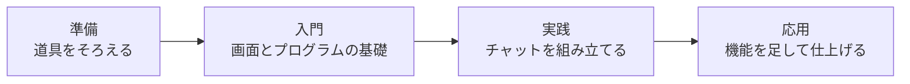

# この教材でつくるもの

これからあなたが自分の手で作るものを、先に見ておきましょう。

この章は5つのセクションでできています。ブラウザ・アカウント・作業部屋の3つをそろえて、自分の打った文字を画面に出すところまで進みます。

| セクション | テーマ | 種類 |
|---|---|---|
| この教材でつくるもの | つくるチャットアプリと、完成までの道のり | 読む |
| Google Chrome を用意する | 教材と同じ画面で進めるためにブラウザをそろえる | 手を動かす |
| GitHub アカウントをつくる | 開発環境の入口になるアカウントをつくる | 手を動かす |
| 開発環境をひらく | ブラウザの中に自分専用の作業部屋をつくる | 手を動かす |
| この教材の進め方 | 打ちかたと、詰まったときのたしかめかた | 読む |

**この Chapter の進め方**: このセクションは読むだけです。続く3つで道具を1つずつそろえ、最後にこの先の進め方を決めます。途中でアカウントをつくる画面が英語で出てきますが、押す場所はすべて画像で示すので、そのまま進められます。

## つくるもの

メッセージを送り合えるチャットアプリです。

できることは3つあります。

- 打ったメッセージを送り、あとから見返せる
- 話題ごとに部屋を分けて、会話を整理できる
- 自分のスマートフォンからも開ける

この画面を、プログラミング未経験の人が一から作ります。これまでコードを書いたことがなくてもかまいません。押すボタンの位置も、打ち込む文字も、すべて手順として書いてあります。

## 用意するもの

パソコンとインターネットの環境だけです。

- 費用はかかりません
- クレジットカードの登録もいりません
- パソコンに何かをインストールする必要もありません

プログラミングというと、パソコンにソフトを入れて設定する場面を思い浮かべる人が多いのですが、この教材はブラウザの中だけで完結します。使う道具は次のセクションから順にそろえていきます。

## 完成までの道のり

4つの段階に分かれています。

折り返しのころには、メッセージを送ると画面に残るところまで動きます。そこから先は、話題ごとに部屋を分けたり、名前を覚えてもらったりして、少しずつ本物のチャットに近づけていきます。スマートフォンから開けるようにするのも、この段階です。

今日のゴールはもっと手前です。自分が打った文字を画面に出すところまで進みます。

!!! note "補足"

    この教材では、コードを覚える必要はありません。写して動かし、動いたものを少しずつ変えていくうちに、読めるコードが増えていきます。

## まとめ

- 作るのはチャットアプリで、送る・部屋で分ける・スマートフォンから開くの3つができる
- 必要なのはパソコンとインターネットだけ。費用はかからず、インストールもいらない
- 今日は自分が打った文字を画面に出すところまで進む

進めていくと、画面が思ったとおりにならないこともあります。そのときの進め方は、今日の最後のセクションで案内します。

次のセクションでは、教材と同じ画面を見ながら進められるように、Google Chrome をインストールして、既定のブラウザに設定します。
