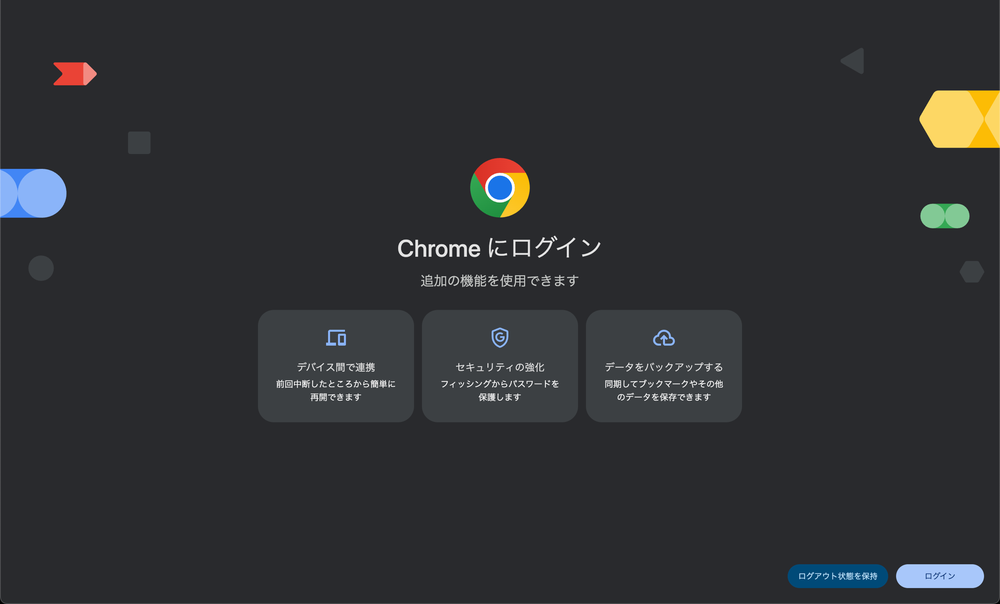
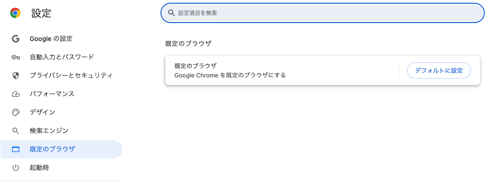

# Google Chrome を用意する

教材と同じ画面を見ながら進められるように、ブラウザをそろえます。

## なぜブラウザをそろえるのか

ブラウザは、インターネットを見るためのソフトです。Google Chrome、Microsoft Edge、Safari など何種類かあり、同じページを開いてもボタンの位置や見た目が少しずつ違います。

この教材の画像はすべて Chrome の画面で撮っています。同じブラウザにそろえておくと、教材の画像と自分の画面が違う、という迷いが起きません。この先で使う開発環境も Chrome での動作を前提にしています。

## 使っているブラウザの確かめかた

いま見ているブラウザが Chrome かどうかは、画面の上のほうにあるアイコンで見分けられます。

すでに Chrome を使っている場合は、このセクションは飛ばしてかまいません。次のセクションに進んでください。

## 実践: Chrome を入れて既定にする

Chrome を使っていない場合は、ここでインストールします。

まず、いま使っているブラウザで次のページを開きます。四角の中の文字をコピーして、ブラウザの上にあるアドレスの欄に貼り付け、Enter キーを押してください。

```text
https://www.google.com/chrome/
```

ページの中央にある「Chrome をダウンロード」のボタンを押すと、ダウンロードが始まります。


ダウンロードしたファイルは、画面の右上（または左下）に出てきます。そこを押すか、パソコンの「ダウンロード」フォルダから開いてください。ここから先は、お使いのパソコンで手順が変わります。

??? note "Windows をお使いの場合"

    ダウンロードしたファイル（`ChromeSetup.exe`）をダブルクリックすると、インストールが始まります。途中で許可を求める画面が出たら、「実行」または「はい」を押して進めてください。しばらく待つと Chrome が自動で開きます。

??? note "Mac をお使いの場合"

    ダウンロードしたファイル（`googlechrome.dmg`）をダブルクリックすると、小さな窓が開きます。その中の Chrome のアイコンを、となりの「アプリケーション」フォルダへドラッグしてください。コピーが終わったら、アプリケーションフォルダから Chrome を開きます。

Chrome が開くと、「Chrome にログイン」という画面が出ます。この教材では Google のアカウントを使わないので、**右下の「ログアウト状態を保持」** を押して進んでください。



最後に、リンクを押したときに Chrome で開くように設定します。Chrome の画面右上にある3つの点のアイコンから「設定」を開き、「既定のブラウザ」を選んで「デフォルトに設定」を押します。

Windows ではこのあとパソコンの設定画面が開くので、そこで Chrome を選び直してください。Mac では確認の窓が出るので「Google Chrome を使用」を押します。



!!! note "補足"

    Chrome を既定にしても、これまで使っていたブラウザは消えません。ブックマークやパスワードもそのまま残ります。

**確認**: Chrome の設定画面に「Google Chrome は現在、既定のブラウザです」と表示されていれば完了です。

## まとめ

- 教材の画像はすべて Chrome の画面で撮っている
- すでに Chrome を使っている場合は、何もしなくてよい
- 既定のブラウザに設定しておくと、リンクを押したときも同じ画面で進められる

次のセクションでは、開発環境を無料で使うために GitHub のアカウントを作ります。
