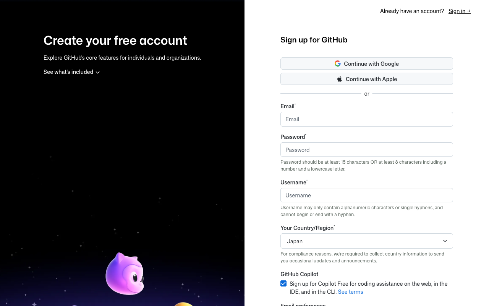
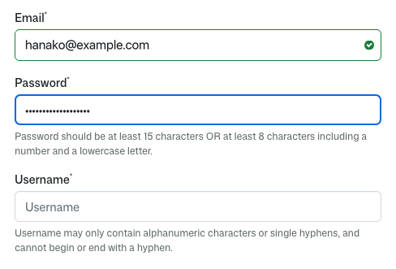
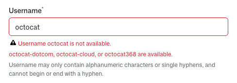
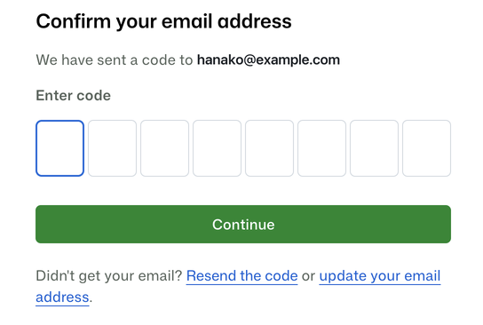
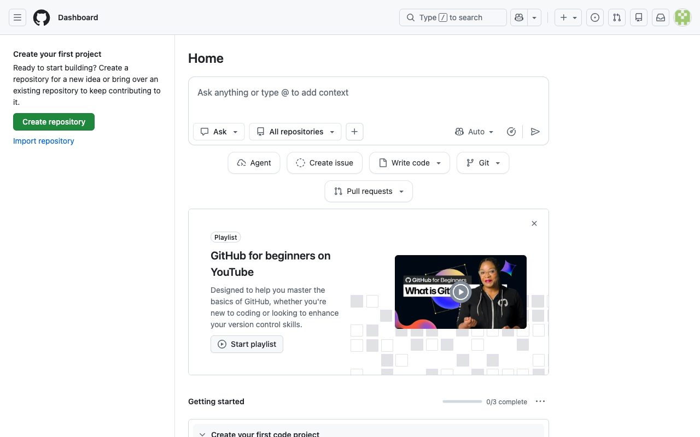

# GitHub アカウントをつくる

このあと使う開発環境の入口になる、GitHub のアカウントを作ります。

## GitHub とは

GitHub は、世界中の開発者が自分の書いたプログラムを置いている場所です。

この教材では、その中のひとつの機能を使います。ブラウザだけで動く開発環境を、アカウントがあれば無料で開けるという機能です。パソコンに何かをインストールしなくてよいのは、この仕組みのおかげです。

アカウントの作成は無料で、クレジットカードの登録もいりません。

!!! note "補足"

    GitHub の画面は英語で表示されます。これから押す場所はすべて画像で示すので、英語が読めなくても手順どおりに進められます。

    どうしても意味を知りたいときは、ページ上で右クリックして「日本語に翻訳」を選べます。ただし翻訳するとボタンの文字が教材の画像と変わってしまうので、まずはそのまま進めるのがおすすめです。

## 実践: アカウントをつくる

### Step 1: 登録画面が開く

Chrome で次のページを開きます。

```text
https://github.com/signup
```



入力欄の上に「Continue with Google」「Continue with Apple」というボタンがありますが、これは別のサービスのアカウントを使う登録方法です。この教材では使わないので、その下の Email から順に進めてください。

### Step 2: メールアドレスとパスワードを決める

上から順に、次の4か所を埋めます。

| 入力欄 | 入れるもの |
|---|---|
| Email | 受け取れるメールアドレス |
| Password | 好きなパスワード（15文字以上、または数字と小文字を混ぜて8文字以上） |
| Username | 好きな名前（半角の英数字とハイフン） |
| Your Country/Region | Japan（最初から選ばれています。そのままでかまいません） |

国名の欄の下に、あらかじめチェックが入っている項目があります。この教材では使わないので、押してチェックを外しておきましょう。



Username は、世界中で自分だけの名前になります。すでに誰かが使っている名前は登録できず、赤い文字で知らせが出ます。そのときは使える名前の候補も一緒に表示されるので、候補をそのまま選んでも、数字を足して別の名前を試してもかまいません。



!!! warning "注意"

    パスワードは、別のパソコンから開くときや、ログアウトしたあとで必要になります。忘れないよう控えておいてください。

### Step 3: 届いたコードを入れるとアカウントができる

入力が終わると、登録したメールアドレスあてに8桁の数字が届きます。メールを開いて、その数字を画面に入力してください。数分たっても届かないときは、迷惑メールフォルダを確認するか、画面の下にある「Resend the code」を押すともう一度送られます。



!!! note "補足"

    登録の途中で、人間であることを確かめる画面が出る場合もあります。絵を回したり、指示されたものを選んだりする形式で、プログラムによる自動登録を防ぐためのものです。何度か間違えてもやり直せます。出ないまま進むこともあります。

コードが正しければ登録は完了です。自分のページが表示されます。



**確認**: 画面の右上に自分のアイコンが表示されていれば、ログインできています。

## まとめ

- GitHub は、ブラウザだけで動く開発環境を無料で開くための入口になる
- 画面は英語のままだが、押す場所は画像で示している
- Username は世界でひとつだけ。重複していたら別の名前にする

次のセクションでは、作ったアカウントで自分専用の開発環境を開き、打った文字を画面に出すところまで進みます。
