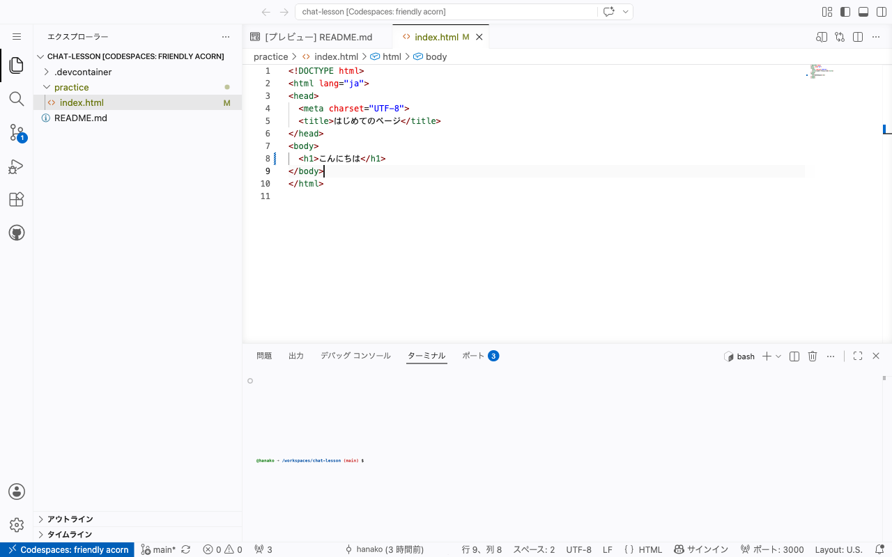
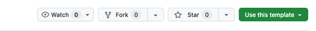
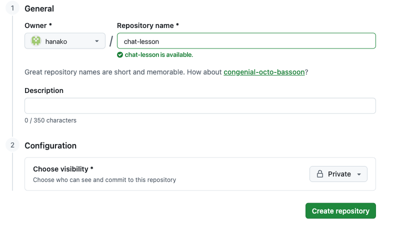
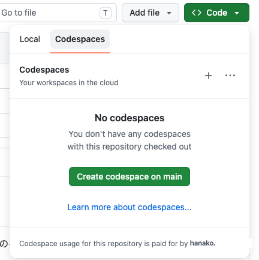
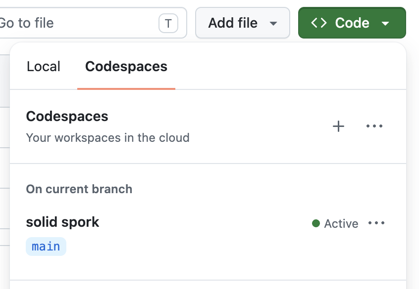
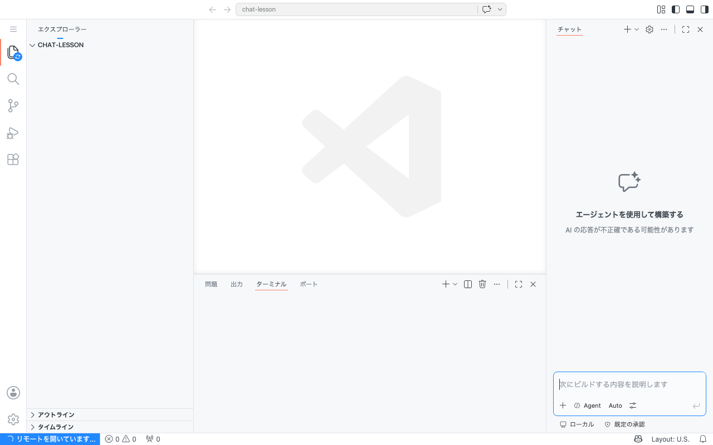
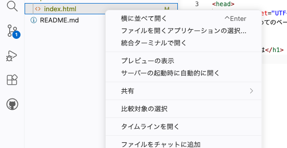

# 開発環境をひらく

ブラウザの中に自分専用の作業場所をつくり、今日のうちに文字を画面に出します。



## Codespaces とは

Codespaces は、GitHub が用意しているブラウザで動く開発環境です。

プログラムを書くには、文字を書くための道具と、書いたものを動かすための道具がいります。ふだんはそれをパソコンに1つずつインストールしますが、Codespaces では最初からひとそろい用意された状態で開きます。

自分専用の作業部屋がブラウザの中にできる、と考えてください。部屋の中の道具はすべて用意ずみで、あなたはドアを開けて座るだけです。全員が同じ道具を使うので、教材の画面と自分の画面がずれることもありません。

前のセクションでは GitHub の画面が英語でしたが、**ここから先の作業部屋は日本語で表示されます**。

## 実践: 自分の作業部屋をつくる

### Step 1: 教材の材料が自分のものになる

まず、教材が用意した材料一式を自分のものとしてコピーします。Chrome で次のページを開いてください。

```text
https://github.com/coachtech-material/laravel-chat-starter
```

ページの右上にある「Use this template」を押し、続けて「Create a new repository」を選びます。



次の画面で、コピー先の名前を決めます。「Repository name」に `chat-lesson` と入力してください。ここで作るコピーのことを、GitHub では「リポジトリ」と呼びます。

その下に「Public」と「Private」を選ぶところがあります。**Private を選んでください。** 自分だけが見られる状態になります。選んだら、いちばん下の「Create repository」を押します。



!!! note "補足"

    ここで作ったものは、あなただけのコピーです。この先どれだけ書き換えても、教材のもとの材料には影響しません。

### Step 2: ブラウザにエディタとターミナルが開く

コピーが終わると、自分のページが表示されます。緑色の「Code」ボタンを押し、「Codespaces」のタブに切り替えて、「Create codespace on main」を押します。



押すと、いま押した場所に、英単語をつないだ見慣れない名前が出てきます。これがいま作られた作業部屋で、名前は自動で付くので見覚えがなくて当然です。**その名前を押してください。**



新しいタブが開き、準備が始まります。ここは数分かかります。画面には英語の文字が流れますが、読む必要はありません。閉じずにそのまま待ってください。



準備が終わると、左にファイルの一覧、中央に文字を書く場所、下にターミナル（文字で指示を出す場所）が並びます。これがこの先ずっと使う作業部屋です。

右端に細いパネルが開いていることもあります。この教材では使わないので、パネル右上の閉じるボタンで閉じてかまいません。閉じたほうが編集する場所を広く使えます。

### Step 3: 打った文字がプレビューに出る

左のファイル一覧から `practice` を開き、その中の `index.html` を押します。中央に中身が表示されます。

8行目に、次の1行があります。

```html title="practice/index.html"
  <h1>はじめまして</h1>
```

この `<h1>` と `</h1>` にはさまれた「はじめまして」の部分を、自分の好きな言葉に書き換えてください。前後の `<h1>` と `</h1>` はそのまま残します。

書き換えたら、**左のファイル一覧にある** `index.html` を右クリックします。長いメニューが出てくるので、上から4つめの「プレビューの表示」を選んでください。



新しいタブが開き、いま打った文字がそのまま表示されます。これがあなたの作ったページです。


!!! note "補足"

    保存のボタンはありません。この作業部屋では、書き換えると自動で保存されます。

今日の作業はここまでです。タブはそのまま閉じてかまいません。作業部屋も、書いた内容も残ります。次に開くときは、自分の GitHub のページから同じ手順（「Code」→「Codespaces」）で戻ってこられます。

## 完成チェックリスト

- 自分の GitHub に `chat-lesson` という名前のコピーができている
- Codespaces を開くと、ファイル一覧・文字を書く場所・ターミナルが並んで表示される
- `index.html` に書いた文字が、新しく開いたタブに表示される

## まとめ

- Codespaces は、道具がひとそろい用意されたブラウザの中の作業部屋
- 教材の材料は「Use this template」で自分のコピーにしてから使う
- 書き換えた文字は、プレビューですぐに確認できる

自分で打った文字が画面に出ました。ここが、この教材でいちばん最初の「動いた」です。

次のセクションでは、ここから先をどう進めていくか、学び方の作法を決めます。
