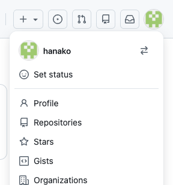
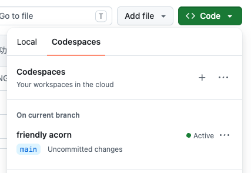

# エディタの見かた

昨日の作業部屋をもう一度ひらいて、どこに何があるのかをおぼえます。

この章は6つのセクションでできています。作業部屋の中を一巡して、ファイル・ターミナル・エラーという、この先ずっと使うものの扱いをそろえます。

| セクション | テーマ | 種類 |
|---|---|---|
| エディタの見かた | 作業部屋にもどって、画面の3つの場所をおぼえる | 手を動かす |
| ファイルとフォルダ | 自分でつくって名前を変え、置き場所の読み方をおさえる | 手を動かす |
| ターミナルに触れる | 文字を打って、コンピュータに用事を頼む | 手を動かす |
| エラーが出たら | わざと打ち間違えて、返ってきた言葉を読む | 手を動かす |
| エラー辞典（困ったときのページ） | 画面に出た言葉から、直し方を引く | 読む |
| 保存の儀式 | 今日の分を GitHub に残して、作業部屋を止める | 手を動かす |

**この Chapter の進め方**: このセクションから手を動かします。前半で画面とファイルとターミナルの扱いをおぼえ、後半でエラーとの向き合い方をおさえて、最後に今日の分を GitHub に残します。困ったときのページだけは通して読む必要がないので、見出しに目を通すだけで先へ進めます。

## 画面の3つの場所

作業部屋の画面は、大きく3つの場所に分かれています。この先ずっと使うので、名前と役割をここでそろえます。

**左のファイル一覧** には、フォルダとファイルの名前が縦に並びます。昨日 `index.html` を探したのがこの場所です。名前を押すと、中身が中央に開きます。

**中央の編集エリア** は、開いたファイルの中身が表示されるところです。文字を書き換える作業は、すべてここで行います。

**下のターミナル** は、ボタンの代わりに短い言葉で用事を頼む場所です。今日のうちに触るので、いまは場所だけ分かっていれば十分です。

## ファイルの開きかたと保存

ファイル一覧の名前を押すと、編集エリアの上にそのファイルの名前が出ます。これがエディタのタブです。

開いただけのファイルのタブは、続けて別の名前を押すと、そちらのファイルに入れ替わることがあります。1文字でも書き換えたファイルのタブは入れ替わらずに残るので、タブが消えても書いた内容は失われません。

いらなくなったタブは、名前の右にある `×` で閉じられます。閉じるのは表示をしまうだけの操作なので、ファイルは左のファイル一覧に残り、中身も消えません。

書き換えると自動で保存されるのは昨日ふれたとおりです。いったん閉じたファイルを開き直しても、最後に打った内容がそのまま出ます。

## 実践: 作業部屋にもどって1行足す

昨日の作業部屋は、ブラウザのタブを閉じたあともそのまま残っています。まずはそこへもどります。

Chrome で次のページを開きます。

```text
https://github.com
```

ログインの画面が出たときは、昨日決めた Username か Email のどちらかと、Password を入れます。

画面の右上にある自分のアイコンを押すと、メニューが下に開きます。その中の「Repositories」を選ぶと自分のリポジトリの一覧が出るので、`chat-lesson` を押してください。



緑色の「Code」ボタンを押して、「Codespaces」のタブに切り替えます。一覧には、昨日作業部屋をつくったときに押したのと同じ、英単語をつないだ名前が並んでいます。並んでいる **その名前** を押してください。



!!! warning "注意"

    一覧の上にある `+` は、新しい作業部屋をもう1つつくるボタンです。押しても壊れませんが、昨日の続きは入っていません。

しばらく待つと、昨日閉じたときのままの画面が開きます。つくり直すのではないので、最初のときより待つ時間は短くなります。`README.md` など別のファイルが表示されていたら、そのエディタのタブは閉じてかまいません。

もどれたら、左のファイル一覧から `practice` の `index.html` を開きます。`<h1>` で始まる行の右のはしを押してから、Enter を押します。すぐ下に空の行が1つできるので、そこに次の1行を打ってください。

```html title="practice/index.html"
  <p>今日から、この作業部屋の使いかたをおぼえます。</p>
```

行のはじめにある空白は、上の行と見た目をそろえるためのものです。ちがっていても同じように動くので、そろえるのに手間をかけなくてかまいません。

`<p>` は、文章のひとまとまりを表す印です。かたちについては、このあと HTML をあつかう章で説明します。かこまれた中の文章は、好きな言葉に変えてかまいません。

!!! warning "注意"

    `<` と `>` は半角で打ちます。日本語入力のままだと `＜` `＞` という別の記号になり、印としては働きません。`＜p＞` ごとそのまま画面に出てきたときは、この2つの記号から見直してください。

足したら、昨日と同じ手順でプレビューを開きます。左のファイル一覧の `index.html` を右クリックして「プレビューの表示」を選んでください。

**確認**: 開いたプレビューに、昨日書いた見出しと、いま足した1行の文章が並んで表示されます。

## まとめ

- 画面は、左のファイル一覧・中央の編集エリア・下のターミナルの3つに分かれている
- 開いただけのファイルのタブは入れ替わることがあり、閉じてもファイルと中身は消えない
- 昨日の作業部屋にもどるときは、「Code」→「Codespaces」から一覧の名前を押す

次のセクションでは、ファイルとフォルダを自分でつくり、つくったあとに名前を変えてみます。あわせて、どのファイルがどこにあるのかを表すパス（ファイルの住所）の読み方もおさえます。
