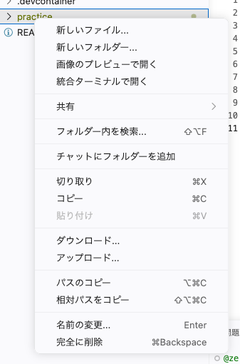
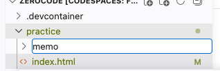

# ファイルとフォルダ

ファイルとフォルダを自分でつくって、置き場所の読み方までおさえます。

## パスとは

作業部屋のファイルは、フォルダの中に置かれています。さきほど `index.html` を開いたときも、`practice` を開いてから選びました。どのフォルダの中にあるのかまで含めて書き表したものが **パス** で、ファイルの住所にあたります。

いま使っているところだけを書き出すと、次のような形です。

```text
/workspaces/chat-lesson
├── README.md
└── practice
    └── index.html
```

いちばん上の `/workspaces/chat-lesson` が作業部屋そのものの場所です。1行を足したファイルはその中の `practice` にあるので、住所は `practice/index.html` です。区切りの `/` は「この中の」という意味で、`practice` の中の `index.html` と読みます。

いちばん上の住所は、次のセクションでターミナルを使うときに、文字を打ちこむ行に出てきます。左のファイル一覧に並ぶ `.devcontainer` は、作業部屋の設定が入ったフォルダなので、この教材では触りません。

この教材でも、コードのかたまりの左上に住所を書いています。`practice/index.html` と出ていたら、そのファイルを開いて書くという合図です。

## ファイルとフォルダのつくりかた

ファイルとフォルダの用事は、左のファイル一覧の中だけで済みます。名前を右クリックすると、次の4つを含むメニューが出ます。

| 選ぶもの | できること |
|---|---|
| 新しいファイル... | ファイルをつくる |
| 新しいフォルダー... | フォルダをつくる |
| 名前の変更... | 名前を変える |
| 完全に削除 | 消す |

つくる場所は、右クリックした場所で決まります。フォルダを右クリックすれば、その中にできます。

名前は半角の小文字で付けてください。日本語でも付けられますが、このあとターミナルから扱うときに打ちにくくなります。

!!! warning "注意"

    「完全に削除」で消したファイルは、元にもどせません。消すのは自分でつくったものだけにして、`practice` や `index.html` は残してください。ここでつくるものは、このあとも使います。

## 実践: 練習用のフォルダをつくる

さきほどの作業部屋をそのまま使います。

### Step 1: 新しいフォルダが一覧に出る

左のファイル一覧で `practice` を右クリックして、「新しいフォルダー...」を選びます。



`practice` の下に、名前を入れる欄がそのまま出てきます。別の窓は開きません。ここに `memo` と打って Enter を押してください。



できあがったことを知らせる表示は出ないので、一覧に `memo` が見えていれば成功の合図です。

!!! note "補足"

    Enter を押す前に一覧の外側を押すと、入力欄が消えてフォルダはつくられません。もう一度 `practice` を右クリックしてやり直せます。

### Step 2: つくったファイルが開く

一覧の `memo` を右クリックして「新しいファイル...」を選び、`memo.txt` と打って Enter を押します。名前の終わりの `.txt` は、文字だけが入っているファイルという印です。

つくったファイルは中央の編集エリアに開きます。中は空なので、1行だけ書いてみましょう。

```text title="practice/memo/memo.txt"
きょうやったこと
```

### Step 3: 名前を変えても中身が残る

名前はあとから変えられます。中身がそのまま残ることを確かめましょう。

一覧の `memo.txt` を右クリックして「名前の変更...」を選ぶと、名前が書き換えられる状態になります。`todo.txt` に直して Enter を押してください。

一覧の名前と、編集エリアのタブの名前が `todo.txt` に変わり、書いた1行はそのまま残っています。

いま使っているところを住所の形で書き出すと、こうなります。

```text
/workspaces/chat-lesson
├── README.md
└── practice
    ├── index.html
    └── memo
        └── todo.txt
```

**確認**: 左のファイル一覧で `practice` の中の `memo` を開き、その中の `todo.txt` を押すと、自分で書いた1行がそのまま表示されます。

## まとめ

- ファイルの住所は `practice/index.html` のように書き、`/` がフォルダとその中身の区切りになる
- ファイルとフォルダは、左のファイル一覧を右クリックしてつくる。できても知らせは出ない
- 名前を変えても中身は残るが、削除で消したものはもどせない

次のセクションでは、下のターミナルに文字を打って Enter を押します。`ls` と `cd` という2つのコマンドを使って、いまつくったフォルダを文字だけでたどってみます。
