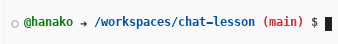
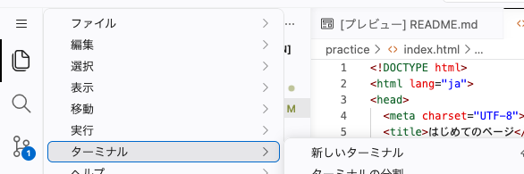

# ターミナルに触れる

ターミナルに文字を打って、コンピュータに用事を頼んでみます。

## ターミナルとは

画面の下にある領域が、前の章の終わりにふれた「黒い画面」です。この作業部屋では白い背景で開くので、色は目印になりません。名前は **ターミナル** で、以降はこちらで呼びます。

マウスで押せるボタンがあるのは、よく使う用事だけです。ボタンが無い用事は、ターミナルに文字を打って頼みます。これから使う道具の多くはボタンを持たないので、文字で呼び出します。

ターミナルに打つ短い言葉を **コマンド** と呼びます。今日おぼえるのは2つだけです。

ターミナルの中には、すでに次のような1行が出ています。

```text
@hanako ➜ /workspaces/chat-lesson (main) $
```

`@` のあとは自分の GitHub のユーザー名なので、人によって違います。`➜` は、打ったコマンドがうまくいったかどうかの目印です。失敗すると赤っぽい色に変わります。まん中の `/workspaces/chat-lesson` が **いまいる場所** です。うしろの `(main)` は、気にしなくてよい表示です。文字を打つのは、いちばん右の `$` のうしろです。



## 実践: 2つのコマンドを打つ

作業部屋はさきほどのまま開いておいてください。ターミナルが見つからない場合は、画面の左上にある、横に3本の線が並んだ印を押します。左のファイル一覧の見出しのすぐ左にあります。メニューが下に開くので、「ターミナル」から「新しいターミナル」を選ぶと、画面の下に開き直せます。



打つ前に、ターミナルの中の `$` のあたりを一度押してください。編集エリアのままだと、開いているファイルの中に文字が入ってしまいます。

1つめのコマンドは `ls` です。いまいる場所にあるファイルとフォルダの名前を並べます。いまいる場所が `/workspaces/chat-lesson` であることを確かめて、半角で次のように打ち、Enter を押してください。

```bash
ls
```

2つの名前が横に並びます。

```text
README.md  practice
```

`ls` は英語の list を縮めた言葉で、「並べて見せて」と頼んだことになります。

左のファイル一覧に見えている `.devcontainer` は、`.` から始まる名前なので `ls` には出てきません。

!!! warning "注意"

    コマンドは半角の小文字で打ちます。日本語入力のままだと全角の文字や空白が混じり、見た目が正しくても `command not found` という英語が返ってきます。大文字と小文字も別のものとして扱われるため、`LS` と打った場合も同じです。

打ち間違えても何も壊れません。英語の言葉が返ってきたら、そのまま打ち直してください。

2つめは `cd` です。いまいる場所を、指定したフォルダの中に移します。さきほどファイルをつくった `practice` に入ってみましょう。

```bash
cd practice
```

Enter を押しても、画面には何も出ません。うまくいった合図は、コマンドを打つ行のほうに出ます。いまいる場所が `practice` まで伸びています。

```text
@hanako ➜ /workspaces/chat-lesson/practice (main) $
```

この場所で、もう一度 `ls` と打ってみます。

```bash
ls
```

```text
index.html  memo
```

1行足したファイルと、自分でつくった `memo` フォルダが並びます。同じ `ls` でも、いる場所によって並ぶ名前が変わります。

!!! note "補足"

    上向きの矢印キーを押すと、前に打ったコマンドが呼び戻せます。同じコマンドをもう一度打つときは、こちらのほうが速く済みます。

最後に、元の場所へ戻ります。

```bash
cd ..
```

`..` は「1つ上のフォルダ」を指す書き方です。いまいる場所が `/workspaces/chat-lesson` に戻ります。この先のコマンドもここで打つので、戻したままにしておいてください。

!!! warning "注意"

    `cd` と `..` の間には、半角の空白を必ず1つ入れます。`cd ..` は「`cd` という頼みごと」と「`..` というあて先」の2つでできているためです。くっつけて `cd..` と打つと、全体で1つの言葉として読まれてしまい、次の英語が返ってきます。

    ```text
    bash: cd..: command not found
    ```

    `cd practice` のときも同じで、`cd` のうしろには半角の空白が入っています。

**確認**: `ls` と打つと `README.md` と `practice` の名前が出て、`cd` を打つといまいる場所の表示が変わります。最後は `/workspaces/chat-lesson` に戻っています。

## まとめ

- ターミナルは、ボタンの代わりに文字で用事を頼む場所で、打ち終わったら Enter を押す
- `ls` はいまいる場所にあるものの名前を並べるコマンドで、`.` から始まる名前だけは出てこない
- `cd` でいまいる場所を移せる。`cd ..` で1つ上に戻り、どこにいるかは打つ行の表示で分かる

次のセクションでは、コマンドをわざと打ち間違えて、エラーをその場で出してみます。返ってきた英語のうち、どこで・何がという2か所だけを読む読み方をなぞり、詰まったときにたしかめる3つの順のどこにあたるのかも思い出します。
