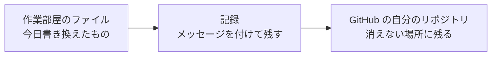
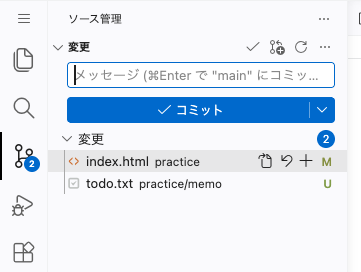
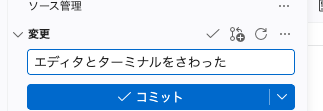
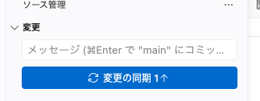
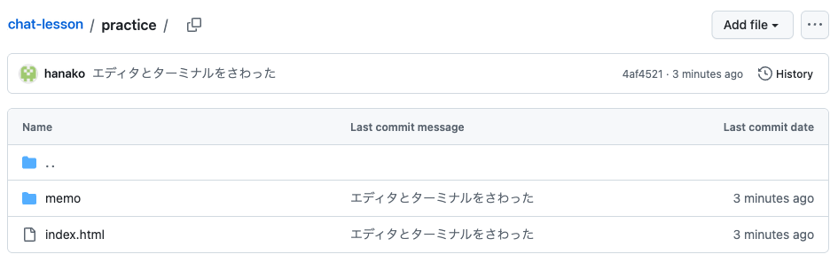
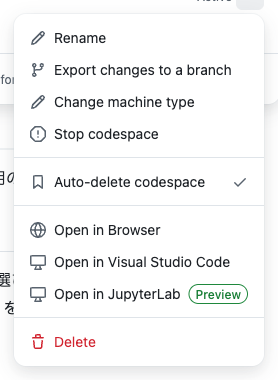
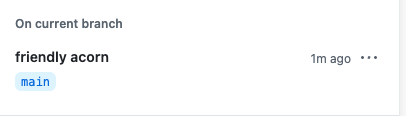

# 保存の儀式

今日さわった分を GitHub に残して、作業部屋を止めるところまで済ませます。

## なぜ保存の儀式をするのか

書いたものは、作業部屋の中では自動で保存されます。作業部屋は、30分ほど触らずにいると自動で止まります。止まっても中身は消えず、開き直せば続きから始められます。ただし、30日ひらかないままだと作業部屋そのものが無くなります。書いたものを、作業部屋の外にある GitHub の自分のリポジトリに上げておけば、作業部屋が無くなっても、そこからもう一度つくって記録したところから続けられます。

そこで、その日の終わりに今日の分を GitHub へ上げて、作業部屋を止めます。これを **保存の儀式** と呼び、章の終わりごとに繰り返します。



## 実践: 今日の分を記録して環境をとめる

今日ひらいた作業部屋をそのまま使います。途中で確認の窓が2回出ますが、どちらも進めてよい確認です。

### Step 1: 変更したファイルが一覧に出る

左のファイル一覧の、さらに左に細長いアイコンの列があります。マウスを乗せると名前が出るので、「ソース管理」を押してください。



今日さわった `index.html` と、新しくつくった `todo.txt` が並びます。

### Step 2: メッセージを付けて記録できる

一覧の上に文字を入れる欄があるので、今日やったことを一言書きます。

```text
エディタとターミナルをさわった
```

書いたら、欄の下の「コミット」を押します。



!!! warning "注意"

    押すと確認の窓が出て、「ステージされている変更がなく、コミットできません。すべての変更をステージして、直接コミットしますか?」と出ます。「できません」と書かれていますが、失敗ではありません。今日の分をまとめて記録するかの確認なので、「はい」を押します。

### Step 3: 自分のリポジトリに上がったことを確かめる

記録できると、一覧の名前が消えます。ここまでは作業部屋の中だけの記録なので、GitHub へ送ります。「コミット」があった場所のボタンが「変更の同期」に変わっているので、押してください。



もう一度、確認の窓が出ます。「このアクションは、"origin/main" との間でコミットをプルおよびプッシュします。」という1文なので、「OK」を押します。「正常にプッシュされました。」と出れば送れています。続けて「定期的に `git fetch` を実行する にしますか?」とたずねる窓が出ることもあります。今日の作業には関係しないので、「いいえ」を押して閉じてかまいません。

Chrome で自分の `chat-lesson` のリポジトリを開いて `practice` を押すと、`memo` フォルダがあり、中の `todo.txt` には書いた1行が残っています。



### Step 4: 環境をとめて、もう一度ひらける

今日の分が残ったので、作業部屋を止めます。止めてひらき直すところまでやっておくと、次に続けるときに迷いません。別のタブで作業部屋を開いたままなら、先に閉じておきましょう。

ページの上にある `chat-lesson` を押して、リポジトリの先頭のページに戻ります。緑色の「Code」から「Codespaces」を開き、名前の右にある、点を3つ並べたボタンを押します。出てきたメニューの中の「Stop codespace」が、止める項目です。



見当たらないときは、`github.com/codespaces` を開くと同じ一覧とメニューが出ます。

!!! warning "注意"

    同じメニューには、作業部屋そのものを消す「Delete」も並んでいます。押すのは「Stop codespace」です。止めるだけなら、書いたものはそのまま残ります。

押したあとは、その行に出ていた緑色の「Active」の印が消えます。それが止まった目印です。



印が消えたら、もう一度ひらきます。開き方は今日のはじめと同じで、一覧の名前を押すと、ファイルと開いていたタブはそのまま出てきます。ターミナルの表示だけは空にもどりますが、打ったコマンドが消えたわけではありません。

## 完成チェックリスト

- 「ソース管理」の一覧に、記録する前に並んでいたファイル名が残っていない
- GitHub の `chat-lesson` のリポジトリで `practice` を開くと `memo` があり、その中に `todo.txt` が入っている
- 「Stop codespace」で止めたあと、一覧の名前を押すと止める前のファイルとタブが出る

## まとめ

- 作業部屋は30分さわらないと止まり、30日ひらかないままだと無くなる
- メッセージを一言書いて「コミット」、続けて「変更の同期」で GitHub に上げる
- 止めた作業部屋は中身が残り、「Code」→「Codespaces」の一覧でひらき直せる

今日は、作業部屋の中を見て回り、ファイルとフォルダをつくり、ターミナルにコマンドを打ちました。エラーの読み方と、困ったときに戻るページも見て、最後に今日の分を GitHub に残しました。

準備編はここまでです。ブラウザと GitHub のアカウントと作業部屋がそろい、自分で打った文字は画面に出ました。打つか貼るかの進め方も、エラーとの向き合い方も分かりました。

次の章からは、画面をつくる言葉と、プログラムを書く言葉に触れます。まずは、ページが表示されるまでにブラウザとサーバーのあいだで何が起きているのかを見て、HTML と CSS の役割分担をつかみます。見るだけの Web サイトと、送ると変わる Web アプリのちがいも見ておきます。
