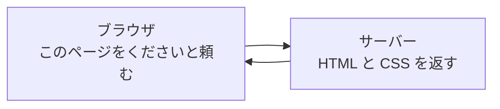

# Web ページのしくみ

ページが表示されるまでに何が起きているかを見ます。

この章は5つのセクションでできています。ページの中身を書く HTML と、見た目を決める CSS を、自己紹介のページを1枚つくりながらおぼえます。

| セクション | テーマ | 種類 |
|---|---|---|
| Web ページのしくみ | ページが届くまでのやりとりと、HTML と CSS の役割 | 読む |
| HTML の基本（見出し・段落・リスト） | 文字に意味をつけるタグを打って表示する | 手を動かす |
| リンクとフォーム部品 | リンクと入力欄をページに置く | 手を動かす |
| CSS で飾る | 色と大きさと余白を変えて見た目を整える | 手を動かす |
| 自己紹介ページをつくろう | 学んだタグと CSS でページを仕上げる | 手を動かす |

**この Chapter の進め方**: このセクションは読むだけです。残りの4つでは、自己紹介のページを1枚つくって、そこにタグと CSS を足していきます。毎回あたらしいファイルをつくるのではなく同じ1枚に書き足すので、前のセクションの続きから始められます。

!!! note "補足"

    このセクションに出てくるコードは、しくみを知るための例なので、打たずに読むだけで進めます。実際に書くのは次のセクションからです。

## ページが表示されるまでのやりとり

ブラウザで見ているページは、自分のパソコンの中にあるものではありません。開くたびに、別のコンピュータから届いています。

ページを開くと、まずブラウザが「このページをください」と頼みます。頼まれる相手が **サーバー** です。サーバーは、ページを預かっていて、頼まれたら渡すコンピュータです。渡されたものをブラウザが読み取って、画面に表示します。



レストランにたとえると、お客さんがブラウザで、お店がサーバーです。お客さんが頼んだものだけが出てきますし、頼むたびに同じやりとりが起きます。リンクを押して別のページに移るときも、同じページを開き直したときも、この往復が毎回繰り返されています。

!!! note "補足"

    サーバーの中で何が起きているかは、チャットをつくる章で開けていきます。いまは、ページが向こうから届くことだけつかめれば十分です。

## Web サイトと Web アプリのちがい

同じ Web ページでも、開いて読むだけのものと、こちらから何かを送ると中身の変わるものがあります。

| | 見るだけ（Web サイト） | 送ると変わる（Web アプリ） |
|---|---|---|
| 例 | ニュースの記事、お店の案内 | チャット、買い物かご、予約 |
| やること | 開いて読む | 打って送る |
| 開くたびに | 同じものが出る | 送った分だけ増えている |

送るほうでは、やりとりが1つ増えます。ブラウザからサーバーへ「この文字を預かってください」と渡し、サーバーがそれをしまっておきます。次にページを頼まれたときは、しまっておいた分も入れて返します。開き直しても打った内容が残っているのは、このためです。

これから作るチャットは、送ると変わるほうです。

## HTML と CSS の役割

サーバーから返ってくるのは、ページの中身を書いたものと、その見せ方を書いたものです。中身を書くのが HTML で、見せ方を書くのが CSS です。

HTML は、ページの骨組みを書きます。どこが見出しで、どこが文章かを決めます。

```html
<h1>ゆい</h1>
<p>はじめまして</p>
```

「ゆい」を見出しに、「はじめまして」を文章にする、という指示です。ブラウザはこれを読んで、見出しを大きく太い文字にし、文章をその下に並べます。

CSS は、その見た目を決めます。色・大きさ・余白の指示を書きます。

```css
h1 {
  color: navy;
}
```

見出しの文字を紺色にする、という指示です。HTML だけでも文字は表示されますが、色や大きさはブラウザが決めたままになります。そこを自分の好きな見た目に近づけるのが CSS です。

## まとめ

- ブラウザが「このページをください」と頼み、サーバーが預かっているページを返す
- Web サイトは開いて読むだけ、Web アプリは送ると中身が変わる
- HTML がページの骨組みを決め、CSS が見た目を決める

次のセクションでは、文字に意味をつけるタグを実際に打って、見出しと段落と箇条書きが並ぶページを表示します。
