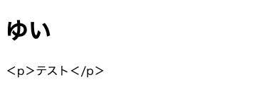
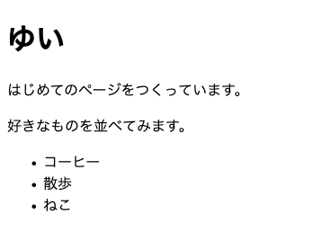

# HTML の基本（見出し・段落・リスト）

文字に意味をつけるタグを、実際に打って表示します。

## HTML とは

HTML は、文字に「ここは見出し」「ここは文章」という意味の印を付ける書き方です。前の章で `index.html` に1行だけ足した `<p>` が、その印のひとつでした。

印のことを **タグ** と呼びます。タグは `<` と `>` で囲んで書き、始まりのタグと終わりのタグで文字をはさみます。終わりのタグには `/` が入ります。

```html
<p>はじめまして</p>
```

はさまれた「はじめまして」を、ブラウザはひとまとまりの文章として扱います。印を付けずに文字だけを並べると、どこで区切るのかが決まらないので、行を分けて書いても続けて表示されます。

## よく使う3つのタグ

この章で使うのは、次のタグだけです。

| 書き方 | 意味 | 画面での見え方 |
|---|---|---|
| `<h1>` 〜 `</h1>` | 見出し | 太くて大きい文字になる |
| `<p>` 〜 `</p>` | 文章のひとまとまり | 前後に余白が空いて、かたまりで並ぶ |
| `<ul>` と `<li>` | 箇条書き | 行の先頭に点が付いて並ぶ |

箇条書きだけは、タグを2つ組み合わせて書きます。`<ul>` が箇条書き全体を囲む箱で、`<li>` が1行ぶんです。

```html
<ul>
  <li>りんご</li>
  <li>みかん</li>
</ul>
```

`<li>` を1行書くごとに、点の付いた行が1つ増えます。

タグは他にもたくさんあります。写真を貼るタグもありますが、この教材では扱いません。チャットをつくるのに使うものだけを、必要になったところで足していきます。

## 実践: 自己紹介の下書きを書く

!!! success "確認"

    自分の GitHub のページから作業部屋を開いてください（「Code」→「Codespaces」）。今日はここから始めます。

### Step 1: 自分のページが開く

新しいファイルをつくります。左のファイル一覧で `practice` を右クリックして「新しいファイル...」を選び、`profile.html` と打って Enter を押してください。名前は半角の小文字です。

中央の編集エリアに空のファイルが開きます。次の内容をまるごと入れてください。ここは長いので、コードの右上のボタンでコピーして貼り付けてかまいません。この10行は、新しいページを作るたびにコピーして使う決まった形です。覚える必要はありません。

```html title="practice/profile.html"
<!DOCTYPE html>
<html lang="ja">
<head>
  <meta charset="UTF-8">
  <title>じこしょうかい</title>
</head>
<body>
  <h1>ゆい</h1>
</body>
</html>
```

`<h1>` の行の上と下にあるのは、どのページにも付く決まった形です。前の章でさわった `index.html` と同じ形なので、いまは意味が分からなくてかまいません。文章や見出しを書き足すのは `<body>` と `</body>` にはさまれたところです。

`DOCTYPE` と `UTF-8` は、見えているとおり大文字で打ちます。`<title>` にはさんだ「じこしょうかい」はページの中には出ず、プレビューを開いたときのブラウザのタブに出ます。

`<h1>` にはさまれた「ゆい」は、自分の名前かニックネームに変えてください。本名である必要はありません。

左のファイル一覧で `profile.html` を右クリックして「プレビューの表示」を選びます。別のタブが開きますが、出てくるのは前の章で書き換えたページです。この開き方ではファイルの名前がアドレスに乗らないので、`practice` の入口にあたる `index.html` が開きます。

見たいページを、アドレスで指します。開いたタブのアドレス欄を1回押し、いちばんうしろに `/profile.html` と打ち足して Enter を押してください。末尾が次の形になります。

```text
/profile.html
```

いま打った名前が、大きな見出しで表示されます。

プレビューのタブは開いたままにしておいてください。編集エリアで書き足すと、そのまま表示にも反映されます。変わって見えないときは、プレビューのタブを再読み込みしてください。

!!! warning "注意"

    書いたタグが、そのまま文章として画面に出てしまうことがあります。`<` と `>` が全角の `＜` `＞` になっていないか見てください。同じ症状は、困ったときに戻るページにも載せてあります。`lang="ja"` と `charset="UTF-8"` の `"` も、同じように半角で打ちます。



### Step 2: 文章が段落として並ぶ

`<h1>` の行のすぐ下に、次の2行を足してください。`</body>` の行は、下にずれます。行を足すときは、`<h1>` の行の右のはしを押してから Enter を押すと、すぐ下に空の行ができます。

```html title="practice/profile.html"
  <p>はじめてのページをつくっています。</p>
  <p>好きなものを並べてみます。</p>
```

プレビューのタブに切り替えると、見出しの下に文章が2つ並びます。どちらも同じ `<p>` ですが、間に余白が空いて、別のかたまりとして表示されます。中の文章は、好きな言葉に変えてかまいません。

### Step 3: 好きなものが箇条書きになる

2つめの `<p>` の行のすぐ下に、次の5行を足してください。`</body>` の行は、下にずれます。

```html title="practice/profile.html"
  <ul>
    <li>コーヒー</li>
    <li>散歩</li>
    <li>ねこ</li>
  </ul>
```

`<li>` の中身は、自分の好きなものに変えてください。行を足せば、項目はいくつでも増やせます。



**確認**: プレビューのタブに、大きな見出しと2つの文章と、点の付いた3行が上から順に並びます。

## まとめ

- タグは `<` と `>` で囲んで書き、始まりと終わりで文字をはさむ
- 見出しは `<h1>`、文章のひとまとまりは `<p>`、箇条書きは `<ul>` と `<li>` で書く
- 編集エリアで書き足すと、開いたままのプレビューに反映される

次のセクションでは、押すと別のページに移るリンクを、行き先の書き方といっしょに置きます。あわせて入力欄とボタンをフォームの部品として並べますが、送ったものが届くしくみは、チャットをつくる章で扱います。
