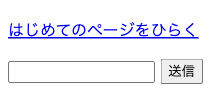

# リンクとフォーム部品

リンクと入力欄を置いて、ページに部品を増やします。

## リンクのしくみ

Web ページの中の青い文字を押すと、別のページに移ります。この押せる文字は `<a>` というタグで作ります。

```html
<a href="index.html">はじめてのページ</a>
```

`<a>` の中に書き足した `href` が、押したときの行き先です。はさんだ「はじめてのページ」が画面に出て、押せる文字になります。見た目の指示をしなければ、青い文字に下線が付いた形で表示されます。

行き先の書き方は2通りあります。同じフォルダに並んでいるファイルは、`index.html` のように名前だけを書きます。外にあるページなら、`https://github.com` のように `https://` から始まるアドレスをまるごと書きます。

## フォームの部品

ページを開いて読むだけなら、ここまでのタグで足ります。こちらから文字を送るには、打ち込む場所と、送る合図を出すボタンが要ります。この2つと、それをまとめる箱の3つを組み合わせます。

| 書き方 | 役割 |
|---|---|
| `<form>` | 送るものをひとまとめにする箱 |
| `<input>` | 文字を打ち込む欄 |
| `<button>` | 押すボタン |

```html
<form>
  <input type="text">
  <button>送信</button>
</form>
```

`<input>` には終わりのタグがありません。1つで完結するタグです。中に書いた `type="text"` は、「文字を打つ欄にする」という指定です。`<button>` のほうは、はさんだ文字がそのままボタンの中に出ます。

このセクションで置くのは、部品の見た目までです。打った文字がどこに届くかは、チャットをつくる章で決めます。

## 実践: リンクと入力欄を置く

前のセクションで作った `profile.html` に書き足していきます。足すのは2か所です。まずリンクを1行、そのあとに入力欄とボタンを4行足します。

プレビューのタブを閉じてしまったときは、前のセクションと同じ手順で開き直せます。どちらも足すとプレビューの見た目が変わるので、中断して戻ったときは、プレビューを見ればどこまで足したか分かります。

1つめはリンクです。`</ul>` の行のすぐ下に、次の1行を足してください。`</body>` の行は、下にずれます。

```html title="practice/profile.html"
  <p><a href="index.html">はじめてのページをひらく</a></p>
```

`index.html` は、はじめて中身を書き換えたページです。`profile.html` と同じ `practice` の中に並んでいるので、名前だけで行き先が決まります。プレビューのタブに切り替えると、青い下線の付いた文字が増えています。押すと、そのページに移ります。ブラウザの戻るボタンを押せば、自己紹介のページに戻れます。

`href` を囲む `"` は半角です。全角の `”` で打つと、見た目は同じリンクになりますが、押しても行き先が見つかりません。そのときは、この `"` を半角で打ち直してください。

2つめは入力欄とボタンです。いま足したリンクの行のすぐ下に、次の4行を足してください。`</body>` の行は、下にずれます。

```html title="practice/profile.html"
  <form>
    <input type="text">
    <button>送信</button>
  </form>
```

プレビューのタブに、四角い入力欄と「送信」と書かれたボタンが並びます。入力欄の中を押すと、文字を打ち込めます。



入力欄に何か打ってから、「送信」を押してみてください。

!!! warning "注意"

    このボタンを押すと、画面がいったん読み込み直されて、打った文字が消えます。アドレスの末尾に `?` も付きます。送り先をまだ決めていないので、これで正常です。打った文字は、どこにも届いていません。

打った文字が本当に届くようにするには、送り先と、受け取ったあとの置き場所が要ります。どちらもチャットをつくる章で用意します。

**確認**: プレビューのタブに、青い下線の付いた文字と、四角い入力欄と「送信」のボタンが並びます。

## まとめ

- `<a>` に `href` で行き先を書くと、はさんだ文字が押せるリンクになる
- 文字を送る部品は `<form>` `<input>` `<button>` の3つで作る
- 送り先を決めていないので、ボタンを押すと画面が読み込み直され、入力欄が空になる

次のセクションでは、CSS を書いて、文字の色と大きさ、それに余白を変えます。あわせて、タグに `class` で名前をつけ、その名前をつけたところだけに見た目を割り当てるしくみも扱います。
