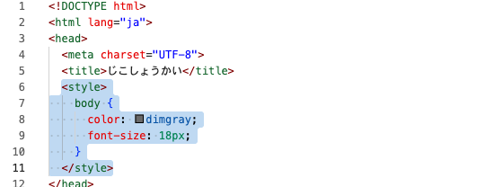
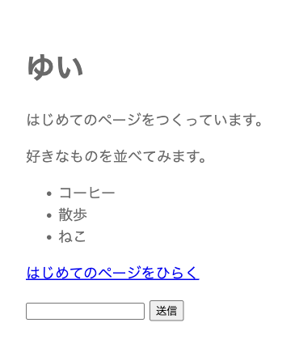
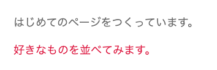

# CSS で飾る

色と大きさと余白を変えて、ページの見た目を整えます。

## CSS とは

ここまでで、見出しと文章と箇条書き、リンクと入力欄が並びました。ただ、色と大きさと余白は、ブラウザが決めたままです。ここを自分で決めるのが CSS です。

CSS は、「どこを」「どうする」の組で書きます。

```css
h1 {
  color: navy;
}
```

`h1` が「どこを」で、`{` と `}` にはさまれた中が「どうする」です。`color` が変えたい項目の名前、`navy` がその値です。1行の終わりには `;` を付けます。

色は名前で指定できます。`navy` は紺、`crimson` は濃い赤、`teal` は青緑、`darkorange` はオレンジです。

この CSS は、`profile.html` の `<head>` の中に `<style>` ではさんで書きます。

## class のしくみ

`h1` のように書くと、ページの中の `<h1>` がすべて同じ見た目になります。ただ、同じタグのうち1か所だけ色を変えたいこともあります。

そのときは、HTML 側でそのタグに名前をつけます。

```html
<p class="intro">この行だけ色を変えたい</p>
```

`class` のうしろに書いた `intro` が、この行につけた名前です。名前は自分で決められます。

CSS 側では、その名前の頭に `.` を付けて「どこを」に書きます。

```css
.intro {
  color: crimson;
}
```

## 実践: 色と余白を変える

前のセクションで書き足した `profile.html` を、そのまま使います。

### Step 1: 文字の色が変わる

`<title>` の行のすぐ下に、次の6行を足してください。`</head>` の行は、下にずれます。

```html title="practice/profile.html"
  <style>
    body {
      color: dimgray;
      font-size: 18px;
    }
  </style>
```

`body` と書くと、`<body>` と `</body>` にはさまれたところ全体が対象になります。`dimgray` は濃い灰色です。`font-size` は文字の大きさで、`18px` の `px` が単位です。数を大きくすると、文字も大きくなります。

プレビューのタブに切り替えると、見出しと文章と箇条書きの色が灰色になり、文字も少し大きくなっています。リンクの色や、入力欄と「送信」の文字は変わりません。ブラウザがはじめから見た目を決めているためです。

色を `navy` などに変えて、変わり方を試してみてください。この先のコードも `dimgray` で書いてあるので、その1語を自分の色に直せば、気に入った色のまま進められます。

!!! warning "注意"

    書いた CSS が、そのまま文字として画面に出てしまうことがあります。`<style>` と `</style>` の行ごと入っているか、その `<` と `>` が全角になっていないかを見てください。

### Step 2: 余白が空いて読みやすくなる

いまは、文字がページのふちのすぐそばから始まっています。まわりに余白を空けます。

ここからは、いま書いたところを新しい内容に入れ替えます。まず、次のコードの右上のボタンを押してコピーしてください。

```html title="practice/profile.html"
  <style>
    body {
      color: dimgray;
      font-size: 18px;
      padding: 24px;
    }
  </style>
```

コピーできたら、入れ替える範囲を選びます。`<style>` の行の先頭から `</style>` の行の末尾まで、マウスでなぞってください。先頭を押したあと、末尾を `Shift` キーを押しながら押しても同じです。選べた範囲には色が付きます。



色が付いたら、`Ctrl` キーと `V` キーを同時に押して貼り付けます（Mac では `command` キーと `V` キーです）。選んだところが入れ替わるので、先に消す必要はありません。書き換えるときは毎回この順番で、`<style>` から `</style>` までをまるごと入れ替えます。

!!! info "ポイント"

    違うところに貼ってしまったときは、`Ctrl` キーと `Z` キーを同時に押すと、ひとつ前にもどります（Mac では `command` キーと `Z` キーです）。何度か押せば、貼る前の状態まで戻せます。消したファイルはもどせませんが、書き換えたところはこれでやり直せます。

入れ替える前と見比べると、増えているのは `padding` の1行だけです。`padding` は内側に空ける余白で、`24px` ぶんの幅がふちとの間に空きます。

行の終わりの `;` を書き忘れると、その行と、すぐ下の1行が効かなくなります。表示が変わらないときは、ここを見てください。



### Step 3: class をつけた部分だけ見た目が変わる

`<h1>` の下に並んだ2つの文章のうち、下の行の `<p` のうしろに半角の空白を空けて、`class="intro"` と書き足してください。下は書き足したあとの見本です。まるごと貼らずに、`class="intro"` の部分だけを足します。

```html
  <p class="intro">好きなものを並べてみます。</p>
```

つぎに CSS 側です。さきほどと同じやり方で入れ替えてください。

```html title="practice/profile.html"
  <style>
    body {
      color: dimgray;
      font-size: 18px;
      padding: 24px;
    }
    .intro {
      color: crimson;
    }
  </style>
```

プレビューのタブでは、名前をつけた文章だけが濃い赤になり、すぐ上の文章は灰色のままです。

色が変わらないときは、HTML 側の `class="intro"` と CSS 側の `.intro` を見比べて、`.` の有無とつづりを確かめてください。



**確認**: プレビューのタブで、見出しと文章と箇条書きの色と大きさが変わり、まわりに余白が空きます。名前をつけた1つの文章だけ、別の色になっています。

## まとめ

- CSS は「どこを」「どうする」の組で書き、`<head>` の中の `<style>` にまとめる
- `color` で文字の色、`font-size` で文字の大きさ、`padding` でまわりの余白が変わる
- タグに `class` で名前をつけ、CSS 側で `.名前` と書くと、そこだけ見た目が変わる

CSS の項目名は数え切れないほどありますが、全部を覚える必要はありません。読んで意味が分かれば足ります。このあとつくるチャットの画面でも、吹き出しの色やまわりの余白は CSS が決めています。そこでは見た目の指示をもっと短い名前で書ける道具を使いますが、決めていること（色・大きさ・余白）は同じです。CSS が読めれば、その短い名前も読めます。

次のセクションでは、この章で学んだタグと CSS を組み合わせて、自分の自己紹介のページを仕上げます。
