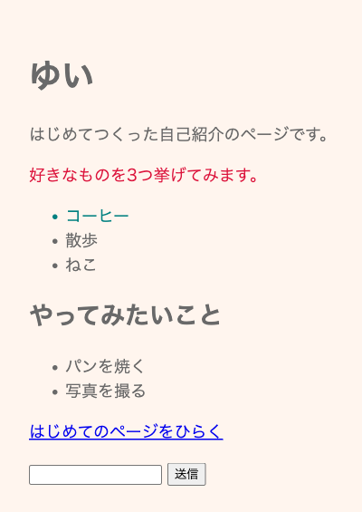

# 自己紹介ページをつくろう

**このハンズオンで使う機能**: 見出し・段落・箇条書き・リンク・入力欄・CSS（この章でやったこと）

学んだタグと CSS を組み合わせて、自分の自己紹介のページを仕上げます。



## つくる前の確認

- `practice` の中に `profile.html` がある
- プレビューに、見出し・文章・点付きの箇条書き・リンク・入力欄が並んでいる
- `<head>` の中に `<style>` があり、文字の色と余白が変わっている

先を急いでいるときは、このセクションを飛ばしても、途中でやめてもかまいません。このあとのチャットづくりには影響しません。ただし、いちばん下にある保存の儀式だけは、飛ばさずに済ませてください。

## 実践: 自己紹介ページを仕上げる

前のセクションまでで書いた `profile.html` を、そのまま使います。新しく覚えるタグは `<h2>` の1つだけで、あとは中の言葉と色を自分のものに置き換えていきます。

書き始める前に、編集エリアのタブの名前が `profile.html` になっているか見てください。`index.html` のままだと、そちらが変わってしまいます。

### Step 1: 名前と見出しが並ぶ

`<body>` のすぐ下は、いまこうなっています。中の言葉は人によって違います。ここは打たずに、自分の画面と見比べてください。

```html
  <h1>ゆい</h1>
  <p>はじめてのページをつくっています。</p>
  <p class="intro">好きなものを並べてみます。</p>
```

`<h1>` の名前はそのままでかまいません。自分の名前になっていなければ、ここで直してください。2つの `<p>` の文章を、自分のことを表す言葉に打ち直してください。下の2行は書き換えたあとの見本です。まるごと貼らずに、タグにはさまれた文章だけを置き換えます。

```html
  <p>はじめてつくった自己紹介のページです。</p>
  <p class="intro">好きなものを3つ挙げてみます。</p>
```

`<head>` の中の `<title>` を自分の名前にすると、ブラウザのタブの表示も変わります。変えなくてもかまいません。

### Step 2: 好きなものがリストで出る

いま並んでいる3つの `<li>` の中身を、自分の好きなものに書き換えてください。

つぎに、別のテーマの箇条書きをもうひとまとまり足します。`</ul>` の行のすぐ下に、次の5行を入れてください。いまそこにあるリンクの行は、下にずれます。入れたあとで、見出しと2行の中の言葉を自分のものに直してください。

```html title="practice/profile.html"
  <h2>やってみたいこと</h2>
  <ul>
    <li>パンを焼く</li>
    <li>写真を撮る</li>
  </ul>
```

`<h2>` は、ここではじめて出てくるタグです。`<h1>` はふつう1ページで1つだけにして、2つめからの見出しには `<h2>` を使います。数字が大きくなるほど、小さい見出しになります。

!!! warning "注意"

    箇条書きを足すときは、`<ul>` から `</ul>` までをひとまとまりで書いてください。`<li>` の行だけがその外に出ると、その行だけ行頭が左にずれます。

### Step 3: 色と余白が整って読みやすくなる

最後に見た目を整えます。`<style>` から `</style>` までを、次の内容にまるごと置き換えてください。前のセクションで色を変えた場合は、貼ったあとで `dimgray` を自分の色名に直せば、その色のまま進められます。

```html title="practice/profile.html"
  <style>
    body {
      color: dimgray;
      font-size: 18px;
      padding: 24px;
      background-color: seashell;
    }
    .intro {
      color: crimson;
    }
    .pickup {
      color: teal;
    }
  </style>
```

足したのは、ページの背景の色を決める `background-color` の行と `.pickup` の3行です。`seashell` は白に近いうすい色です。

`pickup` は、まだどこにも付けていない名前です。箇条書きの中からいちばん好きな行を1つ選び、その `<li` のうしろに半角の空白を空けて `class="pickup"` と書き足してください。

下の1行は書き足したあとの見本です。まるごと貼らずに、`class="pickup"` の部分だけを足します。

```html
    <li class="pickup">コーヒー</li>
```

プレビューのタブに切り替えると、選んだ行だけが青緑になります。

ここから先は、好きな見た目に変えてかまいません。`<style>` の中で書き換えられるのは次の4つです。

| 項目名 | 変えると |
|---|---|
| `color` | 文字の色が変わる |
| `font-size` | 文字の大きさが変わる |
| `padding` | まわりの余白が変わる |
| `background-color` | 背景の色が変わる |

色名はほかにもあります。色を変えたのに表示が変わらないときは、つづりを見てください。つづりが違うと、エラーは出ないままブラウザがその1行を読み飛ばします。

!!! note "補足"

    このページが見えるのは作業部屋のプレビューの中だけで、自分のスマートフォンからは開けません。外から開けるようにするのは、チャットが動くようになってからです。

## 完成チェックリスト

- `profile.html` のプレビューに、自分の名前が大きな見出しで表示される
- 好きなものが点付きの箇条書きで並んでいる
- 2つめの箇条書きの上に、`<h2>` の見出しが名前より小さい文字で出ている
- 文字の色と余白が変わり、名前をつけた部分だけ別の色になっている

## まとめ

- `<h1>` はふつう1ページで1つだけ。2つめからの見出しには `<h2>` を使う
- 箇条書きを足すときは、`<ul>` から `</ul>` までをひとまとまりで書く
- `<style>` の中の色や余白の値を変えると、HTML はそのままで見た目が変わる

今日は、文字にタグで意味を付け、リンクと入力欄を置き、CSS で色と大きさと余白を決めました。自分の言葉で書いたページが1枚、作業部屋に残りました。あとから開いて書き足すこともできます。

最後に、今日の分を記録して終わりましょう。前の章で覚えた保存の儀式の手順で、変更を残しておいてください。このあとのチャットづくりは別のファイルで進めるので、ここで作ったページに手を入れる必要はありません。

次の章では、画面をつくる HTML に続いて、動きをつくる言語にふれます。PHP という、サーバー側で働く言語です。このあとチャットをつくるときに使う Laravel も、中身は PHP でできています。ここで覚えたタグと CSS は、そのチャットの画面でもそのまま使うので、一から覚え直すことはありません。
