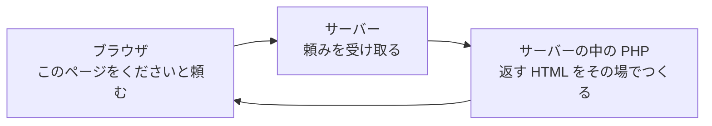

# プログラミング言語 PHP

画面をつくる HTML に続いて、動きをつくる言語にふれます。

この章は6つのセクションでできています。PHP のファイルをつくって動かすところから始めて、変数・くり返し・条件分岐と、書き方を1つずつ増やしていきます。

| セクション | テーマ | 種類 |
|---|---|---|
| プログラミング言語 PHP | どんな言語で、どこで働くのか | 読む |
| ターミナルで PHP を動かす | PHP のファイルをつくって、ターミナルから動かす | 手を動かす |
| 変数と計算 | 値に名前をつけて置いておき、組み合わせて表示する | 手を動かす |
| リストとくり返し | いくつもの値をまとめて持ち、順に取り出して並べる | 手を動かす |
| 条件分岐 | 送った人によって表示を変える | 手を動かす |
| ミニプログラムをつくろう | 学んだ書き方を組み合わせて1本仕上げる | 手を動かす |

**この Chapter の進め方**: このセクションは読むだけです。残りの5つでは、PHP のファイルを1本ずつつくって、ターミナルから動かします。結果が出るのはブラウザではなくターミナルなので、文字が並ぶだけの画面が続きますが、ここで打つ例はどれも、このあとチャットの画面に並べる形です。

!!! note "補足"

    ここに出てくるコードは、しくみを見るための例です。実際に打つのは次のセクションからです。

## PHP とは

前の章で書いた HTML のページは、開き直しても毎回同じものが表示されます。書いたものがそのまま届くので、自分で書き換えないかぎり中身は変わりません。ところがチャットは、開くたびに中身が違っていないと成り立ちません。誰かが送ったメッセージは、次に開いたときに増えています。

この「届けるものをその場でつくる」役目を持つのが PHP です。コンピュータへの指示を書くための言葉で、こうした言葉をプログラミング言語と呼びます。HTML と CSS に続く、3つめの言葉です。

PHP は、たとえばこう書きます。

```php
echo 'こんばんは';
```

画面に「こんばんは」と出す、という指示です。PHP なら、この出す文字を、時刻や送られてきた内容によって変えられます。

## PHP が働く場所

PHP が動くのは、サーバーの中です。



前の章で見た往復に、ひとつ足しただけです。頼みを受けたサーバーは、返すものを PHP につくらせます。できあがったものが、ブラウザへ返ります。

ブラウザに届くのは、PHP そのものではありません。届くのは、PHP がつくった HTML です。ブラウザは、いつもどおり HTML を受け取って表示しているだけです。変わっているのは、その中身です。

チャットをつくるときに使う Laravel も、このサーバーの中で働きます。中身は PHP なので、この章で覚える書き方が、そのまま出てきます。

この章では、サーバーを用意せずに進めます。書いた PHP をターミナルから直接動かして、結果を確かめます。文字が出るのはブラウザではなく、ターミナルです。サーバーの上で動かすのは、チャットをつくりはじめてからです。

## まとめ

- HTML と CSS は書いたものがそのまま届き、PHP はサーバーの中で届けるものをその場でつくる
- ブラウザに届くのは PHP そのものではなく、PHP がつくった HTML
- このあと使う Laravel も中身は PHP なので、ここで覚えた書き方がそのまま出てくる

次のセクションでは、PHP のファイルをひとつつくり、ターミナルから動かして、画面に文字を出します。
