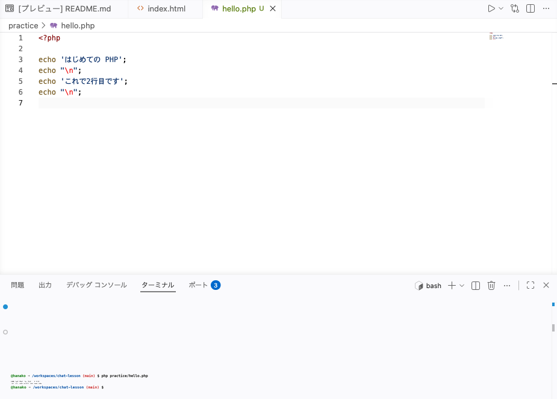

# ターミナルで PHP を動かす

PHP のファイルをつくって、ターミナルから動かします。

## PHP ファイルのきまり

前のセクションで見た `echo 'こんばんは';` は、書く場所を決めないと動かせません。PHP は決まった形のファイルに書いて、そのファイルをターミナルから動かします。

ファイルの名前は `.php` で終えます。HTML のページを `.html` で終えたのと同じで、中身が PHP だという印です。そして1行目には `<?php` と書きます。「ここから先は PHP です」という合図です。

画面に文字を出すのは `echo` です。出したい文字を `'` ではさんで、うしろに書きます。1つの指示の終わりには `;` を付けます。CSS で1行の終わりに `;` を付けたのと同じ区切りです。

## 実践: 画面に文字を出す

!!! success "確認"

    自分の GitHub のページから作業部屋を開いてください（「Code」→「Codespaces」）。今日は、ターミナルの表示が `/workspaces/chat-lesson` になっているところから始めます。画面の下にターミナルが見えないときは、はじめてターミナルに触れたときと同じ手順で開き直せます。

左のファイル一覧で `practice` を右クリックして「新しいファイル...」を選び、`hello.php` と打って Enter を押してください。名前は半角の小文字です。

中央の編集エリアに空のファイルが開きます。次の内容を入れてください。

```php title="practice/hello.php"
<?php

echo 'はじめての PHP';
```

`'` を打つと、閉じるほうの `'` が自動で足されます。壊れたわけではありません。足されたものはそのままにして、見本のとおり最後まで打ってください。閉じるほうの `'` を自分で打つと、足された `'` の右へカーソルが進むだけなので、`'` が2つ並ぶことはありません。打ち終わったら見本と見比べて、万一どこかの記号が増えていたら、その1文字を消してください。

`<?php` の下の空の行は、読みやすくするためのものです。

ここからはターミナルで動かします。ターミナルの表示が `/workspaces/chat-lesson` になっていることを確かめてから、次のコマンドを打ちます。違う場所にいたら `cd /workspaces/chat-lesson` で戻ってください。

```bash
php practice/hello.php
```

`php` は「この PHP のファイルを動かして」と頼むコマンドです。うしろに書くのは、動かしたいファイルの住所です。`practice` の中の `hello.php` を指しています。

!!! failure "よくあるエラー"

    打ったファイルが見つからないと、次のように返ってきます。

    ```text
    Could not open input file: practice/helo.php
    ```

    **原因**: ファイルの名前か、前に付ける `practice/` が違っています。

    **対処法**: 左のファイル一覧に見えている名前と1文字ずつ見比べて、打ち直してください。

    わざと打ち間違えて読んだ `bash:` から始まる形とは、言葉の並びが違います。PHP から返る言葉は形がいくつかあるので、そのつど読み方を確かめていきます。

うまくいくと、次のように出ます。

```text
@hanako ➜ /workspaces/chat-lesson (main) $ php practice/hello.php
はじめての PHP@hanako ➜ /workspaces/chat-lesson (main) $
```

`はじめての PHP` のうしろに、次の文字を打つための行がそのままくっついて出ます。失敗ではありません。`echo` は書いた文字をそのまま出すだけなので、行を変える指示がないとこうなります。

その指示を足します。まず、次のコードの右上のボタンを押してコピーしてください。

```php title="practice/hello.php"
<?php

echo 'はじめての PHP';
echo "\n";
echo 'これで2行目です';
echo "\n";
```

コピーできたら、`hello.php` に書いた中身を、いちばん上の行の先頭からいちばん下の行の末尾までなぞって選び、そこへ貼り付けます。

`echo "\n";` が、行を変える合図です。この形のまま書いてください。`echo` は何回でも書けて、書いた順に上から出ます。

同じ場所（`/workspaces/chat-lesson`）で、もう一度同じコマンドを打ちます。

```bash
php practice/hello.php
```

```text
はじめての PHP
これで2行目です
```

!!! warning "注意"

    行が分かれず、`\n` や `¥n` が文字のまま画面に出ることがあります。どちらもエラーは出ません。

    `\n` が出たときは、`'` ではさんで打っています。行を変える合図は `"` ではさむ形です。`echo "\n";` のとおりに打ち直してください。

    `¥n` が出たときは、`\` のつもりで円記号の `¥` を打っています。`\` のキーは、キーボードによっては `¥` と書かれています。そのキーで `\` を出す打ち方は、Mac と Windows で違います。Mac は `option` を押しながらそのキーを打ちます。Windows は日本語入力を切り、半角の状態でそのキーを打ちます。

1行目の `<?php` を書き忘れると、エラーは出ないまま、書いたものがそのまま画面に出ます。動いていないように見えるときは、1行目も見てください。



**確認**: `php practice/hello.php` と打つと、`はじめての PHP` と `これで2行目です` が2行に分かれて表示されます。

## まとめ

- PHP のファイルは名前を `.php` で終え、1行目に `<?php` と書く
- 画面に文字を出すのは `echo` で、出したい文字を `'` ではさみ、終わりに `;` を付ける
- `php practice/hello.php` のようにファイルの住所を付けて打つと、そのファイルが動く

次のセクションでは、値に名前をつけて入れておく変数を使います。名前や数を変数に入れ、文字をつなげたり計算したりして、その結果を表示します。
