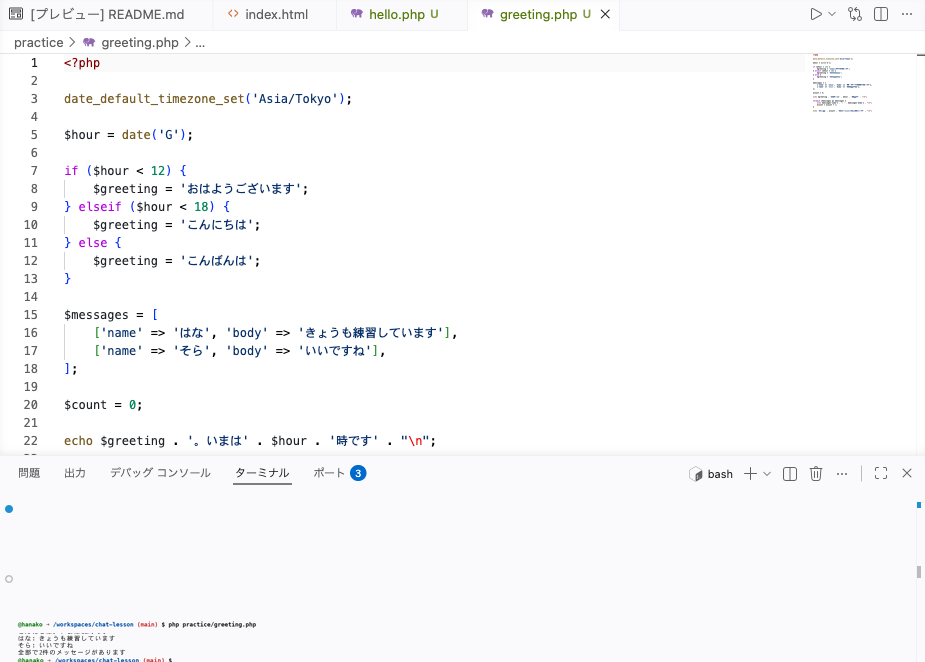

# ミニプログラムをつくろう

**このハンズオンで使う機能**: 変数・リスト・くり返し・条件分岐（この章でやったこと）

学んだ書き方を組み合わせて、小さなプログラムを1本仕上げます。



## つくる前の確認

- 作業部屋が開いていて、ターミナルの表示が `/workspaces/chat-lesson` になっている
- `practice` の中に、前のセクションまでで作った PHP のファイルが並んでいる
- `php practice/talk.php` と打つと、会話が3行表示される

動かした時刻によって挨拶が変わり、そのあとに会話と件数が並ぶプログラムをつくります。会話をくり返しで並べ、条件で表示を分ける組み立ては、このあとチャットの画面をつくるときにも同じ形で出てきます。

時間が足りないときは飛ばしてかまいません。ここで作るファイルを、このあとのチャットづくりで使うことはありません。飛ばすときも、いちばん下にある保存の儀式だけは済ませて、今日の分を残しておいてください。

## 実践: 時間で挨拶が変わるプログラム

左のファイル一覧で `practice` を右クリックして「新しいファイル...」を選び、`greeting.php` と打って Enter を押してください。

!!! warning "注意"

    書き始める前に、中央の編集エリアのタブに出ている名前が `greeting.php` になっているか見てください。前のセクションのファイルを開いたまま打つと、そちらの中身が変わってしまいます。

### Step 1: いまの時刻が出る

まず、いまが何時かを画面に出します。開いた空のファイルに、次の内容を入れてください。

```php title="practice/greeting.php"
<?php

date_default_timezone_set('Asia/Tokyo');

$hour = date('G');

echo 'いまは' . $hour . '時です' . "\n";
```

`date('G')` と書くと、いまが何時かを 0 から 23 までの数で受け取れます。かっこの中の `'G'` が「時を受け取る」という合図で、日付や分にはまた別の文字が決まっています。受け取った数には `$hour` という名前をつけてあります。

その上の `date_default_timezone_set('Asia/Tokyo');` は、日本の時刻で考えてもらうための1行です。これがないと、いまの時刻とずれた数が出ます。

同じ場所（`/workspaces/chat-lesson`）で動かします。

```bash
php practice/greeting.php
```

出力例です（実行した時刻によって変わります）。

```text
いまは4時です
```

### Step 2: 時間帯で挨拶が変わる

受け取った時刻を条件にして、挨拶を選びます。前のセクションで読む例として見た `elseif` と、より小さいことを確かめる `<` を、ここで実際に打ちます。`greeting.php` を次の内容にまるごと置き換えてください。

```php title="practice/greeting.php"
<?php

date_default_timezone_set('Asia/Tokyo');

$hour = date('G');

if ($hour < 12) {
    $greeting = 'おはようございます';
} elseif ($hour < 18) {
    $greeting = 'こんにちは';
} else {
    $greeting = 'こんばんは';
}

echo $greeting . '。いまは' . $hour . '時です' . "\n";
```

同じ場所（`/workspaces/chat-lesson`）で、もう一度打ちます。

```bash
php practice/greeting.php
```

出力例です（実行した時刻によって変わります）。下は 4時に動かしたときのものです。

```text
おはようございます。いまは4時です
```

`$hour` が 12 より小さければ朝、18 より小さければ昼、どちらにも当てはまらなければ夜の挨拶が `$greeting` に入ります。`echo` の行は1つだけで、出る言葉は `$greeting` の中身によって変わります。

`12` や `18` の数を変えて動かすと、挨拶の切り替わる時間が変わります。

!!! warning "注意"

    表示される時刻が実際とずれたり、夜に動かしたのに `おはようございます` と出たりすることがあります。

    **原因**: 先頭の `date_default_timezone_set('Asia/Tokyo');` の行が抜けています。

    **対処法**: この1行を、`<?php` の行のすぐ下に戻してください。

### Step 3: 会話のリストと組み合わさる

最後に、挨拶のあとへ会話を並べて、その件数を数えます。`greeting.php` を次の内容にまるごと置き換えてください。

```php title="practice/greeting.php"
<?php

date_default_timezone_set('Asia/Tokyo');

$hour = date('G');

if ($hour < 12) {
    $greeting = 'おはようございます';
} elseif ($hour < 18) {
    $greeting = 'こんにちは';
} else {
    $greeting = 'こんばんは';
}

$messages = [
    ['name' => 'はな', 'body' => 'きょうも練習しています'],
    ['name' => 'そら', 'body' => 'いいですね'],
];

$count = 0;

echo $greeting . '。いまは' . $hour . '時です' . "\n";

foreach ($messages as $message) {
    echo $message['name'] . ': ' . $message['body'] . "\n";
    $count = $count + 1;
}

echo '全部で' . $count . '件のメッセージがあります' . "\n";
```

同じ場所（`/workspaces/chat-lesson`）で、もう一度打ちます。

```bash
php practice/greeting.php
```

出力例です（実行した時刻によって1行目が変わります）。

```text
おはようございます。いまは4時です
はな: きょうも練習しています
そら: いいですね
全部で2件のメッセージがあります
```

件数を数えているのが `$count` です。はじめに `0` を入れておき、くり返しのたびに `$count = $count + 1;` で1を足します。`=` は「左に右を入れる」印なので、いまの `$count` に1を足したものを、あらためて `$count` に入れ直しています。

ここから先は、好きなように変えてかまいません。`$messages` に1件書き足すと、並ぶ行も、いちばん下の件数も増えます。

## 完成チェックリスト

- `php practice/greeting.php` と打つと、いまの時刻に合った挨拶が1行目に表示される
- そのあとに、送った人の名前を付けた会話が2行並んでいる
- いちばん下の行に、並んだ会話の件数が表示される

## まとめ

- 時刻のように動かすたびに変わる値も、変数に入れれば同じように扱える
- 条件で選んだ言葉を変数に入れておくと、そのあとの `echo` は1つで済む
- くり返しの中で1ずつ足していくと、並べたものの件数を数えられる

この章では、PHP のファイルをつくってターミナルから動かしました。変数に値を入れ、リストを `foreach` で並べ、`if` を使って表示を分けました。`practice` の中に、自分で打って動かしたファイルが並んでいます。

入門編では、HTML でページの骨組みを書き、CSS で見た目を決め、PHP で動きをつくりました。チャットをつくるための材料は、これでそろいました。

最後に、今日の分を記録して終わりましょう。準備編で覚えた保存の儀式の手順で、変更を残しておいてください。

次の章から、いよいよチャットづくりに入ります。Laravel という道具箱を使って、チャットらしい見た目の画面が出るところまで進みます。中身は PHP なので、ここで覚えた書き方がそのまま出てきます。
