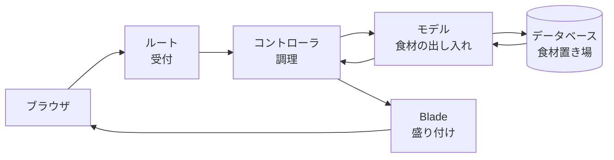

# Laravel とは

ここからチャットづくりに入ります。今日は、チャットらしい見た目の画面が出るところまで進みます。その前に、これから使う道具の全体像をつかんでおきましょう。

この章は5つのセクションでできています。Laravel の土台を生み出してから、URL と画面をひとつずつ足していきます。

| セクション | テーマ | 種類 |
|---|---|---|
| Laravel とは | これから使う道具の全体像と4つの役割 | 読む |
| プロジェクトをつくる | コマンド1つでチャットアプリの土台を生み出す | 手を動かす |
| はじめてのルート | どの URL でどの画面を出すかを決める | 手を動かす |
| Blade で画面をつくる | 画面のファイルに、プログラムから渡した値を出す | 手を動かす |
| チャット画面の器をつくる | 仮の会話が吹き出しで並ぶ画面を組み立てる | 手を動かす |

**この Chapter の進め方**: このセクションは読むだけです。残りの4つでは、実際にファイルを書いて、そのつどブラウザで結果を確かめます。

## フレームワークとは

Laravel は、Web アプリケーションをつくるための道具箱です。こうした道具箱をフレームワークと呼びます。

前の章では、PHP でプログラムを書いて、ターミナルから動かしました。ただ、それだけで Web アプリケーションをつくろうとすると、やることが一気に増えます。ブラウザからの注文を受け取るしくみ、注文の内容によって処理を振り分けるしくみ、データを保存するしくみ。どれも自分で書くとなると、それだけで何日もかかります。

Laravel には、そうしたよく使うしくみが最初からそろっています。あなたが書くのは、自分のアプリにしかない部分だけです。中身は PHP なので、前の章で覚えた書き方がそのまま通用します。

## 4つの役割分担

Laravel では、仕事を役割ごとに分けて書きます。

レストランにたとえると、こうなります。お客さん（ブラウザ）が注文を出すと、受付（ルート）がどの料理かを判断して、調理場（コントローラ）に回します。調理場は、必要な食材を食材係（モデル）に頼んで、食材置き場（データベース）から出してもらいます。できあがったものは盛り付け（Blade）をして、お客さんに返します。

食材置き場にあたるデータベースは、送られたメッセージを預けておく場所です。中を開けるのは次の章です。

チャットアプリでいうと、それぞれの役割はこうなります。

| 役割 | チャットでの仕事 |
|---|---|
| ルート | `/chat` を開いたら、チャット画面を出すと決める |
| コントローラ | 送られてきたメッセージを受け取って、保存を頼む |
| モデル | メッセージをデータベースに入れる、取り出す |
| Blade | 取り出したメッセージを、吹き出しの形に整えて表示する |

表にある `/chat` は、ブラウザのアドレスの末尾に付ける文字です。入門編で開いたファイルの名前とは別のもので、どんな文字にするかは、このあと自分で決められるようになります。

これから何日もかけて、この4つを1つずつ作っていきます。今日触るのは、表のいちばん上の「ルート」と、いちばん下の「Blade」です。

この分け方には MVC（エムブイシー）という呼び名が付いています。モデル・ビュー・コントローラの頭文字で、ビューにあたるのが Blade です。受付のルートは、この3文字には入っていません。プログラムを書く人どうしの会話でよく出てくる言葉なので、頭のすみに置いておくと、いつか役に立ちます。

!!! note "補足"

    いまは全体像だけつかめれば十分です。それぞれが何をするものかは、実際に自分で書くときに、その場で説明します。

## まとめ

- Laravel は、Web アプリケーションでよく使うしくみがそろった道具箱
- 中身は PHP なので、前の章で覚えた書き方がそのまま使える
- 仕事は4つの役割に分かれている（受付・調理・食材の出し入れ・盛り付け）

次のセクションでは、コマンドを1つ打ってチャットアプリの土台を生み出し、それを動かして、Laravel のようこそ画面をブラウザに出します。
