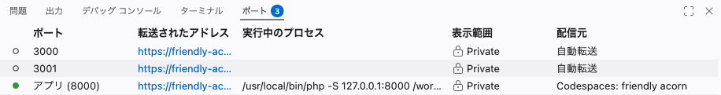
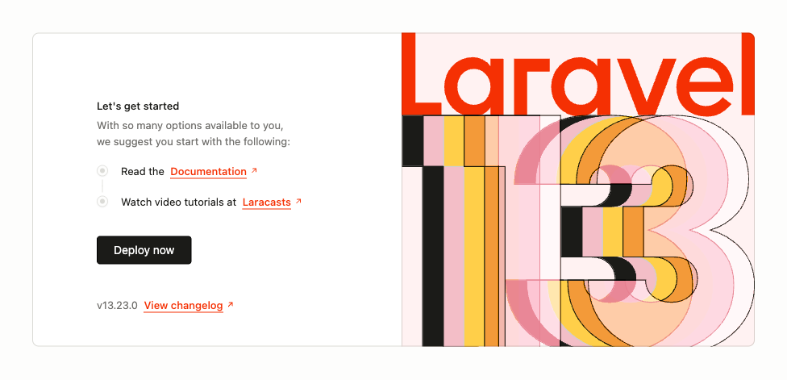

# プロジェクトをつくる

コマンドを1つ打って、チャットアプリの土台を生み出します。

!!! success "確認"

    自分の GitHub のページから作業部屋を開いてください（「Code」→「Codespaces」）。今日は、ターミナルの表示が `/workspaces/chat-lesson` になっているところから始めます。違う場所にいたら `cd /workspaces/chat-lesson` で戻ってください。

## コマンドでつくられるもの

Laravel のアプリは、フォルダとファイルの集まりです。どこに何を置くかは決まっていて、その決まりに沿った空っぽの一式を、コマンド1つで用意できます。

できあがるフォルダは何十個もあります。最初は圧倒されますが、これから使うのは次の3つだけです。

| フォルダ | 中身 |
|---|---|
| `routes` | どの URL でどの画面を出すかを書く場所 |
| `resources/views` | 画面のファイルを置く場所 |
| `app` | プログラムの本体を置く場所 |

残りは Laravel が自分で使うので、開かなくてかまいません。

## 実践: チャットアプリの土台をつくる

### Step 1: ファイル一式ができる

次のコマンドを、入門編と同じ場所（`/workspaces/chat-lesson`）で打ちます。長いので、コピーして貼り付けてかまいません。

```bash
composer create-project laravel/laravel chat-app
```

`composer` は、PHP の部品を集めてくる道具です。ここでは「Laravel 一式を集めて、`chat-app` という名前のフォルダに入れて」と頼んでいます。

英語の文字がたくさん流れます。長くても **1〜2分** で終わるので、そのまま待ってください。

終わった合図は2つあります。流れていた文字が止まって自分で打てる行にもどること、そして左のファイル一覧に `chat-app` が増えることです。最後はこう出ます（数字は打つたびに変わります）。

```text
   INFO  Running migrations.

  0001_01_01_000000_create_users_table ........................... 67.14ms DONE
  0001_01_01_000001_create_cache_table ........................... 34.71ms DONE
  0001_01_01_000002_create_jobs_table ............................ 37.87ms DONE

@hanako ➜ /workspaces/chat-lesson (main) $
```

見慣れない英語が並びますが、Laravel が最初にする準備です。できあがった `chat-app` は、入門編で使った `practice` の隣にできます。

```text
/workspaces/chat-lesson
├── README.md
├── chat-app
└── practice
```

これから触るのは `chat-app` の中だけです。

!!! warning "注意"

    文字が流れている間は、`Ctrl` キーと `C` キーを同時に押さないでください。途中で止まると `chat-app` は動かない状態で残ります。このあとの手順で `Fatal error` や英語の長い文字が出たら、途中で止まっています。

    止めてしまったかどうかは、左のファイル一覧では見分けられません。完成したときと同じ名前が並びます。やり直すときは、左のファイル一覧の `chat-app` を右クリックして「完全に削除」を選びます。作り直すので、消してかまいません。消したら同じコマンドを打ち直します。消さずに打ち直すと `is not empty.` と出て断られます。

### Step 2: ようこそ画面がブラウザに出る

できあがったフォルダに移動します。

```bash
cd chat-app
```

アプリを動かします。`artisan` は Laravel に付いてくる道具で、コマンドでアプリの操作を頼むときに使います。

```bash
php artisan serve
```

`INFO  Server running on [http://127.0.0.1:8000].` と表示されたら動いています。

数秒すると、画面の右下に小さな知らせが出ます。「ポート 8000 で実行されているアプリケーション (アプリ) は使用可能です。」という文と、「ブラウザーで開く」「公開用にする」の2つのボタンが入った枠です。10秒ほどで消えるので、見えているうちに左の「ブラウザーで開く」を押してください。右は押しません。


押しそこねても、あとから開けます。画面の右下のすみのベルのアイコンを押すと、同じ知らせがボタンごと残っています。

ベルの中にも見つからないときは、ターミナルの上に並んだタブから「ポート」を押してください。一覧が開き、`3000`・`3001`・`8000` の3行が並びます。3行はサーバーを動かす前からあり、動いている印は `8000` の行に付く緑の点です。その行を右クリックして「ブラウザーで開く」を選ぶと、同じ画面が開きます。



どちらでも新しいタブが開き、Laravel のようこそ画面が表示されます。「このページが見つかりません」と出たときは、少し待ってからページを再読み込みするか、「ポート」の一覧から開き直してください。



この画面が出れば、土台は完成です。これから毎日ここに手を入れていきます。

!!! warning "注意"

    表示された `http://127.0.0.1:8000` を、自分のブラウザのアドレス欄に打ち込んでも開けません。作業部屋の中だけで通じるアドレスです。ただしターミナルに出ているこの文字は押せます。押すと同じ画面が開きます。

### Step 3: 次に始めるときの手順をおぼえる

`php artisan serve` は、動かしている間ターミナルを占領します。止めたいときは、ターミナルをクリックして選んだ状態で `Ctrl` キーと `C` キーを同時に押してください（Mac でも `command` ではなく `Ctrl` です）。ファイル一式を集めている途中で押すと壊れますが、動いているサーバーを止めるのは正しい使い方です。

次にこの続きをするときは、この4つで始められます。

1. 自分の GitHub のページから作業部屋を開く（ターミナルが打てるまで1〜3分かかることがあります）
2. `cd chat-app` で移動する
3. `php artisan serve` で動かす
4. また出てくる知らせの「ブラウザーで開く」を押す（前のタブが残っていれば再読み込みでもかまいません。アドレスは日をまたいでも変わりません）

!!! failure "よくあるエラー"

    2つめを飛ばして `php artisan serve` を打つと、次の1行が返ります。

    ```text
    Could not open input file: artisan
    ```

    **原因**: ファイル名ではなく、いる場所が `chat-app` の1つ外です。入門編では同じ言葉が打ち間違いの合図でしたが、ここは場所のちがいです。`➜` はどちらの場合でも赤くなるので、見分けるには `ls` を打って、`artisan` が見えるかどうかを確かめます。

    **対処法**: `ls` と打って `chat-app` が見えたら、1つ外にいます。`cd chat-app` を打ってから `php artisan serve` を打ち直します。

この章から先は毎回この手順で始まるので、各章の最初にも書いておきます。

## 完成チェックリスト

- `chat-app` フォルダが左のファイル一覧にある
- `php artisan serve` を打つと `Server running` と表示される
- ブラウザに Laravel のようこそ画面が表示される

## まとめ

- Laravel のアプリは、決まった形のフォルダ一式としてコマンドで生み出せる
- 使うのは `routes`・`resources/views`・`app` の3つだけで、残りは開かなくてよい
- 動かすのは `php artisan serve`、止めるのは `Ctrl` + `C`

次のセクションでは、`routes` フォルダの中のファイルに自分のページを1つ足して、URL と表示の対応（ルート）を自分で決められるようにします。
