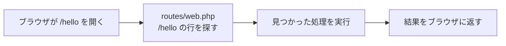
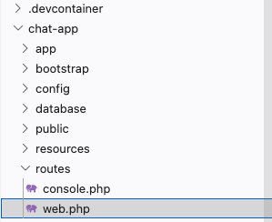
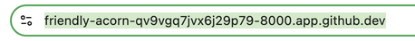

# はじめてのルート

どの URL でどの画面を出すかを、自分で決められるようにします。

## ルートとは

ルートは、URL と表示するものの対応表です。

前のセクションで開いた画面は、`/` という住所に対して「ようこそ画面を出す」と決められていたから表示されました。この対応を書いておく場所が `routes/web.php` で、ここに1行足せば、自分の好きな住所に好きなものを表示できます。

入門編ではファイルの場所を住所と呼びましたが、ここの住所はファイルの場所ではありません。`/hello` というファイルは作らず、対応表に1行足すだけです。



住所が対応表にないときは、白い画面に `404` と `Not Found` の文字だけが出ます。ページが見つからないという意味で、住所のつづりを打ち間違えたときにも同じ画面になります。

!!! note "補足"

    このあと出てくるコードには、まだ習っていない記号や書き方が混ざっています。`use` で始まる行や `::`、`function () {` の形がそれです。いまは意味が **分からなくてかまいません**。どれも Laravel の決まった書き方で、必要になったところで説明します。まずは形をそのまま写して、画面が変わることを確かめてください。

## 実践: 自分のページを追加する

前のセクションで動かした `php artisan serve` を、そのまま使います。止めてしまったときは、`cd chat-app` のあともう一度打ってください。

### Step 1: 対応表に `/hello` の行が増える

左のファイル一覧から `chat-app` を開き、その中の `routes` フォルダにある `web.php` を押します。中身は数行だけです。



`web.php` を次の内容にまるごと置き換えてください。上半分はもともと書かれている内容と同じなので、実際に増えるのは最後の `/hello` の部分だけです。

```php title="routes/web.php"
<?php

use Illuminate\Support\Facades\Route;

Route::get('/', function () {
    return view('welcome');
});

Route::get('/hello', function () {
    return 'はじめまして';
});
```

増えた3行が、`/hello` という住所に来たときの決まりです。`return` のうしろに書いたものが、そのまま画面に返ります。ターミナルに文字を出すときの `echo` にあたる書き方です。`function () {` と `}` の間に書いたことが、その住所を開いたときに動きます。いまは1行ですが、このあと何行も書き足します。

### Step 2: `/hello` に「はじめまして」が表示される

ブラウザで開いているアドレスの末尾に `/hello` を足します。`https://（あなたの作業部屋のアドレス）/hello` の形になります。

足し方には順番があります。アドレスの欄を1回押すと、いま入っている文字の全体に色が付きます。この状態のまま打つと、アドレスが打った文字にまるごと入れ替わり、検索の結果が出てしまいます。



色が付いたら、もう一度アドレスの右のはしを押してください。色が消えて、その位置から文字を足せる状態になります。そこで `/hello` と打って、Enter キーを押します。

アドレスがすでに `/` で終わっている場合は、その `/` を消してから `/hello` を足してください。

画面に「はじめまして」と表示されれば成功です。


!!! failure "よくあるエラー"

    記号を打ち間違えると、ブラウザの画面いっぱいに英語が出ます。`;` を1つ落としたときは、上から順に次のような文字が並びます。

    ```text
    Internal Server Error
    ParseError
    routes/web.php:11
    syntax error, unexpected token "}", expecting ";"
    ```

    **原因**: 入門編では、記号を落としたときの `Parse error` はターミナルに出ました。Laravel では出る場所がブラウザに移り、ターミナルには開いたページの記録が1行増えるだけで、エラーの言葉は出ません。また Laravel は、どのページを開くときも `routes/web.php` を先にまるごと読みます。そのため1文字崩れると、`/hello` だけでなくようこそ画面まで出なくなります。

    **対処法**: 4行は、上から順に「何かが失敗した合図」「エラーの種類（いちばん大きな文字）」「どのファイルの何行目か（小さな1行）」「エラーの中身」です。読むのは3行目からで、書かれている数字の行と、そのすぐ上の行の記号を見てください。入門編で覚えた読み方がそのまま使えます。直して開き直せば、出なくなっていたページも全部もどります。同じ症状は、困ったときに戻るページにも載せてあります。

### Step 3: 書き換えた文字が画面に出る

`return` のあとの文字を、好きな言葉に変えてみてください。書き換えたらブラウザに切り替えて、アドレスの左にある丸い矢印を押します。これが再読み込みで、この先「開き直す」と書いてあるのはこの操作です。書いた文字がそのまま画面に出ます。

入門編では、ファイルに書き足すとプレビューの表示もそのまま変わりました。`php artisan serve` で動かす画面はしくみが違い、自分で再読み込みするまで前の表示のままです。

これで、URL も、そこに出る文字も、自分で決められるようになりました。

**確認**: `/hello` を開くと、自分で書いた文字が表示されます。

## まとめ

- ルートは、URL と表示するものの対応表で、`routes/web.php` に書く
- `Route::get('住所', function () { ... });` の形で1つ足せる（`...` の場所に `return` の行が入る）
- 対応表にない住所を開いた場合は、ページが見つからない画面になる
- 書き間違えたときのエラーは、ターミナルではなくブラウザの画面いっぱいに出る

この形が分かれば、住所はいくつでも増やせます。いま作った `/hello` は練習のためのものです。そのまま残しておいてもかまいませんし、最後の3行を消せば元にもどります。

次のセクションでは、画面のファイルを別に用意して、ルートからそこへ変数を渡し、その値を画面に表示します。
