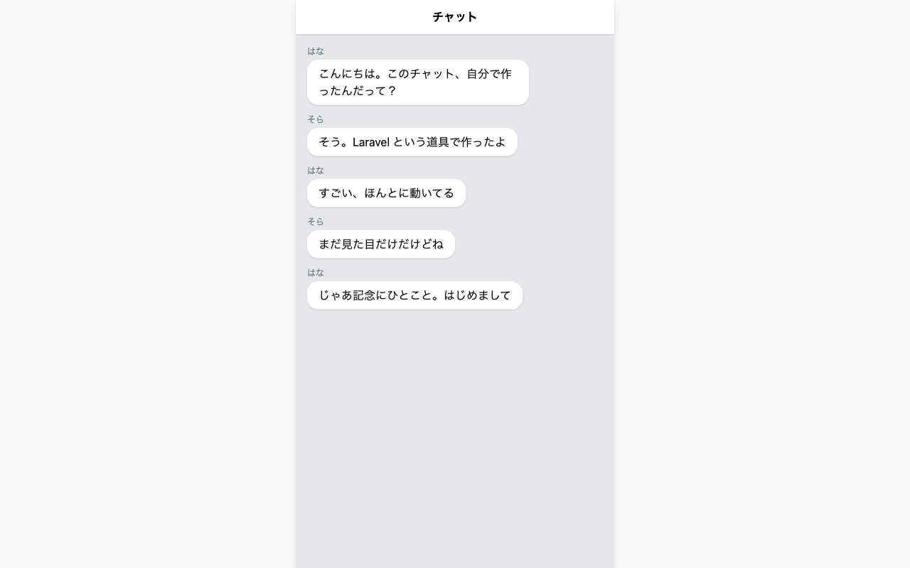
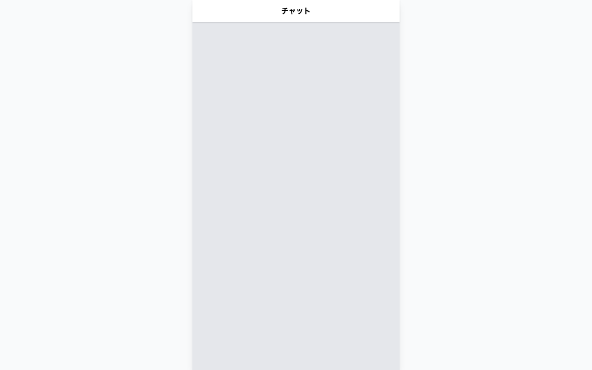
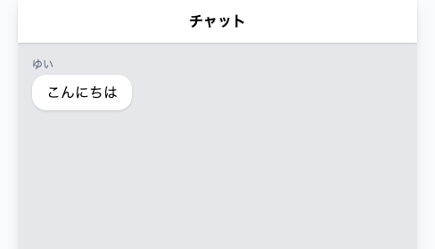

# チャット画面の器をつくる

**このハンズオンで使う機能**: ルート・Blade（この章でやったこと）、配列とくり返し（入門編でやったこと）

前のセクションまでで作ったものを組み合わせて、チャットらしい見た目の画面を作ります。



## つくる前の確認

- `chat-app` フォルダができていて、`php artisan serve` で動く
- `routes/web.php` に `/chat` のルートがある
- `resources/views/chat.blade.php` がある

## 実践: チャットらしい画面をつくる

`cd chat-app` を済ませ、`php artisan serve` が動いた状態から始めます。作業部屋を開き直したときは、この2つを先にやってください。

### Step 1: 画面の枠が出る

まず、見た目を整える道具を読み込みます。Tailwind CSS というもので、`class` に決まった名前を書くだけで色や余白が付きます。入門編で書いた CSS を、短い名前で呼び出せるようにしたものだと考えてください。

!!! note "補足"

    このあと貼るコードには、入門編では出てこなかったタグが並びます。`<div>` `<header>` `<main>` は、画面を区画に分けるためのものです。上の帯にあたるのが `<header>` で、その下の広い場所が `<main>` です。`<head>` の中の `<script>` は、さきほどの Tailwind を読み込む行です。その上の `<meta name="viewport">` は、スマートフォンで見たときの表示を整えます。`class` に並んでいる文字は、いまは読めなくてかまいません。読み方は、自分好みの色に変えるときあらためて説明します。

`resources/views/chat.blade.php` を開き、次の内容にまるごと置き換えてください。

```blade title="resources/views/chat.blade.php"
<!DOCTYPE html>
<html lang="ja">
<head>
  <meta charset="UTF-8">
  <meta name="viewport" content="width=device-width, initial-scale=1.0">
  <title>チャット</title>
  <script src="https://cdn.jsdelivr.net/npm/@tailwindcss/browser@4"></script>
</head>
<body class="bg-gray-50">
  <div class="max-w-md mx-auto h-screen flex flex-col bg-gray-200 shadow-lg">

    <header class="bg-white px-4 py-3 shadow-sm">
      <h1 class="font-bold text-center">チャット</h1>
    </header>

    <main class="flex-1 overflow-y-auto p-4">
    </main>

  </div>
</body>
</html>
```

ブラウザで `/chat` を開き直すと、画面の中央に、上から下までのびる細長い列が出ます。列の上端は白い帯で、中央に「チャット」と太字で出ています。その下は少し濃い灰色で、まだ何も入っていません。幅が狭いのは、スマートフォンで見るときと同じ幅に決めてあるためです。



!!! warning "注意"

    灰色の列と白い帯が出ず、「チャット」の文字だけが左上に大きく出ることがあります。

    **原因**: 見た目を読み込む1行が正しく入っていません。

    **対処法**: 上のコードの `<script` で始まる行と、自分のファイルの同じ行を見比べてください。`@tailwindcss` と `browser@4` の2か所に `@` が入っています。打ち直すより、コピーして貼り替えるほうが確実です。貼り替えても変わらないときは、編集エリアのタブの名前が `chat.blade.php` になっているか見てください。

### Step 2: 吹き出しが1つ表示される

灰色の場所に、メッセージの吹き出しを1つ置きます。`<main class="flex-1 overflow-y-auto p-4">` の行のすぐ下に、次の6行を足してください。`</main>` の行は、下にずれます。

```blade title="resources/views/chat.blade.php"
      <div class="mb-3">
        <p class="text-xs text-gray-500 mb-1">ゆい</p>
        <div class="bg-white rounded-2xl px-4 py-2 inline-block max-w-[75%] shadow-sm">
          <p>こんにちは</p>
        </div>
      </div>
```

開き直すと、白い角丸の吹き出しに「こんにちは」と表示されます。上に小さく名前も出ます。



### Step 3: 仮の会話が5つ並ぶ

吹き出しを5つ書くこともできますが、同じ形を5回書くのは面倒です。入門編で使ったくり返しを、ここで使います。

表示したい会話を、ルート側で用意します。`routes/web.php` を開き、`Route::get('/chat', function () {` の行の先頭から、いちばん下の `});` の行の末尾まで（3行）を選び、次の内容を貼り付けてください。範囲は、先頭を押したあと、末尾を `Shift` キーを押しながら押すと選べます。選んだところが入れ替わるので、先に消す必要はありません。`/` と `/hello` の行は、そのまま残ります。

```php title="routes/web.php"
Route::get('/chat', function () {
    $messages = [
        ['name' => 'はな', 'body' => 'こんにちは。このチャット、自分で作ったんだって？'],
        ['name' => 'そら', 'body' => 'そう。Laravel という道具で作ったよ'],
        ['name' => 'はな', 'body' => 'すごい、ほんとに動いてる'],
        ['name' => 'そら', 'body' => 'まだ見た目だけだけどね'],
        ['name' => 'はな', 'body' => 'じゃあ記念にひとこと。はじめまして'],
    ];

    return view('chat', ['messages' => $messages]);
});
```

名前つきリストが5つ入ったリストです。入門編で書いた形と同じものが、そのまま出てきました。

次に、画面側でこれをくり返します。`chat.blade.php` にもどり、Step 2 で足した `<div class="mb-3">` の行の先頭から、`</main>` のすぐ上の `</div>` の行の末尾まで（6行）を選び、同じやり方で次の内容に貼り替えてください。

```blade title="resources/views/chat.blade.php"
      @foreach ($messages as $message)
        <div class="mb-3">
          <p class="text-xs text-gray-500 mb-1">{{ $message['name'] }}</p>
          <div class="bg-white rounded-2xl px-4 py-2 inline-block max-w-[75%] shadow-sm">
            <p>{{ $message['body'] }}</p>
          </div>
        </div>
      @endforeach
```

開き直すと、吹き出しが5つ縦に並びます。

!!! warning "注意"

    吹き出しが6つ並び、いちばん上かいちばん下の1つが「ゆい」「こんにちは」のままになることがあります。エラーは出ません。

    **原因**: Step 2 で足した6行が残ったまま、新しい分が足されています。

    **対処法**: 「ゆい」と「こんにちは」が入っている6行を選んで、`Backspace` キーで消してください。これで5つになります。

`@foreach` は、入門編で書いた `foreach` を Blade で使うための書き方です。リストから1件ずつ取り出して、`@endforeach` までの内容をくり返します。取り出した1件が `$message` で、`{{ $message['name'] }}` は、入門編で `echo $message['name'];` と書いたのと同じ働きをします。

入門編ではくり返しの中身を `{` と `}` ではさみましたが、Blade ではその役目を `@foreach` と `@endforeach` が引き受けます。記号のときと同じで、数が1つずつそろっていないとエラーになります。

!!! failure "よくあるエラー"

    `@endforeach` を書き忘れると、ブラウザの画面いっぱいに次の文字が出ます。

    ```text
    Internal Server Error
    ParseError
    resources/views/chat.blade.php:21
    syntax error, unexpected end of file
    ```

    **原因**: くり返しを開いたまま、閉じていません。

    **対処法**: この画面では、小さな1行に出ている数字が当てになりません。示された 21 行目に問題はなく、直す場所はもっと下にあります。数字のかわりに、`@foreach` と `@endforeach` の数を数えてください。逆に `@foreach` のほうを書き忘れたときは、`endforeach` という言葉が画面に出て、数字もその行を指します。同じ症状は、困ったときに戻るページにも載せてあります。

ルート側のリストに1件足して開き直すと、画面の吹き出しも1つ増えます。`routes/web.php` にもどり、リストのいちばん下にある `'じゃあ記念にひとこと。はじめまして'],` の行のすぐ下に、次の1行を足してみてください。`];` の行は、下にずれます。

```php title="routes/web.php"
        ['name' => 'かい', 'body' => 'わたしも入れて'],
```

開き直すと、吹き出しが6つに増えます。確かめたら、いま足した1行を消して、5つにもどしておいてください。

くり返しを使うと、画面を書き換えなくても、データを足すだけで表示が増えます。

## 完成チェックリスト

- `/chat` を開くと、上に白い帯のあるチャット画面が表示される
- 吹き出しが5つ、縦に並んでいる
- 各吹き出しの上に、送った人の名前が小さく表示されている
- ルート側のリストを増やすと、画面の吹き出しも増える
- ターミナルでは `php artisan serve` が動いたままになっている

## まとめ

- Tailwind CSS を1行読み込むと、`class` に名前を書くだけで見た目が付く
- 表示したいデータはルート側で用意し、画面へ渡す
- `@foreach` で、リストの件数だけ同じ形をくり返せる

チャットの器ができました。ただし、いまの会話はルートに直接書いた仮のもので、あなたが書き換えないかぎり変わりません。ページを開いた人が新しいメッセージを送ることもできません。

この章では、Laravel のプロジェクトをつくり、URL と表示の対応を決めて、画面に渡した値をくり返しで並べました。4つの役割のうち今日触ったのは、受付のルートと、盛り付けの Blade です。残るモデルとコントローラは、次の章から順に出てきます。

最後に、今日の分を記録して終わりましょう。準備編で覚えた保存の儀式の手順で、変更を残しておいてください。一覧には、50 件を超えるファイルの名前が並びます。前の章までとはけたが違います。Laravel の一式が増えたぶんです。そのまま全部残してかまいません。数が多いだけで、待ち時間はいつもと同じです。

次の章では、送られたメッセージを残しておく場所を用意します。誰かが送った言葉を受け取るには、表のかたちで保存しておく場所が必要です。ファイル1つで動く SQLite というデータベースを使って、消えない会話にしていきます。
