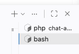
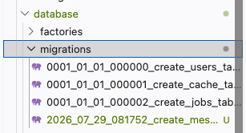

# メッセージの表をつくる

メッセージを入れておく表を、設計図から用意します。

## マイグレーションとは

前のセクションで形を見た `messages` の表は、まだデータベースの中にありません。ただ、表計算ソフトのようにシートを開いて、列の名前を打ち込めるわけではありません。

そこで Laravel では、どんな列を持つ表なのかを別のファイルに書き、そのファイルをコマンドでデータベースに反映します。このしくみがマイグレーションで、書くファイルが表の設計図になります。

設計図はファイルとして残るので、同じ表をあとからもう一度つくれます。

## 設計図が表になるまで


設計図のファイルは、自分でつくらずにコマンドで出してもらいます。そのコマンドが `php artisan make:migration` で、`make:` は決まった形のファイルを作ってもらう頼み方です。出てきたファイルに列を書き、`php artisan migrate` を打つと表ができます。

## 実践: messages の表をつくる

!!! success "確認"

    自分の GitHub のページから作業部屋を開いてください（「Code」→「Codespaces」）。今日は、ターミナルで `cd chat-app` を済ませ、`php artisan serve` が動いている状態から始めます。ブラウザで `/chat` を開くと、前の章でつくったチャット画面が出ます。このセクションで画面は使いませんが、サーバーは止めずに置いておきます。

ここからはコマンドを打ちます。`php artisan serve` は動かしている間ターミナルを占領するので、コマンド用にもう1つターミナルを開きます。動いているほうはそのままにして、ターミナルの右上にある `+` を押してください。押しても、動いているものは止まりません。同じ並びには、ターミナルを閉じるゴミ箱の印もあります。閉じるとその中で動いているものも止まるので、押さないでください。

新しいターミナルが手前に出るので、`php artisan serve` の文字は見えなくなります。止まったわけではありません。右側に出ているターミナルの一覧を押すと、元のほうに切り替えられます。



新しく開いたターミナルは `chat-app` の外にいるので、まず移動します。

```bash
cd chat-app
```

このあとのコマンドは、すべてこの `chat-app` に移動したターミナルで打ちます。

!!! warning "注意"

    新しく開いたターミナルで `php artisan serve` を打たないでください。すでに動いているので、次のように出て、別の番号でもう1つ動き出します。

    ```text
      Failed to listen on 127.0.0.1:8000 (reason: Address already in use)

       INFO  Server running on [http://127.0.0.1:8001].

      Press Ctrl+C to stop the server
    ```

    打ってしまったときは、`Ctrl` キーと `C` キーを同時に押すと止められます。このターミナルで打つのは、このあとのコマンドだけです。

### Step 1: 設計図のファイルができる

次のコマンドを打ちます。

```bash
php artisan make:migration create_messages_table
```

うしろの `create_messages_table` で何をつくるかを指定しているので、`messages` の表をつくる形まで入ったファイルが出てきます。

出力例です（ファイル名の前半の数字は、打った時点をもとに決まります）。

```text
   INFO  Migration [database/migrations/2026_07_29_030018_create_messages_table.php] created successfully.
```

ここに出す見本と数字が違っていて、それで正しいです。

左のファイル一覧で `chat-app` の中の `database` を開き、さらに `migrations` を開いてください。いま増えたファイルが、`0001_01_01` で始まる3つのファイルと並んでいます。この3つは Laravel が最初から用意しているものなので、開かなくてかまいません。



増えたファイルを押して開いてください。見慣れない行がいくつも並んでいますが、いま読むのは次の部分だけです。以下は主要部分の抜粋です。

```php
        Schema::create('messages', function (Blueprint $table) {
            $table->id();
            $table->timestamps();
        });
```

`Schema::create('messages', ...)` が、`messages` という名前の表をつくるという指示です。そのあいだにはさまれた行が、表に持たせる列です。`$table->id();` は `id` の列、`$table->timestamps();` は入れた時刻と直した時刻の列です。どちらも頼んだ時点で入っているので、自分で書く必要がありません。

### Step 2: 名前と本文の列を書き足す

`name` と `body` は自分で決める列なので、まだ入っていません。

`$table->id();` の行のすぐ下に、次の2行を足してください。`$table->timestamps();` の行は、下にずれます。

```php
            $table->string('name');
            $table->text('body');
```

`string` は短い文字、`text` は長い文にも使える文字です。名前は短いので `string`、メッセージの本文は長くなることがあるので `text` にしています。

足したあとは、この形になります。

```php
        Schema::create('messages', function (Blueprint $table) {
            $table->id();
            $table->string('name');
            $table->text('body');
            $table->timestamps();
        });
```

### Step 3: 表ができて、決めた列が並ぶ

設計図がそろったので、同じターミナルでデータベースに反映します。

```bash
php artisan migrate
```

出力例です（ファイル名の数字と、かかった時間は環境によって変わります）。

```text
   INFO  Running migrations.

  2026_07_29_030018_create_messages_table ........................ 4.13ms DONE
```

出るのは1行だけです。末尾に `DONE` と付いていれば、表ができています。

できた表を見てみます。

```bash
php artisan db:table messages
```

```text
  main.messages ..............................................................
  Columns .................................................................. 5

  Column ................................................................ Type
  id integer, autoincrement .......................................... integer
  name varchar ....................................................... varchar
  body text ............................................................. text
  created_at datetime, nullable ..................................... datetime
  updated_at datetime, nullable ..................................... datetime

  Index ......................................................................
  primary id ......................................................... primary
```

英語がたくさん出ますが、見るのは列の名前だけです。自分で書いた `name` と `body` が、`id` と時刻の列のあいだに並んでいます。`Columns` の右の `5` が、この表の列の数です。

!!! warning "注意"

    一覧に `name` と `body` が無いときは、2行を足す前に `php artisan migrate` を打っています。もう一度打っても `Nothing to migrate.` と出るだけなので、`php artisan migrate:fresh` と打って表をつくり直してください。

画面の見た目は、まだ何も変わりません。入れておく場所ができただけで、中身は空だからです。

**確認**: `php artisan db:table messages` と打つと、`name` と `body` が列の一覧に並びます。

## まとめ

- 表は、どんな列を持つかを書いた設計図のファイルを用意し、コマンドで反映してつくる
- 設計図は `php artisan make:migration` で出してもらい、`php artisan migrate` でデータベースに反映する
- `id` と時刻の列は Laravel が用意し、`name` と `body` のような自分で決める列は設計図に書き足す

次のセクションでは、いまつくった空の表にサンプルの会話を入れます。表を扱う係になるモデルと、最初のデータを入れるシーダーという道具を使います。
