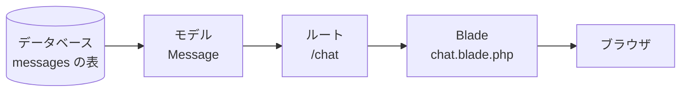
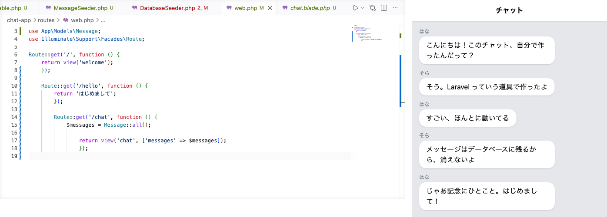

# データベースから一覧表示

画面に並ぶ会話を、仮のものからデータベースのものに入れ替えます。

## 画面とデータベースのつなぎかた

前のセクションで、表には会話が5件入りました。それでも `/chat` の画面は何も変わっていません。画面が並べているのは、ルートに直接書いた仮の会話のままだからです。

入れた会話を画面に出すには、ルートで表から取り出して、それを Blade へ渡します。取り出しを頼む相手は、前のセクションでつくった `Message` というモデルです。



Laravel の役割分担を見たときの図から、いま動いているところだけを取り出して、データの側から見た形です。あの図はブラウザから始まっていたので、矢印の向きは逆になります。役割は4つありましたが、この図に出ているのは3つです。残りの1つは、次の章で出てきます。

`Message::all()` と書くと、`messages` の表に入っているものを全部まとめて取り出します。並ぶ順は表に入れた順で、古い会話が上、新しい会話が下になります。

## データベースから来たものの書きかた

取り出した会話を1件ずつ吹き出しにするところは、前の章で書いた `@foreach` がそのまま使えます。変えるのは、1件から名前と本文を取り出す書き方だけです。

ここから続く2つのコードは左上に住所がないので、打たずに読むだけです。

いま画面に書いてあるのは、この形です。

```blade
{{ $message['name'] }}
```

これから書き替えるのは、この形です。

```blade
{{ $message->name }}
```

`->` は半角の `-` と `>` を続けて打ちます。取り出す書き方は、名前つきリストなら `['name']`、データベースから来たものなら `->name` です。指しているものはどちらも `name` の中身で、書き方だけが変わります。

どちらの書き方でも会話は画面に出ます。ただ、データベースから来たものは `->` で書くのがふつうで、このあとの章もすべてこの書き方で進むので、ここでそろえておきます。

## 実践: 仮の会話を本物に差し替える

前のセクションで `php artisan db:seed` を打ち、表に会話が入ったところから続けます。このあと画面をブラウザで開くので、`php artisan serve` が動いていることも確かめてください。止めていたときは、`chat-app` に移動したターミナルで打ち直します。ほかにコマンドは打たず、ファイルを2つ書き替えます。書き替える前の `/chat` を開いたままにしておくと、あとで見比べられます。

まずルート側です。左のファイル一覧で `chat-app` の中の `routes` を開き、`web.php` を押してください。ファイル全体を次の内容にまるごと置き換えます。

```php title="routes/web.php"
<?php

use App\Models\Message;
use Illuminate\Support\Facades\Route;

Route::get('/', function () {
    return view('welcome');
});

Route::get('/hello', function () {
    return 'はじめまして';
});

Route::get('/chat', function () {
    $messages = Message::all();

    return view('chat', ['messages' => $messages]);
});
```

いちばん上に1行増えます。そして `/chat` の中に書いてあった会話5件は、まるごと消えます。代わりに入るのが `Message::all()` の1行です。Blade へ渡す行は前のままで、渡す中身だけが仮の会話から表のものに変わります。

次は画面側です。`resources/views/chat.blade.php` を開き、`@foreach` の行から `@endforeach` の行までを、次の内容に置き換えてください。

```blade title="resources/views/chat.blade.php"
      @foreach ($messages as $message)
        <div class="mb-3">
          <p class="text-xs text-gray-500 mb-1">{{ $message->name }}</p>
          <div class="bg-white rounded-2xl px-4 py-2 inline-block max-w-[75%] shadow-sm">
            <p>{{ $message->body }}</p>
          </div>
        </div>
      @endforeach
```

変わるのは2か所だけです。`['name']` が `->name` に、`['body']` が `->body` になります。ほかの行は前と同じなので、まるごと貼り替えるかわりに、この2か所だけを直してもかまいません。

ブラウザで `/chat` を開き直してください。

さきほど `routes/web.php` から会話5件を消したのに、画面には5つの吹き出しが並んでいます。この5件は、もうプログラムの中には書かれていません。画面がデータベースを見にいくからです。表に入れておいた会話が、そのまま出ています。

前のセクションで書いた `MessageSeeder` も、いまは動いていません。あのファイルが動いたのは、会話を表に入れた1度だけで、画面はその表を見ています。

!!! warning "注意"

    吹き出しが10個以上並び、同じ会話がくり返されているときは、前のセクションで `php artisan db:seed` を2回以上打っています。このコマンドは書いておいた会話を入れるだけで、前に入れたものを消さないので、打った回数だけ増えます。`chat-app` に移動したターミナルで `php artisan migrate:fresh` を打って表をつくり直し、そのあと `php artisan db:seed` をもう一度打つと5件に戻ります。

見比べると、句読点や言い回しの違う吹き出しがいくつかあります。前の章で書いた仮の会話と、表に入れた会話は、もともと別の文だからです。いちばんはっきり違うのは4つめで、「メッセージはデータベースに残るから、消えないよ」に変わっています。仮の会話にはなかった文です。



!!! note "補足"

    前のセクションで会話を自分の言葉に変えていた場合は、その言葉が吹き出しに出ます。

## 完成チェックリスト

- `routes/web.php` の `/chat` の中から会話5件が消えていて、`Message::all()` の1行だけになっている
- それでも `/chat` を開くと、吹き出しが5つ並んでいる
- 4つめの吹き出しが「メッセージはデータベースに残るから、消えないよ」になっている
- `chat.blade.php` の `@foreach` の中が `->name` と `->body` になっている

## まとめ

- 表に入れた会話は `Message::all()` で全部取り出せる
- 取り出したものはルートから Blade へ渡し、`@foreach` で吹き出しに並べる
- データベースから来たものは `->name` の形で取り出す

この章では、メッセージを入れておく表を設計図からつくり、そこにサンプルの会話を入れて、画面がデータベースを見るようにしました。

最後に、今日の分を記録して終わりましょう。準備編で覚えた保存の儀式の手順で、変更を残しておいてください。

次の章では、画面から自分でメッセージを送れるようにします。チャット画面の下に入力欄を置き、打った言葉を送ってデータベースに残し、この一覧に並ぶところまで進みます。はじめに、ページを見るだけの行き方と、内容を届けるための行き方のちがいを見ます。
