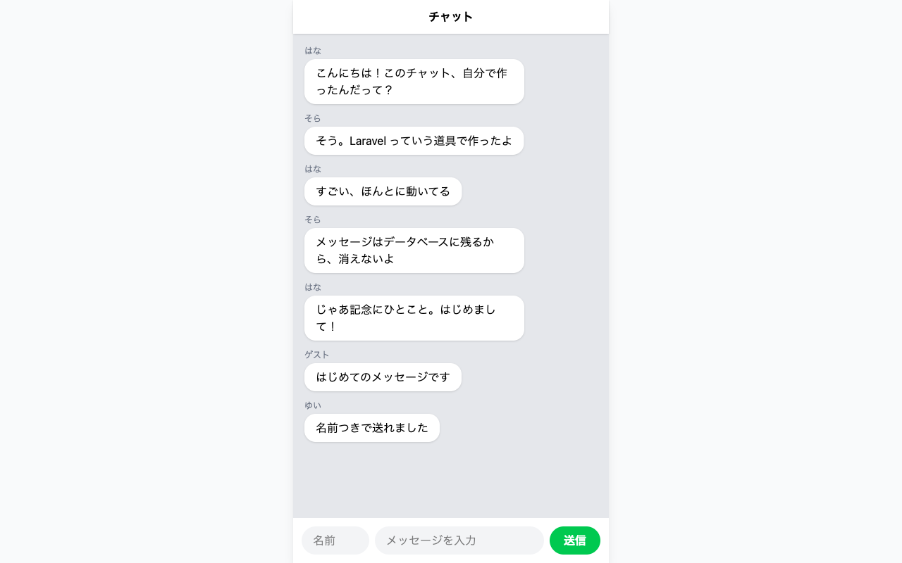
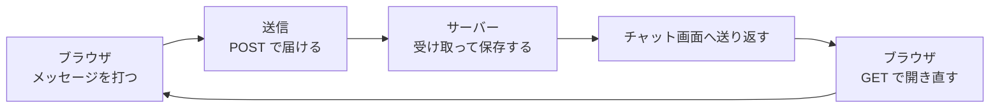

# フォームと送信のしくみ

入門編で置いた、押しても文字が届かなかったフォームを、ここから動かしていきます。

この章は5つのセクションでできています。チャット画面の下に入力欄を置いて、打った言葉がデータベースに残り、そのまま画面に並ぶところまで進みます。

| セクション | テーマ | 種類 |
|---|---|---|
| フォームと送信のしくみ | 打った文字が向こう側へ届くまでのしくみ | 読む |
| 送信フォームをつくる | チャット画面の下に入力欄と送信ボタンを置く | 手を動かす |
| 受け取り役をつくる | 送られてきた内容を受け取る係をつくる | 手を動かす |
| 保存してもどる | 受け取った内容をデータベースに残し、画面に戻す | 手を動かす |
| 名前を書いて送る | 名前を添えて送れるようにする | 手を動かす |

**この Chapter の進め方**: このセクションは読むだけです。残りの4つで、入力欄を置き、送られた言葉を受け取って、データベースに残すところまで進みます。

## フォームとは

ここまで画面に出してきた言葉は、どれも自分がプログラムに書いたものです。チャットは、画面を開いた人が打った言葉を受け取らないと成り立ちません。その受け渡しに使う部品がフォームです。

フォームは注文票に似ています。用紙に書いて渡すと、向こう側で中身が読まれて、その結果が返ってきます。書く欄と、渡す合図さえあれば形になります。

入門編で置いた入力欄とボタンが、この注文票にあたります。ただ、あのときは書いたものを渡す相手が決まっていませんでした。足すものは2つです。どこへ届けるかという **送り先** と、どうやって届けるかという **行き方** です。

## GET と POST のちがい

行き方は2つあります。見るための行き方が `GET`、届けるための行き方が `POST` です。

| 行き方 | していること | 起きること |
|---|---|---|
| `GET` | ページを見せてもらう | アドレスを開いたりリンクを押したりすると、その画面が返ってくる |
| `POST` | 打った文字を届ける | 向こう側で中身が処理されて、その結果が返ってくる |

ふだんページを開いて読んでいるときは、`GET` が動いています。こちらから渡すものがないので、頼めばそのまま画面が返ってきます。

入門編でボタンを押したとき、入力欄が空に戻り、アドレスの末尾に `?` が付きました。送り先を決めていなかったので、見るための行き方で同じページを開き直しただけになっていました。打った文字は、どこにも渡っていません。

送り先を書いて `POST` を選ぶと、打った文字はそのまま向こう側に渡ります。このあとつくるチャットでは、`/chat` という同じ住所に2つの行き方が並びます。画面を見るときは `GET` で開き、メッセージを送るときは `POST` で届けます。住所が同じでも、行き方が違えば動くものが変わります。

送ったメッセージが画面に並ぶまでは、この一周でできています。

打った言葉は `POST` でサーバーに届き、そこで保存されて、`GET` で開き直した画面に並びます。この一周を、このあと少しずつ組み立てていきます。

## まとめ

- フォームは、画面を開いた人が打った言葉を受け取るための部品で、送り先と行き方を決めて使う
- `GET` はページを見せてもらう行き方、`POST` は打った文字を届ける行き方
- 入門編でボタンを押しても文字が届かなかったのは、送り先を決めていなかったから

次のセクションでは、チャット画面の下に入力欄と送信ボタンを置きます。あわせて、そのフォームに送り先と行き方を書き込みます。
