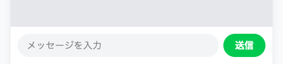
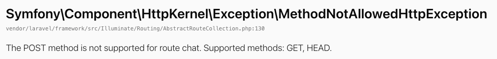

# 送信フォームをつくる

チャット画面の下に、メッセージを打ち込む欄を置きます。

## 送信フォームの部品

入門編で置いた `<form>` `<input>` `<button>` の3つは、そのまま使えます。足りないのは、前のセクションで見た送り先と行き方です。どちらも `<form>` の中に書きます。

送り先は `action="/chat"` と書きます。いま開いている画面と同じ住所です。これで `/chat` に、画面を見るための行き方と、メッセージを届けるための行き方が並びます。行き方のほうは `method="POST"` です。この2つを書かないと、入門編のときと同じで、押しても同じページを開き直すだけになります。

Laravel のフォームには、もう1行だけ足すものがあります。合言葉の1行です。Laravel は、送られてきたものが自分の出したフォームから来たのかどうかを、合言葉で確かめます。`@csrf` と書いておけば、その合言葉がフォームに入ります。中身は Laravel が用意するので、この1行を写すだけで足ります。逆に、この1行を消すと送れなくなります。

入力欄には `name="body"` と名札を付けておきます。打った文字は、この名札とセットで届きます。次のセクションで受け取る係をつくるとき、名札を頼りに中身を取り出します。

## 実践: 画面の下に入力欄を置く

!!! success "確認"

    自分の GitHub のページから作業部屋を開いてください（「Code」→「Codespaces」）。今日は、ターミナルで `cd chat-app` を済ませ、`php artisan serve` が動いている状態から始めます。作業部屋を開き直した直後は、この2つを自分で打ってください。ブラウザで `/chat` を開くと、データベースに入れた会話が吹き出しで並びます。

`resources/views/chat.blade.php` を開いてください。吹き出しの区画が終わる `</main>` の行のすぐ下に、次の8行を足してください。`</main>` より下にある行は、そのまま下にずれます。

```blade title="resources/views/chat.blade.php"
    <footer class="bg-white p-3">
      <form action="/chat" method="POST" class="flex gap-2">
        @csrf
        <input type="text" name="body" placeholder="メッセージを入力"
          class="flex-1 bg-gray-100 rounded-full px-4 py-2">
        <button type="submit" class="shrink-0 bg-green-500 text-white font-bold rounded-full px-5 py-2">送信</button>
      </form>
    </footer>
```

`<footer>` は画面のいちばん下の帯で、上の白い帯をつくった `<header>` と対になる区画です。`placeholder` は、まだ何も打っていないときに薄く出る案内の文字です。`class` に並ぶ文字は、これまでと同じで読めなくてかまいません。

ブラウザで `/chat` を開き直してください。画面のいちばん下に白い帯が増えて、その中に入力欄と緑の「送信」ボタンが並びます。入力欄を押すと、文字を打ち込めます。



!!! warning "注意"

    このボタンを押すと、ブラウザの画面いっぱいに英語のエラー画面が出ます。壊したわけではありません。送り先は決めましたが、その住所で届いたものを受け取る係を、まだつくっていないためです。

入力欄に何か打ってから、「送信」を押してみてください。出てきた画面の中に、次の文字で終わる大きな行と、そのあとに続く説明の行があります。

```text
MethodNotAllowedHttpException
The POST method is not supported for route chat. Supported methods: GET, HEAD.
```

読むのは2行目です。`/chat` という住所では届けるための行き方を受け付けていない、という知らせです。用意してあるのは、いまのところ画面を見るための行き方だけです。次のセクションで受け取る係をつくると、この画面は出なくなります。同じ症状は、困ったときに戻るページにも載せてあります。



ブラウザの戻るボタンを押せば、チャット画面にもどれます。

**確認**: `/chat` を開くと、画面のいちばん下に入力欄と緑の「送信」ボタンが並びます。この時点では、「送信」を押すとエラー画面になるのが正しい状態です。

## まとめ

- フォームには、送り先を `action` で、行き方を `method` で書く
- Laravel のフォームには、合言葉の1行 `@csrf` を入れる
- 送り先を書いても、その住所で受け取る係がなければ、押したときにエラー画面が出る

次のセクションでは、送られてきた内容を受け取る係をつくります。コントローラという専用のファイルをコマンドで用意して、届いた内容を画面に出して確かめます。
