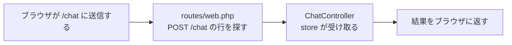

# 受け取り役をつくる

送られてきた内容を受け取る係をつくって、届いたことを画面で確かめます。

## コントローラとは

ここまで、住所ごとの処理はすべて `routes/web.php` に直接書いてきました。ただ、送られてきたメッセージを扱う仕事は長くなります。受け取って中身を確かめ、データベースに入れて、画面に戻すところまでがひとつながりです。これを全部あの対応表に書くと、どの住所に何が対応しているのかを読み取れなくなります。

そこで Laravel では、処理そのものを専用のファイルに移します。このファイルがコントローラです。対応表のほうには「この住所は、このファイルのこの係に任せる」とだけ書きます。Laravel の役割分担を見たときの、調理場にあたる場所です。

## ルートからコントローラを指す

コントローラを使うと、ルートの書き方も変わります。これまでの形と、これから足す形を並べます。打たずに、形だけ見比べてください。

```php
Route::get('/hello', function () {
    return 'はじめまして';
});

Route::post('/chat', [ChatController::class, 'store']);
```

上は、住所のうしろに `function () {` と書いて、その場に処理を並べる形です。練習用のページも、チャット画面を出す行も、この形で書きました。

下が、これから足す形です。処理そのものは書かず、`[ChatController::class, 'store']` とだけ書きます。`ChatController` がファイルの名前で、`store` がその中の係の名前です。2つを並べて「このファイルの、この係に任せる」と指しています。`::class` のような記号は、これまでと同じで、形をそのまま写せば足ります。

送られたものがどこへ回るのかを図にすると、こうなります。



ルートのしくみを見たときの図と、形は同じです。真ん中が、その場に書いた処理から受け取る係に変わっただけです。

## 実践: 送った内容を受け取る

前のセクションの続きで、送信ボタンを押すとエラー画面が出るところから始めます。`cd chat-app` を済ませ、`php artisan serve` が動いた状態にしてください。作業部屋を開き直したときは、この2つを先にやります。ここではコマンドも打つので、前の章と同じように、ターミナルをもう1つ開いて `cd chat-app` を済ませておきます。

まず、コントローラのファイルを出してもらいます。

```bash
php artisan make:controller ChatController
```

次のように出ます。

```text
   INFO  Controller [app/Http/Controllers/ChatController.php] created successfully.
```

出てきたのが `app/Http/Controllers/ChatController.php` です。左のファイル一覧では、`chat-app` の中の `app` を開き、`Http`、`Controllers` と進んだところにあります。開いてみると、中身は数行だけです。

ファイル全体を、次の内容にまるごと置き換えてください。

```php title="app/Http/Controllers/ChatController.php"
<?php

namespace App\Http\Controllers;

use Illuminate\Http\Request;

class ChatController extends Controller
{
    public function store(Request $request)
    {
        return $request->input('body');
    }
}
```

増えたのは `store` のかたまりです。これがこの係の名前で、ルートから名前で呼ばれます。`$request` には、送られてきたものがまとめて入っています。`input('body')` と書くと、その中から `body` という名札の付いた文字を取り出せます。前のセクションで入力欄に付けた名札です。

`return` のうしろに書いたものが画面に返るところは、ルートに書いていたときと同じです。`namespace` や `use` で始まる行は Laravel の決まった書き方なので、そのまま残します。

次に、この係を呼ぶ行をルートに足します。`routes/web.php` を開き、ファイル全体を次の内容にまるごと置き換えてください。上のほうはいま書かれている内容と同じで、増えるのは `use` で始まる行が1行と、いちばん下の1行だけです。練習用につくった `/hello` を消していた場合は、その3行を抜いて貼ってください。

```php title="routes/web.php"
<?php

use App\Http\Controllers\ChatController;
use App\Models\Message;
use Illuminate\Support\Facades\Route;

Route::get('/', function () {
    return view('welcome');
});

Route::get('/hello', function () {
    return 'はじめまして';
});

Route::get('/chat', function () {
    $messages = Message::all();

    return view('chat', ['messages' => $messages]);
});

Route::post('/chat', [ChatController::class, 'store']);
```

これで、同じ住所に2つの行き方が並びました。上の `/chat` は画面を見るための行き方で、下がメッセージを届けるための行き方です。

ブラウザに切り替えて、チャット画面を開き直してください。エラー画面が出たままのときは、先に戻るボタンを押します。入力欄に `はじめての送信` と打って、「送信」を押してください。真っ白な画面に、打った文字だけが出ます。

```text
はじめての送信
```


エラー画面は出なくなりました。打った文字が受け取る係まで届き、そこから返ってきています。

確かめたら、戻るボタンを押して、チャット画面にもどっておきましょう。吹き出しの数は変わりません。いまは受け取ったものを返しているだけで、どこにも残していないためです。

!!! failure "よくあるエラー"

    送信したときに、ブラウザの画面に数字とひとことだけが出ることがあります。

    ```text
    419
    Page Expired
    ```

    **原因**: 送信フォームに付ける合言葉の1行が抜けています。ページを開いたまま長いあいだおいてから送ったときにも出ます。画面にはこの2つしか出ないので、どこが悪いのかは書かれていません。

    **対処法**: 先に戻るボタンを押して、チャット画面にもどります。`resources/views/chat.blade.php` の `<form>` の中に `@csrf` の1行があるか確かめてから、送り直してください。同じ症状は、困ったときに戻るページにも載せてあります。

**確認**: 入力欄に文字を入れて「送信」を押すと、真っ白な画面に、打った文字だけが表示されます。戻るボタンを押すと、チャット画面にもどります。

## まとめ

- コントローラは、ルートに直接書いていた処理を移すための専用のファイルで、`php artisan make:controller` でつくる
- ルートには、処理そのものではなく、どのファイルのどの係に任せるかを書く
- 送られてきたものは `$request` に入っていて、`input('body')` で名札の付いた文字を取り出せる

次のセクションでは、受け取った内容をデータベースに保存して、送ったメッセージが残るようにします。送信のあとはチャット画面に戻り、一覧のいちばん下に自分のメッセージが増えます。
