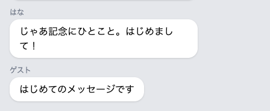

# 保存してもどる

受け取った内容をデータベースに残して、チャット画面に戻します。

## 保存してもどるまでの流れ

前のセクションで、打った言葉は受け取る係まで届くようになりました。ただ、いまはその文字をそのまま画面に返しているだけです。戻るボタンでチャット画面にもどっても吹き出しは増えませんし、開き直せば送ったものは消えています。残るようにするには、受け取った文字をデータベースの表に入れる必要があります。

「送信」を押してから画面が戻るまでを、3つに分けて見ていきます。

1つめは **受け取る** です。ここは前のセクションでできました。

2つめが **保存する** です。表への出し入れを頼む相手は `Message` です。`Message::create()` と書いて、どの列に何を入れるかを渡すと、`Message` が表に1行足します。

あわせて、`Message` の側にも1行足します。画面から送られてきたものを保存するときは、入れてよい列を先に決めておきます。届いた中身をそのまま信じて、余計な列まで書き替えないための決まりです。

3つめが **送り返す** です。保存が済んだら、ブラウザにチャット画面を開き直してもらいます。この送り返しを **リダイレクト** と呼び、`return redirect('/chat');` の1行で書けます。開き直すときに動くのは画面を見るための行き方なので、表から取り直した一覧に、いま保存したメッセージも並びます。

## 実践: 送ったメッセージを残す

いまは、送信すると真っ白な画面に打った文字だけが出ます。ここからはコマンドを打たず、ファイルを3つ書き替えます。`php artisan serve` はそのまま動かしておいてください。

はじめは、送り返す住所のための1行です。左のファイル一覧で `chat-app` の中の `bootstrap` を開き、`app.php` を押してください。まん中あたりに `//` とだけ書かれた行があります。データベースの表を扱う係をつくったときと同じ、何も書かれていないという印です。この行を書き替えて、前後の形を下のとおりにしてください。

```php title="bootstrap/app.php"
    ->withMiddleware(function (Middleware $middleware): void {
        $middleware->trustProxies(at: '*');
    })
```

アプリは作業部屋の中で動いていて、ブラウザのアドレス欄に出ている住所を知りません。この1行は、外から届いた住所をそのまま使ってよい、とアプリに伝えるものです。書かないと、送り返す住所を作業部屋の中だけで通じる形で組み立ててしまい、送信のあとに「このページが見つかりません」と出ます。

次は `Message` のほうです。左のファイル一覧で `chat-app` の中の `app` を開き、`Models` の中の `Message.php` を押してください。ファイル全体を、次の内容にまるごと置き換えます。

```php title="app/Models/Message.php"
<?php

namespace App\Models;

use Illuminate\Database\Eloquent\Model;

class Message extends Model
{
    protected $fillable = ['name', 'body'];
}
```

変わるのは1行だけです。何も書かれていないという印だった `//` が、`name` と `body` の2つを許可する行に入れ替わります。

!!! failure "よくあるエラー"

    この1行を入れないまま送信すると、画面いっぱいに英語のエラー画面が出ます。その中に、次の1行があります。

    ```text
    Add [name] to fillable property to allow mass assignment on [App\Models\Message].
    ```

    **原因**: どの列に入れてよいかを `Message` に教えていないため、Laravel が保存を止めています。

    **対処法**: `app/Models/Message.php` に `protected $fillable = ['name', 'body'];` の1行があるか確かめてください。直したら、先に戻るボタンを押してチャット画面にもどり、もう一度送ります。同じ症状は、困ったときに戻るページにも載せてあります。

次は受け取る係です。`app/Http/Controllers/ChatController.php` を開き、ファイル全体を次の内容にまるごと置き換えてください。

```php title="app/Http/Controllers/ChatController.php"
<?php

namespace App\Http\Controllers;

use App\Models\Message;
use Illuminate\Http\Request;

class ChatController extends Controller
{
    public function store(Request $request)
    {
        Message::create([
            'name' => 'ゲスト',
            'body' => $request->input('body'),
        ]);

        return redirect('/chat');
    }
}
```

上のほうで `use` の行が1本増えました。このファイルから `Message` に頼むので、その名前を先に書いておきます。

`store` の中身も入れ替わります。前は受け取った文字をそのまま返していましたが、届くことは確かめたので、これからは保存して送り返します。`'body'` に入るのが、その受け取った文字です。`'name'` のほうは `ゲスト` と決め打ちしてあります。名前を打つ欄をまだ置いていないためで、次のセクションで打った名前が入るようにします。

最後の1行が、チャット画面へ送り返すリダイレクトです。

ここでブラウザに切り替えます。前のセクションの白い画面が出たままのときは、先に戻るボタンを押してチャット画面にもどってください。入力欄に `はじめてのメッセージです` と入れて、「送信」を押します。

押したあと、画面はチャットに戻ります。吹き出しのいちばん下に、いま送ったメッセージが増えています。名前のところには `ゲスト` と出ます。



前のセクションでは、送信のあとに白い画面が出て、チャット画面にもどるには戻るボタンを押していました。いまは、その一手が要りません。送ったメッセージが増えているところまで、ひと続きで目に入ります。

チャット画面をもう一度開き直しても、送ったメッセージは残っています。前のセクションで打った文字は画面に返ってきただけでしたが、いまはデータベースの表に入っているためです。

!!! failure "よくあるエラー"

    メッセージを空のまま「送信」を押すと、画面いっぱいに英語のエラー画面が出ます。その中に、次の文字ではじまる行があります。

    ```text
    SQLSTATE[23000]: Integrity constraint violation: 19 NOT NULL constraint failed: messages.body
    ```

    **原因**: 空のままだと、データベースが受け付けません。表をつくったとき、`body` を空でもよい列にしていないためです。

    **対処法**: 先に戻るボタンを押して、チャット画面にもどってください。文字を入れてから送り直します。空のまま送っても止まるようにするのは、次のセクションでやります。同じ症状は、困ったときに戻るページにも載せてあります。

**確認**: メッセージを入れて「送信」を押すと、チャット画面に戻り、いちばん下に「ゲスト」という名前で自分のメッセージが増えます（空のまま送るとエラー画面になるので、いまは必ず文字を入れて送ります）。

## まとめ

- `Message::create()` に、どの列に何を入れるかを渡すと、データベースの表に1行増える
- 保存してよい列は、あらかじめ `Message` の側に書いておく
- 保存のあとは `redirect('/chat')` でチャット画面に送り返し、開き直した一覧に増えたメッセージが並ぶ

次のセクションでは、フォームに名前の欄を足します。打った名前が、そのまま吹き出しに出ます。あわせて、空のまま送れないようにして、足りないときは日本語の注意を画面に出します。ここまでで、動くチャットができあがります。
