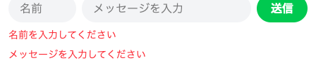

# 名前を書いて送る

名前を添えて送れるようにして、動くチャットを仕上げます。

## 入力チェックのしくみ

いまは、メッセージを空のまま送ると、画面いっぱいに英語のエラー画面が出ます。名前の欄を足すと、空のまま送られる場所は2つに増えます。保存する前に中身を確かめて、足りないものがあれば画面で知らせておきたいところです。この確かめを **入力チェック** と呼びます。

Laravel では `validate()` に、どの名札を必須にするかを並べます。あわせて、足りなかったときに画面へ出す文も自分で決められます。日本語で書いておけば、そのまま日本語で出ます。

止まったときの戻り先は、エラー画面ではありません。ブラウザはチャット画面に戻り、入力欄の下に赤い文字で足りないものが出ます。吹き出しはそのまま並んでいるので、その場で打ち直して送れます。

もう1つ足すのが `old()` です。戻ってきたときに、埋めてあったほうの欄には打った文字が残ります。片方だけ空だったときに、もう片方を打ち直さずに済みます。

## 実践: 名前つきで送れるようにする

`php artisan serve` が動いていて、ブラウザでチャット画面が開ける状態から始めます。ここではコマンドを打たず、ファイルを2つ書き替えます。

### Step 1: 名前の欄が増える

`resources/views/chat.blade.php` を開いてください。`<footer class="bg-white p-3">` の行の先頭から、`</footer>` の行の末尾まで（8行）を選び、次の内容に貼り替えます。

```blade title="resources/views/chat.blade.php"
    <footer class="bg-white p-3">
      <form action="/chat" method="POST" class="flex gap-2">
        @csrf
        <input type="text" name="name" placeholder="名前" value="{{ old('name') }}"
          class="w-24 shrink-0 bg-gray-100 rounded-full px-4 py-2">
        <input type="text" name="body" placeholder="メッセージを入力" value="{{ old('body') }}"
          class="flex-1 bg-gray-100 rounded-full px-4 py-2">
        <button type="submit" class="shrink-0 bg-green-500 text-white font-bold rounded-full px-5 py-2">送信</button>
      </form>
      @error('name')
        <p class="text-red-500 text-sm mt-2">{{ $message }}</p>
      @enderror
      @error('body')
        <p class="text-red-500 text-sm mt-2">{{ $message }}</p>
      @enderror
    </footer>
```

増えたものは3つです。1つめが名前の欄で、`name` という名札が付いています。2つめが `value="{{ old('name') }}"` と `value="{{ old('body') }}"` で、戻ってきたときに打った文字を欄へ戻す役です。3つめが `@error` から `@enderror` までの2かたまりで、足りないものがあったときに赤い文字を出す場所です。`</form>` のすぐ下に置いてあるので、入力欄の真下に出ます。

!!! note "補足"

    `@error` の中の `{{ $message }}` は、吹き出しをくり返すときの `$message` とは別物です。ここに入るのは、足りないものを知らせる文そのものです。Laravel がそう決めている名前なので、`chat.blade.php` の中では同じ名前が2つの役割で出てきます。

チャット画面を開き直してください。いちばん下の帯に、細い「名前」の欄とメッセージの欄が横に並びます。欄は2つです。3つ以上並んだときは、前の `<footer>` が消えずに残っています。名前の欄が入っていないほうの `<footer>` の行から `</footer>` の行までを選び、`Backspace` キーで消してください。


ここではまだ送信を試しません。このあと受け取る側も書き替えるので、試すのは両方が済んでからです。

### Step 2: 空のまま送ると赤い文字で止まる

`app/Http/Controllers/ChatController.php` を開き、ファイル全体を次の内容にまるごと置き換えてください。

```php title="app/Http/Controllers/ChatController.php"
<?php

namespace App\Http\Controllers;

use App\Models\Message;
use Illuminate\Http\Request;

class ChatController extends Controller
{
    public function store(Request $request)
    {
        $validated = $request->validate([
            'name' => 'required',
            'body' => 'required',
        ], [
            'name.required' => '名前を入力してください',
            'body.required' => 'メッセージを入力してください',
        ]);

        Message::create([
            'name' => $validated['name'],
            'body' => $validated['body'],
        ]);

        return redirect('/chat');
    }
}
```

`validate()` に渡した1つめのかたまりが、確かめる中身です。`name` と `body` のどちらにも `'required'` と書いてあり、これが「空では通さない」の印です。2つめのかたまりが、足りなかったときに画面へ出す文です。

確かめが通ると、その中身は `$validated` に入ります。前のセクションで `ゲスト` と決め打ちしていたところに、打った名前が入るようになりました。

チャット画面を開き直して、どちらの欄も空のまま「送信」を押してください。チャット画面に戻り、入力欄の下に赤い文字が2行出ます。

```text
名前を入力してください
メッセージを入力してください
```



これはエラーではなく、空のまま送ったことの知らせです。吹き出しはそのまま並んでいます。名前だけ空にすると上の1行、メッセージだけ空にすると下の1行が出ます。そのとき、埋めてあったほうの欄には打った文字が残ります。

### Step 3: 名前つきのメッセージが並ぶ

名前の欄に `ゆい`、メッセージの欄に `名前つきで送れました` と入れて、「送信」を押してください。

チャット画面に戻ると、いちばん下に `ゆい` の名前で吹き出しが増えています。赤い文字は消え、2つの欄はどちらも空になります。名前を変えてもう一度送れば、別の名前で並びます。


いまの形では、送るたびに名前も打ち込みます。一度決めた名前を覚えておいてもらう作り方は、このあと足していきます。

## 完成チェックリスト

- `/chat` を開くと、サンプルの会話と自分の送ったメッセージが上から順に並んでいる
- 名前とメッセージを入れて「送信」を押すと、チャット画面に戻り、いちばん下に自分のメッセージが増える
- チャット画面を開き直しても、送ったメッセージが残っている
- 名前かメッセージを空のまま送ると、赤い文字で足りないものが出て、入れたほうの文字は欄に残っている
- 今日の分が GitHub に上がっている

## まとめ

- `validate()` に必須の名札を並べると、空のまま送られたときに保存の手前で止まる
- 止まったときに出す文は自分で決められ、`@error` を置いた場所に出る
- `old()` を書いておくと、戻ってきたときに打った文字が欄に残る

この章では、チャット画面の下へ入力欄を置き、送られたものを受け取る係をつくり、データベースに残して画面へ送り返すところまで進めました。フォームから送ったメッセージは、そのまま画面に残ります。

この章に入る前には、Laravel のプロジェクトから画面の器をつくり、メッセージをしまう表を用意して画面に並べました。器、残しておく場所、送る道の順に積み上げてきたことになります。送る、保存する、画面に戻すという Web アプリの中心の流れを、自分の手で通しました。

最後に、今日の分を記録して終わりましょう。準備編で覚えた保存の儀式の手順で、変更を残しておいてください。これでチェックリストの最後の1つも埋まります。

いま動いているチャットの画面は、スクリーンショットに撮って残しておきましょう。Windows では `Windows` キーと `Shift` キーと `S` キーを同時に押し、Mac では `shift` キーと `command` キーと `4` キーを同時に押すと、範囲を選んで撮れます。今日つくったものが、そのまま手元に残ります。

ここからは、このチャットに機能を足して、本物らしく育てていきます。はじめに手をつけるのは、送ったメッセージを取り消したり、書き直したりするしくみです。そのために、どのメッセージのことなのかを伝えるところから見ていきます。
