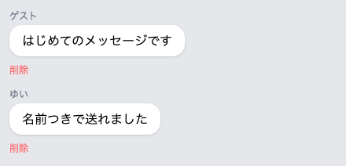
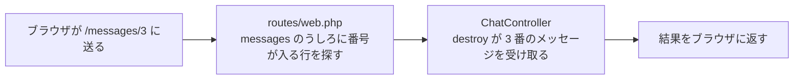

# 削除ボタンを置く

送ったメッセージを取り消せるように、まず「どれを消すか」を伝える道をつくります。



この章は5つのセクションでできています。送ったメッセージを取り消したり、書き直したりできるようにして、チャットで一通りの操作がそろうところまで進みます。

| セクション | テーマ | 種類 |
|---|---|---|
| 削除ボタンを置く | どのメッセージを消すかを伝える道をつくる | 手を動かす |
| メッセージを消す | 受け取った1件をデータベースから消す | 手を動かす |
| 編集画面をつくる | いまの内容が入った書き直しの画面をひらく | 手を動かす |
| 書き直しを保存する | 書き直した内容で上書きする | 手を動かす |
| ふりかえり: CRUD がそろった | つくる・見る・直す・消すがそろったことを整理する | 読む |

**この Chapter の進め方**: はじめの4つで、削除と書き直しを順につくります。最後のセクションは読むだけで、自分が書いたコードを見わたします。

## 1件を指す URL

ここまでにつくった住所は、`/chat` のように決まった文字でした。いつ開いても同じ画面が出るので、住所だけで足りていました。削除ではそうもいきません。「消したい」とだけ伝えても、どのメッセージのことなのかが向こう側に届きません。

手がかりは、メッセージの表をつくったときに用意してあります。1件ごとに違う番号が付く `id` という列です。あとから1件を指すために使う番号で、これを住所に混ぜます。

```text
/messages/3   3番のメッセージのこと
/messages/8   8番のメッセージのこと
```

`messages` のところは自分で決めてよい名前で、メッセージ1件を指す住所なのでこう名づけました。

対応表に書くほうは、番号の場所を波かっこにして `/messages/{message}` とします。「ここには番号が入る」という印で、番号が違っても1本の行で受け止められます。受け取る係のカッコの中には `Message $message` と書きます。この2か所の名前をそろえておくと、Laravel が URL の番号を読んで、そのメッセージを1件まるごと係に渡します。



受け取る係をつくったときの図と形は同じで、住所に番号が入るところだけが増えました。

## 消したいを伝える1行

行き方は2つ習いました。見るための `GET` と、届けるための `POST` です。消すための行き方は `DELETE` という別の名前ですが、HTML のフォームに書けるのは `GET` と `POST` の2つだけです。「消したい」は、そのまま送れません。

そこで足すのが `@method('DELETE')` の1行です。フォームは `POST` で送りながら、中に「本当は消したい」というメモを同封します。Laravel はそのメモを読んで、消すための行き方として扱います。合言葉の `@csrf` と並べて2行書くのが、削除のフォームの形です。

## 実践: 削除ボタンを置いて受け取りを確かめる

!!! success "確認"

    自分の GitHub のページから作業部屋を開いてください（「Code」→「Codespaces」）。今日は、ターミナルで `cd chat-app` を済ませ、`php artisan serve` が動いている状態から始めます。作業部屋を開き直した直後は、この2つを自分で打ってください。ブラウザは、右下に出る知らせの「ブラウザーで開く」から開きます。前のタブが残っていれば、そのタブを再読み込みしてもかまいません。`/chat` を開くと、これまでの会話が吹き出しで並び、いちばん下には名前とメッセージの入力欄と「送信」があります。

手を入れるのは全部で3か所です。画面、受け取る係、対応表の順に進めます。3つそろってから試すので、途中で「削除」を押さないでください。

1つめは、画面です。`resources/views/chat.blade.php` を開いてください。`@foreach ($messages as $message)` の行の先頭から、`@endforeach` の行の末尾まで（8行）を、`<style>` の中身をまるごと入れ替えたときと同じやり方で選び、次の内容に貼り替えます。

```blade title="resources/views/chat.blade.php"
      @foreach ($messages as $message)
        <div class="mb-3">
          <p class="text-xs text-gray-500 mb-1">{{ $message->name }}</p>
          <div class="bg-white rounded-2xl px-4 py-2 inline-block max-w-[75%] shadow-sm">
            <p>{{ $message->body }}</p>
          </div>
          <div class="mt-1">
            <form action="/messages/{{ $message->id }}" method="POST" class="inline">
              @csrf
              @method('DELETE')
              <button type="submit" class="text-xs text-red-400">削除</button>
            </form>
          </div>
        </div>
      @endforeach
```

増えたのは、`<div class="mt-1">` から始まる7行です。中身は小さなフォームで、送り先が `/messages/{{ $message->id }}` になっています。この `{{ }}` は吹き出しごとの番号に置き換わるので、吹き出しの数だけ、行き先の違うボタンが並びます。`class="inline"` は、フォームが横1行を占領しないようにする指定です（このあと隣にもう1つ置きます）。

2つめは、押されたときに受け取る係です。`app/Http/Controllers/ChatController.php` を開き、ファイル全体を次の内容にまるごと置き換えてください。

```php title="app/Http/Controllers/ChatController.php"
<?php

namespace App\Http\Controllers;

use App\Models\Message;
use Illuminate\Http\Request;

class ChatController extends Controller
{
    public function store(Request $request)
    {
        $validated = $request->validate([
            'name' => 'required',
            'body' => 'required',
        ], [
            'name.required' => '名前を入力してください',
            'body.required' => 'メッセージを入力してください',
        ]);

        Message::create([
            'name' => $validated['name'],
            'body' => $validated['body'],
        ]);

        return redirect('/chat');
    }

    public function destroy(Message $message)
    {
        return $message->body;
    }
}
```

増えたのは `destroy` のかたまりです。カッコの中が `Message $message` なので、押した吹き出しの1件がまるごとここに届きます。`return $message->body;` と書くと、その1件の文が画面に返ります。

3つめは、対応表です。`routes/web.php` を開き、いちばん下の `Route::post('/chat', [ChatController::class, 'store']);` の行のすぐ下に、空の行を1つはさんで次の1行を足してください。ここは足すだけで、ファイル全体は貼り替えません。

```php title="routes/web.php"
Route::delete('/messages/{message}', [ChatController::class, 'destroy']);
```

フォームに書いた `DELETE` と、この行の `delete` は、大文字と小文字が違うだけで同じ行き方です。

!!! warning "注意"

    波かっこの中の `{message}` と、係のカッコの中の `$message` は、同じ名前でそろえてください。別の名前にすると、文字が1つも出ない真っ白な画面になります。エラーの言葉はどこにも出ません。うまくいったときは文字が出るので、1つも出ないことが、気づくための手がかりです。そのときはこの2か所を見比べます。

ブラウザに切り替えて、チャット画面を開き直してください。吹き出しの下に、小さな赤い文字で「削除」が並びます。前の章の最後に自分で送った吹き出し（`名前つきで送れました`）の「削除」を押してみましょう。真っ白な画面に、その吹き出しの文字だけが出ます。

```text
名前つきで送れました
```


打った文字がそのまま返ってきた画面と、見え方は同じです。ボタンを押しただけで、どの1件のことなのかが向こう側に伝わっています。

確かめたら、先に戻るボタンを押して、チャット画面にもどりましょう。

!!! failure "よくあるエラー"

    「削除」を押すと、画面いっぱいに英語のエラー画面が出ることもあります。送信フォームをつくったときに一度見た画面です。

    ```text
    MethodNotAllowedHttpException
    The POST method is not supported for route messages/7. Supported methods: DELETE.
    ```

    **原因**: フォームから `@method('DELETE')` の行が抜けています。この行がないと、届けるための行き方のまま送るので、受け取り口が合いません。`messages/` のうしろの数字は、押した吹き出しによって変わります。

    **対処法**: 先に戻るボタンを押して、`resources/views/chat.blade.php` の `<form>` の中に `@csrf` と `@method('DELETE')` の2行がそろっているか確かめてください。`@csrf` のほうが抜けているときは、`419` と `Page Expired` の2行だけが出ます。

**確認**: 吹き出しの下に小さな赤い「削除」が並び、押すと真っ白な画面にその吹き出しの文字だけが出ます。戻るとチャット画面にもどり、吹き出しは減っていません。

## まとめ

- 住所に番号を混ぜると、メッセージ1件を指せる（`/messages/3` の形）
- 対応表の波かっこの中と、係のカッコの中の名前をそろえると、その1件がまるごと届く
- HTML のフォームに書ける行き方は2つだけなので、`@method('DELETE')` の1行で「消したい」を伝える

次のセクションでは、受け取った1件を実際にデータベースから消します。書き替えるのは受け取る係の中だけで、「削除」を押すと、そのメッセージが消えたチャット画面に戻ります。
