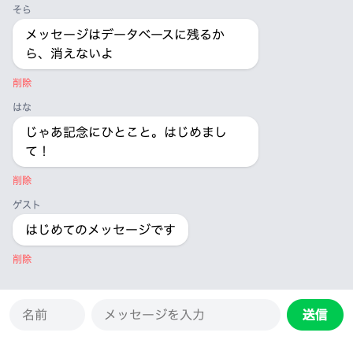

# メッセージを消す

受け取った1件を、今度は実際にデータベースから消します。

## 削除のしくみ

前のセクションで、「削除」を押すと、そのメッセージ1件が受け取る係の手元まで届くようになりました。ただ、届いた文を画面に返しているだけなので、データベースの表の中身はまだ何も変わっていません。

消すこと自体は1行で済みます。届いたその1件に向かって `$message->delete()` と書くと、データベースの表からその行が無くなります。表のどの行かを自分で探す必要はありません。手元にあるのが押された1件なので、それに「消して」と伝えるだけです。

もう1行、消したあとに画面をどうするかを書きます。メッセージを保存できるようにしたときのリダイレクトを、そのまま同じ形で書きます。これがあると、「削除」を押した人はチャット画面へ送り返されます。自分で戻るボタンを押す必要はありません。

## 実践: 押したメッセージを消す

書き替えるのは1つ、受け取る係のファイルだけです。対応表と画面はそのままで、ターミナルも触りません（`php artisan serve` は動かしたままにしておきます）。作業部屋を開き直したときは、`cd chat-app` を済ませたターミナルで `php artisan serve` を打ち直してください。

`app/Http/Controllers/ChatController.php` を開き、ファイル全体を次の内容にまるごと置き換えてください。

```php title="app/Http/Controllers/ChatController.php"
<?php

namespace App\Http\Controllers;

use App\Models\Message;
use Illuminate\Http\Request;

class ChatController extends Controller
{
    public function store(Request $request)
    {
        $validated = $request->validate([
            'name' => 'required',
            'body' => 'required',
        ], [
            'name.required' => '名前を入力してください',
            'body.required' => 'メッセージを入力してください',
        ]);

        Message::create([
            'name' => $validated['name'],
            'body' => $validated['body'],
        ]);

        return redirect('/chat');
    }

    public function destroy(Message $message)
    {
        $message->delete();

        return redirect('/chat');
    }
}
```

変わるのは `destroy` の中だけです。届いた文を返していた `return $message->body;` の1行が消えて、消す1行とリダイレクトの1行に入れ替わります。

書き替えは自動で保存されるので、そのままブラウザに切り替えて、チャット画面を開き直してください。

!!! warning "注意"

    消したメッセージは元にもどせません。試すのは、前のセクションで「削除」を押してみた `名前つきで送れました` の吹き出しがちょうどよいでしょう。同じ文は、あとから入力欄に打てばもう一度送れます。サンプルの会話を消してしまっても、この先の手順はすべて進められます。ただし1〜2件は残しておくと、このあとの章で確かめるときに画面が見やすくなります。

では、その吹き出しの下の「削除」を押してみましょう。真っ白な画面をはさまずにチャット画面が出て、押した吹き出しはもうありません。



もう一度開き直しても、消したメッセージは出てきません。画面から見えなくなっただけでなく、データベースの表から行ごと無くなっているためです。

!!! warning "注意"

    「削除」を押して真っ白な画面が出たときは、リダイレクトの1行が抜けています。エラーの言葉はどこにも出ません。この真っ白な画面だけが、気づくための手がかりです。メッセージのほうは消えています。先に戻るボタンを押してチャット画面にもどり、`destroy` の中に `return redirect('/chat');` の行があるか確かめてください。

**確認**: 吹き出しの下の「削除」を押すと、そのままチャット画面が出て、押した吹き出しは消えています。開き直しても、消したメッセージは出てきません。

## まとめ

- 届いた1件に `$message->delete()` と伝えると、データベースの表からその行が無くなる。開き直しても、消したメッセージは出てこない
- 消したあとはリダイレクトでチャット画面へ送り返すので、戻るボタンを押す一手が要らない

次のセクションでは、書き直せるようにします。吹き出しの下に「編集」を足して、押すと、いまの内容が入った入力欄のある画面がひらきます。消すのはボタン1つで足りましたが、直すにはその画面が要ります。チャット画面に続いて、2枚目の画面ファイルをつくります。
