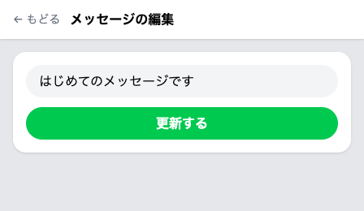
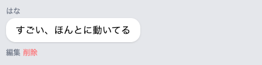

# 編集画面をつくる

書き直せるように、そのメッセージだけを載せた画面をひらきます。



## なぜ画面を1枚増やすのか

チャット画面にも入力欄はあります。ただ、あの欄は新しいメッセージを送るためのものです。書き直しを打ち込んでも、吹き出しが1つ増えるだけで、どのメッセージを直したいのかは伝わりません。

書き直すときにほしいのは、直したい1件だけが載っていて、いまどう書いてあるかが見える場所です。文が入った状態なら、直したいところだけ打ち替えて送れます。そのメッセージ専用の画面を、もう1枚つくります。

## 書き直すフォームのかたち

新しい画面に置くのは、送信フォームとよく似たフォームです。送り先は `/chat` ではありません。削除のフォームと同じ、そのメッセージ1件を指す住所です。行き方を伝える1行も、同じ場所に同じ形で書きます。言葉だけが、書き直しを伝える `PATCH` に変わります。

違うのは入力欄です。送信フォームの欄は空から始まり、薄い案内の文字だけが出ていました。こちらは `value="{{ $message->body }}"` と書いて、そのメッセージの文を先に入れておきます。名札は送信フォームと同じ `body` です。

## 実践: 書き直す画面をひらく

`php artisan serve` を動かしたまま、ブラウザでチャット画面が開ける状態から始めます。作業部屋を開き直したときは、`cd chat-app` を済ませたターミナルで `php artisan serve` を打ち直してください。手を入れるのは全部で4か所です。新しい画面をつくり、それを呼び出す係、住所の対応表、押す場所の順に足します。最後の1行を足すと、その場で押して確かめられます。

1つめは、新しい画面のファイルです。左のファイル一覧で `chat-app` の中の `resources` を開き、さらに `views` を開いてください。その `views` を右クリックして「新しいファイル...」を選び、`edit.blade.php` と打って Enter を押してください。名前は半角で、`.blade.php` まで続けて打ちます。

中央に空のファイルが開くので、次の内容をまるごと入れてください。

```blade title="resources/views/edit.blade.php"
<!DOCTYPE html>
<html lang="ja">
<head>
  <meta charset="UTF-8">
  <meta name="viewport" content="width=device-width, initial-scale=1.0">
  <title>メッセージの編集</title>
  <script src="https://cdn.jsdelivr.net/npm/@tailwindcss/browser@4"></script>
</head>
<body class="bg-gray-50">
  <div class="max-w-md mx-auto h-screen flex flex-col bg-gray-200 shadow-lg">

    <header class="bg-white px-4 py-3 flex items-center gap-3 shadow-sm">
      <a href="/chat" class="text-sm text-gray-500">← もどる</a>
      <h1 class="font-bold">メッセージの編集</h1>
    </header>

    <main class="flex-1 overflow-y-auto p-4">
      <form action="/messages/{{ $message->id }}" method="POST" class="bg-white rounded-2xl p-4 shadow-sm">
        @csrf
        @method('PATCH')
        <input type="text" name="body" value="{{ $message->body }}"
          class="w-full bg-gray-100 rounded-full px-4 py-2 mb-3">
        @error('body')
          <p class="text-red-500 text-sm mb-3">{{ $message }}</p>
        @enderror
        <button type="submit" class="w-full bg-green-500 text-white font-bold rounded-full px-4 py-2">更新する</button>
      </form>
    </main>

  </div>
</body>
</html>
```

この画面の多くの行は、チャット画面とまったく同じ文字列です。違うのは、タブに出る文字と、ヘッダーのかたまりと、`<main>` の中のフォームだけです。画面が増えるたび、この枠も書き写すことになります。1か所にまとめる書き方もありますが、この教材では扱いません。

`@error` から `@enderror` までは、送信フォームに置いたのと同じ、赤い文字を出す場所です。中の `{{ $message }}` も同じで、上の `value` とは別物の注意の文です。いまは何も出ません。

2つめは、押されたときに受け取る係です。`app/Http/Controllers/ChatController.php` を開き、ファイル全体を次の内容にまるごと置き換えてください。

```php title="app/Http/Controllers/ChatController.php"
<?php

namespace App\Http\Controllers;

use App\Models\Message;
use Illuminate\Http\Request;

class ChatController extends Controller
{
    public function store(Request $request)
    {
        $validated = $request->validate([
            'name' => 'required',
            'body' => 'required',
        ], [
            'name.required' => '名前を入力してください',
            'body.required' => 'メッセージを入力してください',
        ]);

        Message::create([
            'name' => $validated['name'],
            'body' => $validated['body'],
        ]);

        return redirect('/chat');
    }

    public function edit(Message $message)
    {
        return view('edit', ['message' => $message]);
    }

    public function destroy(Message $message)
    {
        $message->delete();

        return redirect('/chat');
    }
}
```

増えたのは `edit` のかたまりです。カッコの中は削除のときと同じなので、押した1件がまるごと届きます。`return view('edit', ['message' => $message]);` は、いまつくった `edit.blade.php` にその1件を渡して呼び出す1行です。渡した先で `{{ $message->body }}` に文が入ります。

3つめは、住所の対応表です。`routes/web.php` を開き、`Route::delete` で始まる行のすぐ下に、次の1行を足してください。ここは足すだけで、ファイル全体は貼り替えません。

```php title="routes/web.php"
Route::get('/messages/{message}/edit', [ChatController::class, 'edit']);
```

番号までは削除のときと同じで、うしろに `/edit` を足すと「そのメッセージの編集画面」を指す住所になります。開くだけなので、行き方は画面を見るための `GET` です。

4つめは、押す場所です。`resources/views/chat.blade.php` を開き、`<div class="mt-1">` の行のすぐ下に、次の1行を足してください。`<form` で始まる行から下は、そのまま下にずれます。

```blade title="resources/views/chat.blade.php"
            <a href="/messages/{{ $message->id }}/edit" class="text-xs text-gray-500">編集</a>
```

ブラウザに切り替えて、チャット画面を開き直してください。それぞれの吹き出しの下に、小さな灰色の「編集」と赤い「削除」が横に並びます。



どれか1つの「編集」を押してみましょう。アドレスの末尾が `/edit` に変わり、「メッセージの編集」という見出しの画面が出ます。入力欄には、押した吹き出しの文がそのまま入っています。

入力欄に `{{ $message->body }}` という文字がそのまま入っているときは、ファイルの名前から `.blade` が抜けています。右クリックの「名前の変更...」で `edit.blade.php` に直してください。

!!! warning "注意"

    「更新する」を押すと、画面いっぱいに英語のエラー画面が出ます。壊したわけではありません。届ける先は決めましたが、その行き方で受け取る係を、まだつくっていないためです。

    ```text
    MethodNotAllowedHttpException
    The PATCH method is not supported for route messages/6. Supported methods: DELETE.
    ```

    数字は押した吹き出しによって変わります。先に戻るボタンを押せば、編集画面にもどります。

**確認**: 吹き出しの下の「編集」を押すと、いまの内容が入った入力欄と緑の「更新する」ボタンのある画面が出ます。この時点では、「更新する」を押すとエラー画面になるのが正しい状態です。見出しの左の「← もどる」を押すと、チャット画面にもどります。

## まとめ

- 直すには、いまどう書いてあるかが見えて、その場で打ち直せる画面が要る
- 入力欄に `value="{{ $message->body }}"` と書くと、開いた時点でその文が入っている
- 書き直しを伝える言葉は `PATCH` で、書く場所と形は「消したい」を伝えた1行と同じ

次のセクションでは、この画面から送った書き直しを受け取って保存します。足すのは住所の対応表の1行と、受け取る係の1つだけです。「更新する」を押すと、書き直した内容で上書きされ、チャット画面にもどります。
