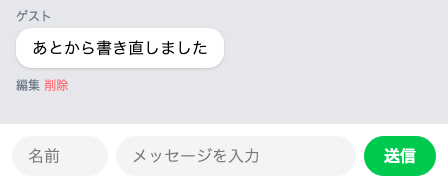
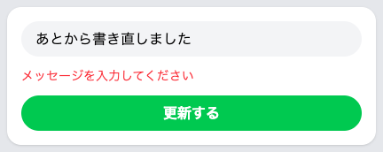

# 書き直しを保存する

書き直した内容で上書きして、チャット画面に戻ります。

## 更新のしくみ

前のセクションで、書き直すための画面ができました。ただ、「更新する」を押すと、まだ画面いっぱいに英語のエラー画面が出ます。書き直しを受け取る係と、その行き方の住所が、どちらもまだないためです。

受け取る係の中でやることは2つです。1つめが、届いた内容の確かめです。メッセージが空だったら、保存の手前で止めます。空のまま「送信」を押したときと同じしくみで、画面に出す日本語の文もそこで決めます。

2つめが、書き換えです。届いた1件に向かって `$message->update()` と書き、確かめの通った内容をカッコの中に渡すと、データベースの表のその行が、渡した内容で書き換わります。消すときと同じで、表のどの行かを自分で探す必要はありません。

止まったときの戻り先は、送ったもとの画面です。編集画面から送っているので、出るのはチャット画面ではなく編集画面で、足りないことは前のセクションで置いた赤い文字の場所に出ます。書き換えができたときだけ、リダイレクトでチャット画面に戻ります。

## 実践: 書き直した内容を保存する

前のセクションから続けて、`php artisan serve` を動かしたまま進めます。作業部屋を開き直したときは、`cd chat-app` を済ませたターミナルで `php artisan serve` を打ち直してください。書き替えるファイルは2つです。受け取る係を先に足して、最後に住所の対応表に1行足します。

`app/Http/Controllers/ChatController.php` を開き、ファイル全体を次の内容にまるごと置き換えてください。

```php title="app/Http/Controllers/ChatController.php"
<?php

namespace App\Http\Controllers;

use App\Models\Message;
use Illuminate\Http\Request;

class ChatController extends Controller
{
    public function store(Request $request)
    {
        $validated = $request->validate([
            'name' => 'required',
            'body' => 'required',
        ], [
            'name.required' => '名前を入力してください',
            'body.required' => 'メッセージを入力してください',
        ]);

        Message::create([
            'name' => $validated['name'],
            'body' => $validated['body'],
        ]);

        return redirect('/chat');
    }

    public function edit(Message $message)
    {
        return view('edit', ['message' => $message]);
    }

    public function update(Request $request, Message $message)
    {
        $validated = $request->validate([
            'body' => 'required',
        ], [
            'body.required' => 'メッセージを入力してください',
        ]);

        $message->update($validated);

        return redirect('/chat');
    }

    public function destroy(Message $message)
    {
        $message->delete();

        return redirect('/chat');
    }
}
```

増えたのは `update` のかたまりです。カッコの中が2つあるのは、送られてきた中身と、書き直す1件の両方を受け取るためです。`validate()` に並べた名札は、編集画面の入力欄に付いている `body` の1つだけです。確かめの通った中身は `$validated` に入り、そのまま `$message->update($validated)` に渡します。

続けて、住所の対応表です。`routes/web.php` を開き、ファイルのいちばん下に、次の1行を足してください。ここは足すだけで、ファイル全体は貼り替えません。

```php title="routes/web.php"
Route::patch('/messages/{message}', [ChatController::class, 'update']);
```

住所は削除のときとまったく同じで、行き方の言葉だけが `patch` です。編集画面のフォームに書いた `@method('PATCH')` とこの行がそろって、はじめて書き直しが届きます。

ブラウザに切り替えて、チャット画面を開き直してください。`はじめてのメッセージです` の吹き出し（消してしまっていたら、残っているどれかの吹き出し）の「編集」を押したら、入力欄の中を一度押して、`Ctrl` キーと `A` キーを同時に押します（Mac では `command` キーと `A` キーです）。入っている文がすべて選ばれるので、そのまま `あとから書き直しました` と打ち替えて、「更新する」を押しましょう。

チャット画面が出て、その吹き出しの文が変わっています。



開き直しても、変わったままです。データベースの表の中身が書き換わっているためです。

もう一度その吹き出しの「編集」を押して、こんどは同じやり方で入力欄の文をすべて選び、`Backspace` キー（Mac では `delete` キー）で消して「更新する」を押してみましょう。チャット画面には戻りません。編集画面がそのまま出て、入力欄の下に赤い文字が1行出ます。

```text
メッセージを入力してください
```



空のまま送ったことの知らせで、表の中身はそのままです。入力欄には、データベースに残っている文がそのまま出ます。そこから打ち直して「更新する」を押せば保存できます。左上の「← もどる」でチャット画面にもどってもかまいません。

!!! failure "よくあるエラー"

    「更新する」を押しても、まだ画面いっぱいに英語のエラー画面が出ることもあります。

    ```text
    MethodNotAllowedHttpException
    The POST method is not supported for route messages/6. Supported methods: PATCH, DELETE.
    ```

    **原因**: 編集画面のフォームから `@method('PATCH')` の行が抜けています。届けるための行き方のまま送っているので、いま足した受け取り口には入りません。

    **対処法**: 先に戻るボタンを押して、`resources/views/edit.blade.php` の `@csrf` のすぐ下に `@method('PATCH')` があるか確かめてください。`The PATCH method is not supported` で始まる文が出るときは、対応表の1行を足していないか、打ち間違えています。同じ症状は、困ったときに戻るページにも載せてあります。

最後に、今日の分を記録して終わりましょう。左端のアイコンの列から「ソース管理」を押し、メッセージを打って「コミット」、続けて「変更の同期」を押します。手順の詳しい説明は、はじめて保存の儀式をしたページにあります。

```text
メッセージの編集と削除をつけた
```

## 完成チェックリスト

- 吹き出しの下に、小さな「編集」と「削除」が横に並んでいる
- 「削除」を押すと、押した吹き出しの消えたチャット画面が出て、開き直しても出てこない
- 「編集」を押すと、いまの内容が入った入力欄のある画面がひらく
- 書き替えて「更新する」を押すと、チャット画面に戻り、その吹き出しの文が変わっている
- 入力欄を空のまま「更新する」を押すと、編集画面に赤い文字で「メッセージを入力してください」と出る
- 今日の分が GitHub に上がっている

## まとめ

- 届いた1件に `$message->update()` と伝えると、渡した内容で表のその行が書き換わる
- 保存の手前の確かめは送信のときと同じしくみで、空のまま押すと編集画面に戻って赤い文字が出る
- 書き換えができたときは、リダイレクトでチャット画面に戻り、書き直した文が吹き出しに出る

次のセクションでは手を止めて、ここまでに書いたものを読み返します。つくる・見る・直す・消すという4つの操作は、Web アプリの基本の形です。自分が書いたコードのどこがどれに当たるのかを、順に対応づけていきます。
