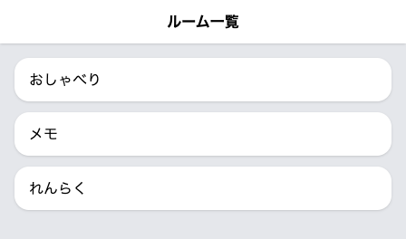
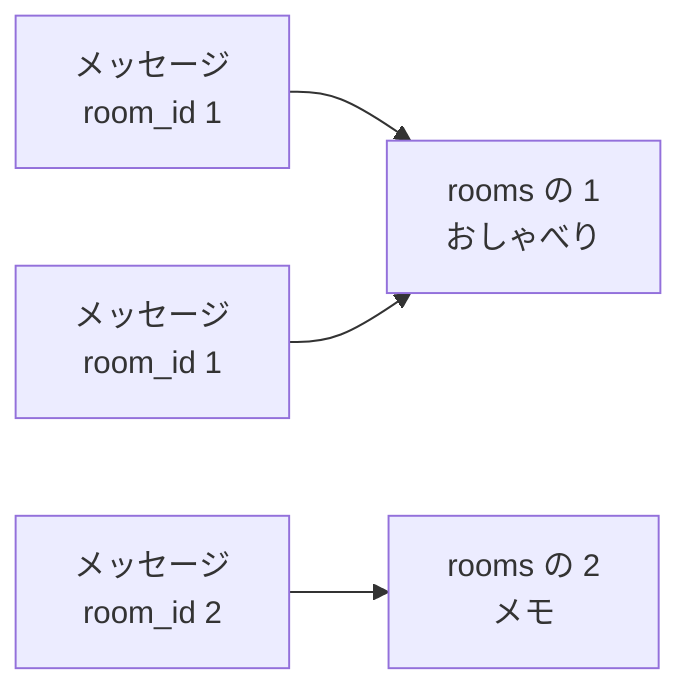

# ルームのしくみ

話題ごとに場所を分けて、会話が混ざらないようにします。前のセクションの終わりでふれたとおり、今日はこの教材でいちばん作りごたえのある日です。

この章は5つのセクションでできています。部屋そのものを入れておく表をつくり、メッセージと結びつけて、一覧から選んだ部屋の会話だけが開くところまで進みます。

| セクション | テーマ | 種類 |
|---|---|---|
| ルームのしくみ | 場所を分けるしくみと、2つ目の表 | 読む |
| ルームの表をつくる | ルームそのものを入れておく表を用意する | 手を動かす |
| メッセージとルームをつなぐ | メッセージがどの部屋のものかを覚えられるようにする | 手を動かす |
| ルーム一覧と切り替え | 一覧から選んで、そのルームの会話だけを開く | 手を動かす |
| 送信をルームに紐づける | いま開いているルームあてに送る | 手を動かす |

**この Chapter の進め方**: このセクションは読むだけです。残りの4つでは、先にデータベースの側を用意してから、画面をつなぎます。見た目が変わるのは後半の2つで、それまではターミナルと編集エリアで手を動かします。

## なぜルームで分けるのか

いまのチャットは、送ったメッセージがすべて1つの画面に並びます。会話が1本しかないうちは、これで足ります。

困るのは、別の話をしたくなったときです。買い物のメモを送ったあと、思いついたことを続けて送ると、その2つが同じ列に並びます。あとで買い物のメモだけを読み返したくても、関係のないメッセージのあいだから探すことになります。

ふだん使われているチャットアプリでは、こうならないように場所が分かれています。この教材でも同じものをつくります。分かれた一つひとつの場所を **トークルーム** と呼び、以降は短く「ルーム」と書きます。このセクションではしくみの説明が続くので、そのまま「部屋」とも呼びます。

## 部屋を入れておく表

部屋を分けるには、まず部屋そのものをどこかに残しておく必要があります。残す先はデータベースです。あとから取り出して画面に並べたいものは表に入れる、というのは、メッセージのときと同じです。

部屋の表は `rooms` という名前にします。持たせるのは部屋の名前だけなので、`messages` よりも小さい表になります。自分でつくる表は、これで2つ目です。

| `id` | `name` |
|---|---|
| 1 | おしゃべり |
| 2 | メモ |
| 3 | れんらく |

`id` は、メッセージの表と同じで、入れた順に付く番号です。1つの部屋に1つの番号が付きます。この番号が、このあとの結びつけで手がかりになります。

## メッセージと部屋のつながり

部屋の表ができても、会話はまだ分かれません。メッセージの側が、自分がどの部屋のものかを覚えていないからです。

そこで、メッセージの表に列を1つ足します。入れるのは部屋の番号で、列の名前は `room_id` にします。表をはじめて見たときの形に、いちばん右の列が増えると考えてください。

次の表は、いまある会話から2件だけを抜き出したものです。

| `id` | `name` | `body` | `room_id` |
|---|---|---|---|
| 2 | そら | そう。Laravel っていう道具で作ったよ | 1 |
| 3 | はな | すごい、ほんとに動いてる | 1 |

この2件は、どちらも `room_id` が 1 なので、1番の部屋のメッセージです。メモの部屋で送ったメッセージには、`room_id` に 2 が入ります。

矢印は「この番号の部屋のもの」という結びつきです。番号を持つのはメッセージの側だけで、部屋の表には何も足しません。この1本があれば、1つの部屋にメッセージがいくつ集まっても、どれがどの部屋のものかが決まります。

画面に会話を並べるときは、この番号でふるい分けます。1番の部屋を開いたときは `room_id` が 1 のメッセージだけを取り出して吹き出しにします。

## 今日つくるものの順番

やることは4つで、この順に進みます。

1. 部屋そのものを入れておく表をつくり、最初の部屋を入れる
2. メッセージの表に、部屋の番号を入れる列を足す
3. 部屋の一覧の画面をつくり、選んだ部屋の会話だけを出す
4. 送信を、いま開いている部屋あてにする

はじめの2つは、データベースの側の仕事です。この2つを終えても画面の見た目は変わらないので、手ごたえが出るのは3つ目からになります。3つ目がいちばん長く、書き替えるファイルも多くなります。

3つ目では、チャット画面を開くアドレスも変わります。いまは `/chat` で開いていますが、どの部屋を開くかでアドレスが変わる形になるため、`/chat` では開けなくなります。何をどう書き替えるかは、その場で説明します。

!!! tip "ヒント"

    今日は長い日なので、途中で手を止めてかまいません。区切るときはセクションの終わりまで進めておくと、次に開いたときに続きから始められます。

## まとめ

- いまは全部の会話が1つの画面に並ぶので、話題が増えると混ざる。話題ごとに分けた場所がルーム
- 部屋そのものは `rooms` という2つ目の表に入れ、名前と番号を持たせる
- メッセージの側は `room_id` の列に部屋の番号を持ち、この番号で会話をふるい分ける

次のセクションでは、部屋そのものを入れておく `rooms` の表をつくります。表の設計図を書いて反映し、サンプルの会話を入れたときと同じ道具で、最初の部屋を3つ入れるところまで進みます。
