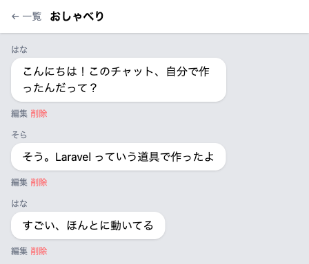
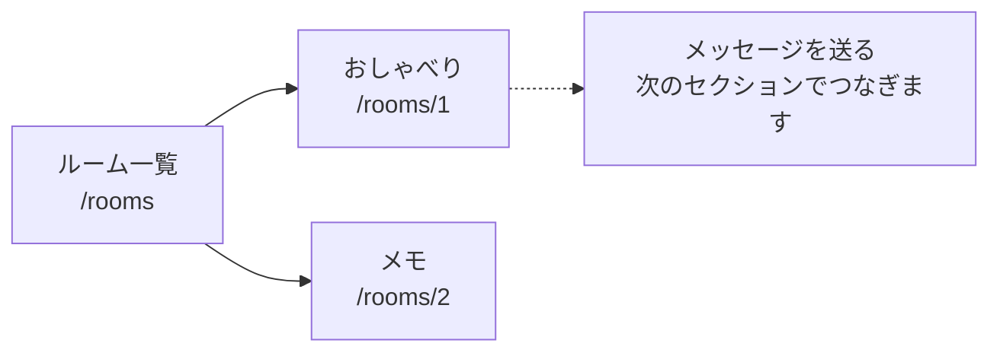
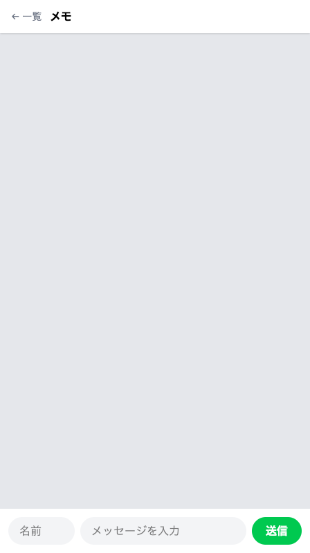

# ルーム一覧と切り替え

ルームの一覧から選んで、そのルームの会話だけを開けるようにします。



## URL にルーム番号を入れる

チャット画面の住所は、ここまで `/chat` の1つだけでした。ルームが3つになると、どのルームを開くのかを住所で伝える必要があります。書き方は、メッセージ1件を指す住所と同じで、番号を混ぜます。

```text
/rooms      ルームの一覧
/rooms/1    1番のルームのチャット画面
/rooms/2    2番のルームのチャット画面
```

対応表には番号の場所を波かっこにして `/rooms/{room}` と書き、受け取る係のカッコの中は `Room $room` にします。消す1件を受け取ったときと同じしくみです。

ルームの係は、メッセージの係とは別のファイルにまとめます。名前は `RoomController` で、入れるのは一覧を出す係と、選ばれたルームを開く係の2つです。

チャット画面のファイルは1つのままで、開いたルームによって中身が変わります。いままでの `/chat` は対応表から消すので、`/chat` では開けなくなります。



点線は、このセクションではまだつながりません。送信フォームの送り先を `/chat` から変えるのは次のセクションなので、それまで送信は使えません。

## ルームから会話をたどる1行

いままでは `Message::all()` で全部のメッセージを取り出していました。これからは、届いたルームに向かって `$room->messages` と書くと、`room_id` がそのルームの番号のメッセージだけが返ります。並ぶ順は前と同じで、古い会話が上です。

そう書けるようにするため、`Room` に4行足します。足すのは `hasMany` という指定で、「たくさん持っている」という意味です。メッセージとルームのつながりを図で見たときの矢印を、そのまま書き表したものです。

## 実践: ルームを選んでひらく

前のセクションから続けて、`php artisan serve` が動いている状態で進めます。コマンドを1つ打つので、`chat-app` にいるもう1つのターミナルも使います。作業部屋を開き直したときは、`cd chat-app` を済ませたターミナルを2つ用意し、片方で `php artisan serve` を打ってからブラウザを開いてください。

手を入れるのは全部で9か所です。一覧を出す、ルームを開く、行き先をつなぎ直す、の3つに分けて進めます。番号は9つめまで通しで振ってあるので、途中で手を止めるときは、いくつめまで終わったかを覚えておけば、そこから続けられます。

### Step 1: ルームの一覧が出る

1つめは、ルームを扱う係のファイルです。

```bash
php artisan make:controller RoomController
```

```text
   INFO  Controller [app/Http/Controllers/RoomController.php] created successfully.
```

`app` の中の `Http`、`Controllers` と進んだところに増えています。開いて、ファイル全体を次の内容にまるごと置き換えてください。

```php title="app/Http/Controllers/RoomController.php"
<?php

namespace App\Http\Controllers;

use App\Models\Room;

class RoomController extends Controller
{
    public function index()
    {
        $rooms = Room::all();

        return view('rooms', ['rooms' => $rooms]);
    }
}
```

`index` が一覧を出す係です。`Room::all()` で全部のルームを取り出し、`rooms` という画面に渡します。もとの `use` の行は、`use App\Models\Room;` に入れ替わります。

2つめは、渡す先の画面です。書き直しの画面をつくったときと同じやり方で、`resources` の中の `views` を右クリックして「新しいファイル...」を選び、`rooms.blade.php` をつくってください。開いた空のファイルに、次の内容をまるごと入れます。

```blade title="resources/views/rooms.blade.php"
<!DOCTYPE html>
<html lang="ja">
<head>
  <meta charset="UTF-8">
  <meta name="viewport" content="width=device-width, initial-scale=1.0">
  <title>ルーム一覧</title>
  <script src="https://cdn.jsdelivr.net/npm/@tailwindcss/browser@4"></script>
</head>
<body class="bg-gray-50">
  <div class="max-w-md mx-auto h-screen flex flex-col bg-gray-200 shadow-lg">

    <header class="bg-white px-4 py-3 shadow-sm">
      <h1 class="font-bold text-center">ルーム一覧</h1>
    </header>

    <main class="flex-1 overflow-y-auto p-4">
      @foreach ($rooms as $room)
        <a href="/rooms/{{ $room->id }}"
          class="block bg-white rounded-2xl px-4 py-3 shadow-sm mb-3">
          {{ $room->name }}
        </a>
      @endforeach
    </main>

  </div>
</body>
</html>
```

`@foreach` でルームを1件ずつ取り出し、白いカードを縦に並べます。カードそのものがリンクで、行き先は `/rooms/{{ $room->id }}` です。押したルームの番号が住所に入ります。

3つめは対応表です。`routes/web.php` を開き、上のほうの `use App\Http\Controllers\ChatController;` の行のすぐ下に、次の1行を足してください。`use App\Models\Message;` の行は、下にずれます。ここは足すだけで、ファイル全体は貼り替えません。

```php title="routes/web.php"
use App\Http\Controllers\RoomController;
```

続けて、いちばん下の `Route::patch` で始まる行のすぐ下に、空の行を1つはさんで次の1行を足します。

```php title="routes/web.php"
Route::get('/rooms', [RoomController::class, 'index']);
```

ブラウザに切り替えて、アドレスの末尾を `/rooms` に変えて開いてください。「ルーム一覧」の見出しの下に、「おしゃべり」「メモ」「れんらく」の3つが縦に並びます。


前のセクションまでで入れた3つのルームが、ここで初めて目に見えました。名前を押すと、いまは `404` と `Not Found` だけの画面が出ます。開く先をまだ決めていないので、これで合っています。

### Step 2: 選んだルームの会話だけ並ぶ

4つめから7つめまで書き替えます。全部そろってから開くので、途中で一覧のルームを押さないでください。

4つめは `Room` です。`app` の中の `Models` にある `Room.php` を開き、`//` の行をまるごと選んで、次の4行に置き換えてください。ファイル全体は貼り替えません。

```php title="app/Models/Room.php"
    public function messages()
    {
        return $this->hasMany(Message::class);
    }
```

足すのはこの4行だけで、`use` の行は要りません。

!!! failure "よくあるエラー"

    このあとルームを開いたときに、画面いっぱいに英語のエラー画面が出ることもあります。

    ```text
    ErrorException
    resources/views/chat.blade.php:18
    foreach() argument must be of type array|object, null given
    ```

    **原因**: `Room` に足した4行が抜けています。`$room->messages` が「何も無い」を返し、それをくり返しの指示に渡したためです。

    **対処法**: 先に戻るボタンを押して、`app/Models/Room.php` に `messages()` の4行があるか確かめてください。この画面が指しているのは `chat.blade.php` の行で、**直すファイルの名前はどこにも出てきません**。抜けやすいのは、いちばん短いこの4行です。

5つめは `RoomController` です。ファイル全体を次の内容にまるごと置き換えてください。

```php title="app/Http/Controllers/RoomController.php"
<?php

namespace App\Http\Controllers;

use App\Models\Room;

class RoomController extends Controller
{
    public function index()
    {
        $rooms = Room::all();

        return view('rooms', ['rooms' => $rooms]);
    }

    public function show(Room $room)
    {
        $messages = $room->messages;

        return view('chat', ['room' => $room, 'messages' => $messages]);
    }
}
```

増えたのは `show` のかたまりです。カッコの中が `Room $room` なので、押されたルームが1件まるごと届きます。そこから `$room->messages` で会話を取り出し、ルームと一緒にチャット画面へ渡します。渡すものが2つなので、カッコの中がカンマで並びます。

6つめはチャット画面です。`resources/views/chat.blade.php` を開き、`<header` で始まる行の先頭から `</header>` の行の末尾まで（3行）を選び、次の内容（4行）に貼り替えてください。選ぶ3行は、`チャット` という文字が入った `<h1` の行を上下からはさんだ形で、`<header` の行はこのファイルに1つだけです。

```blade title="resources/views/chat.blade.php"
    <header class="bg-white px-4 py-3 flex items-center gap-3 shadow-sm">
      <a href="/rooms" class="text-sm text-gray-500">← 一覧</a>
      <h1 class="font-bold">{{ $room->name }}</h1>
    </header>
```

上の白い帯に、一覧へもどるリンクと、開いているルームの名前が並びます。`{{ $room->name }}` に入るのが、`show` から渡したルームの名前です。書き直しの画面のヘッダーと同じ形です。

7つめは対応表です。`routes/web.php` を開き、ファイル全体を次の内容にまるごと置き換えてください。3つめで足した2行も、この貼り替えの中に入っています。貼る前に、いま開いたファイルに `Route::get('/hello'` で始まる行があるか見てください。あれば下の内容をそのまま貼り、無ければ下の内容から `/hello` の3行を抜いて貼ります。

```php title="routes/web.php"
<?php

use App\Http\Controllers\ChatController;
use App\Http\Controllers\RoomController;
use Illuminate\Support\Facades\Route;

Route::get('/', function () {
    return view('welcome');
});

Route::get('/hello', function () {
    return 'はじめまして';
});

Route::delete('/messages/{message}', [ChatController::class, 'destroy']);
Route::get('/messages/{message}/edit', [ChatController::class, 'edit']);
Route::patch('/messages/{message}', [ChatController::class, 'update']);

Route::get('/rooms', [RoomController::class, 'index']);
Route::get('/rooms/{room}', [RoomController::class, 'show']);
```

増えたのは、いちばん下のルームを開くための1行です。消えたのは `/chat` の2本のルート（画面を見るための行き方と、メッセージを届けるための行き方）と、そこで使っていた `use App\Models\Message;` の1行です。

ブラウザに切り替えます。`404` の画面が出ているときは、戻るボタンを押すと一覧にもどれます。一覧で「おしゃべり」を押してください。アドレスが `/rooms/1` に変わり、上の帯に「← 一覧」と「おしゃべり」が出て、これまでの会話がそのまま並びます。

上の帯の「← 一覧」を押して一覧にもどり、こんどは「メモ」を押します。吹き出しが1つもない、灰色の広い画面が出ます。サンプルの会話は全部1つ目のルームに入っているので、ほかの2つはまだ空です。これで合っています。



吹き出しの下の「編集」と「削除」は、Step 3 で行き先をつなぎ直してから使います。下の「送信」がつながるのは次のセクションです。その「送信」はいまも `/chat` に向かうので、押すと `404` と `Not Found` だけの画面が出ます。戻るボタンでルームにもどれますし、打ったメッセージはどこにも残らないので、押してしまってもかまいません。「編集」を押すと書き直しの画面は開きますが、そこの「← もどる」と「更新する」がまだ `/chat` に向かうので、行き来はできません。「削除」は吹き出しが本当に消えるので、つなぎ直したあとにしましょう。

!!! warning "注意"

    どのルームを押しても空の画面が出て、しかも上の帯にルームの名前が出ていないときは、対応表の波かっこの中と、係のカッコの中の名前がそろっていません。`{room}` と `Room $room` を見比べてください。エラーの言葉はどこにも出ません。上の帯にルームの名前が出ているかどうかが、気づくための手がかりです。

### Step 3: 編集や削除のあともルームにもどる

`/chat` を行き先にしていたのは、削除したあとの戻り先、書き直しを保存したあとの戻り先、書き直しの画面の「← もどる」です。このセクションで直すのはこの3つの行き先で、どれも開いていたルームにもどるように変えます。手を入れるファイルは8つめと9つめの2つです。

8つめは、削除と書き直しを受け取る係です。`app/Http/Controllers/ChatController.php` を開き、ファイル全体を次の内容にまるごと置き換えてください。変わるのは2行だけです。

```php title="app/Http/Controllers/ChatController.php"
<?php

namespace App\Http\Controllers;

use App\Models\Message;
use Illuminate\Http\Request;

class ChatController extends Controller
{
    public function store(Request $request)
    {
        $validated = $request->validate([
            'name' => 'required',
            'body' => 'required',
        ], [
            'name.required' => '名前を入力してください',
            'body.required' => 'メッセージを入力してください',
        ]);

        Message::create([
            'name' => $validated['name'],
            'body' => $validated['body'],
        ]);

        return redirect('/chat');
    }

    public function edit(Message $message)
    {
        return view('edit', ['message' => $message]);
    }

    public function update(Request $request, Message $message)
    {
        $validated = $request->validate([
            'body' => 'required',
        ], [
            'body.required' => 'メッセージを入力してください',
        ]);

        $message->update($validated);

        return redirect('/rooms/' . $message->room_id);
    }

    public function destroy(Message $message)
    {
        $message->delete();

        return redirect('/rooms/' . $message->room_id);
    }
}
```

変わったのは `update` と `destroy` の最後の行です。`$message->room_id` は、そのメッセージが入っているルームの番号で、前のセクションで足した列がここで効きます。`destroy` は消したあとに番号を読んでいますが、消したメッセージの中身はその場に残っているので、行き先は決まります。

`store` の中にも `/chat` が残っていますが、これは送信をつなぎ直す次のセクションで書き替えます。

9つめは書き直しの画面です。`resources/views/edit.blade.php` を開き、`← もどる` が入っている行を、次の1行に置き換えてください。置き換えるのはこの1行だけです。

```blade title="resources/views/edit.blade.php"
      <a href="/rooms/{{ $message->room_id }}" class="text-sm text-gray-500">← もどる</a>
```

ブラウザで一覧から「おしゃべり」を開き、どれか1つの吹き出しの「編集」を押してください。左上の「← もどる」で、「おしゃべり」のチャット画面にもどります。もう一度「編集」を押して、入力欄をそのままに「更新する」を押しても、同じルームにもどります。前はどちらも `/chat` にもどっていたところです。「削除」も同じで、消したあとは開いていたルームにもどります。

!!! warning "注意"

    行き先をつなぎ直したあとも、送信だけはまだつながっていません。送り先が `/chat` のままなので、押すと変わらず `404` の画面が出ます。次のセクションでつなぎます。

**確認**: `/rooms` を開くと3つのルームが並び、「おしゃべり」を押すとアドレスが `/rooms/1` に変わって、これまでの会話が並びます。「← 一覧」で一覧にもどり、吹き出しの「編集」から「← もどる」を押すと、開いていたルームにもどります。いちばん下の「送信」を押したときだけは、アドレスが `/chat` に変わって `404` の画面になります。ここは次のセクションでつなぐので、この状態で合っています。

## まとめ

- 住所に番号を混ぜると、開くルームが決まる（`/rooms/1` の形）。ルームの係は新しい `RoomController` にまとめた
- `Room` に4行足すと、`$room->messages` でそのルームの会話だけを取り出せる。つながりの書き方はほかにもあるが、この教材で使うのはこの1つだけ
- チャット画面の住所が引っ越したので、これまでの `/chat` では開けない（`404` と `Not Found` だけの画面になる）。削除と書き直しのあとの戻り先も、開いていたルームに変えた

次のセクションでは、送信をつなぎます。フォームの送り先をいま開いているルームあてに変え、保存するときにそのルームの番号を一緒に入れます。空のルームで打った最初のひとことが、そのルームの吹き出しになります。
