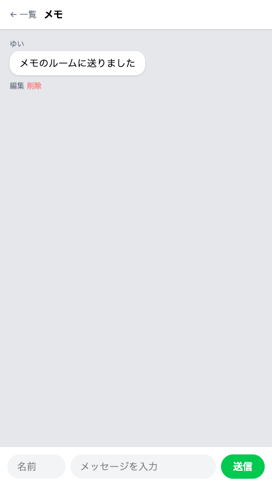

# 送信をルームに紐づける

いま開いているルームあてに、メッセージを送れるようにします。



## 送り先にルーム番号を含める

前のセクションでつなぎ直さなかったのは、送信だけです。フォームの送り先が `/chat` のままなので、押しても行き先がありません。

送り先は、一覧に並べたリンクと同じ書き方にします。`/rooms/` のうしろに番号を足す形です。チャット画面には開いているルームが1件届いているので、そこから `{{ $room->id }}` で番号を取り出せます。

対応表にも1行足します。届けるための行き方で `/rooms/{room}` に来たら、メッセージを受け取る係へつなぐ行です。これで同じ住所に、見るための行き方と届けるための行き方の2つが並びます。送信をつくったときに `/chat` で並べたのと同じ形です。

受け取る係のカッコの中にも `Room $room` を足します。住所に入っていた番号のルームが1件そのまま渡るので、保存するときに `'room_id' => $room->id` と書けば、そのルームの番号が一緒に入ります。書き直しを受け取る係が、届いた中身と1件の両方を受け取ったのと同じ形です。送ったあとの戻り先も、そのルームにします。

## 実践: 開いているルームに送る

前のセクションから続けて進めます。作業部屋を開き直したときは、`cd chat-app` を済ませたターミナルで `php artisan serve` を打ち直し、ブラウザで `/rooms` を開いてください。ターミナルを使うのはそこだけで、このあとは出てきません。手を入れるのは全部で3か所です。

1つめは、送信フォームの1行です。`resources/views/chat.blade.php` を開き、下のほうにある次の行を探してください。下の1行は探すための目印なので、まだ打ちません。

```blade title="resources/views/chat.blade.php"
      <form action="/chat" method="POST" class="flex gap-2">
```

同じファイルには吹き出しごとの「削除」のフォームもあるので、`class="flex gap-2"` が付いているほうが送信のフォームです。この行を、次の1行に置き換えます。ここは1行だけで、ファイル全体は貼り替えません。

```blade title="resources/views/chat.blade.php"
      <form action="/rooms/{{ $room->id }}" method="POST" class="flex gap-2">
```

2つめは対応表です。`routes/web.php` を開き、ファイルのいちばん下にある `Route::get('/rooms/{room}'` で始まる行のすぐ下に、次の1行を足してください。ここは足すだけで、ファイル全体は貼り替えません。

```php title="routes/web.php"
Route::post('/rooms/{room}', [ChatController::class, 'store']);
```

住所は上の行と同じで、違うのは行き方の言葉（`get` と `post`）と、つなぐ先の係です。

3つめは受け取る係です。`app/Http/Controllers/ChatController.php` を開き、ファイル全体を次の内容にまるごと置き換えてください。

```php title="app/Http/Controllers/ChatController.php"
<?php

namespace App\Http\Controllers;

use App\Models\Message;
use App\Models\Room;
use Illuminate\Http\Request;

class ChatController extends Controller
{
    public function store(Request $request, Room $room)
    {
        $validated = $request->validate([
            'name' => 'required',
            'body' => 'required',
        ], [
            'name.required' => '名前を入力してください',
            'body.required' => 'メッセージを入力してください',
        ]);

        Message::create([
            'name' => $validated['name'],
            'body' => $validated['body'],
            'room_id' => $room->id,
        ]);

        return redirect('/rooms/' . $room->id);
    }

    public function edit(Message $message)
    {
        return view('edit', ['message' => $message]);
    }

    public function update(Request $request, Message $message)
    {
        $validated = $request->validate([
            'body' => 'required',
        ], [
            'body.required' => 'メッセージを入力してください',
        ]);

        $message->update($validated);

        return redirect('/rooms/' . $message->room_id);
    }

    public function destroy(Message $message)
    {
        $message->delete();

        return redirect('/rooms/' . $message->room_id);
    }
}
```

変わったのは `store` のまわりだけです。上に `use App\Models\Room;` の行が増え、`store` のカッコの中が2つになり、保存する内容に `'room_id' => $room->id,` の1行が入りました。最後の戻り先も、開いていたルームに変わっています。

ブラウザに切り替えて、`/rooms` を開き直してください。「メモ」を押して、名前に `ゆい`、メッセージに `メモのルームに送りました` と入れて「送信」を押します。

同じ「メモ」の画面が出て、いま打ったひとことが吹き出しになって1つだけ並びます。会話が無かったルームの、はじめの1件です。

!!! failure "よくあるエラー"

    「送信」を押すと、`404` と `Not Found` だけの画面が出ることもあります。

    **原因**: 1つめのフォームの行が、まだ `/chat` を指しています。届ける住所が対応表にないので、メッセージはどこにも残っていません。

    **対処法**: 先に戻るボタンを押して、`resources/views/chat.blade.php` の `class="flex gap-2"` が付いたフォームの行を確かめてください。

「← 一覧」を押して、こんどは「おしゃべり」を開いてみましょう。前からの会話だけが並び、いま送ったものは混ざっていません。

!!! warning "注意"

    画面は戻ってくるのに、送ったはずのルームに吹き出しが増えないときは、「おしゃべり」を開いてみてください。そこに入っていたら、`app/Models/Message.php` の角かっこに `'room_id'` が足りていません。エラーの言葉はどこにも出ません。送ったルームではなく「おしゃべり」に増えることが、気づくための手がかりです。

ためしに、名前とメッセージを両方空のまま「送信」を押してみましょう。開いていたルームに戻って、入力欄の下に赤い文字が2つ出ます。

最後に、今日の分を記録して終わりましょう。左端のアイコンの列から「ソース管理」を押し、メッセージを打って「コミット」、続けて「変更の同期」を押します。手順の詳しい説明は、はじめて保存の儀式をしたページにあります。

```text
ルームごとにメッセージを分けた
```

## 完成チェックリスト

- `/rooms` を開くと、「おしゃべり」「メモ」「れんらく」のルームが縦に並ぶ
- ルームを押すとアドレスが `/rooms/1` のように変わり、そのルームの会話だけが並ぶ
- 「メモ」で名前とメッセージを入れて「送信」を押すと、そのルームに吹き出しが増える
- 「← 一覧」から別のルームを開くと、いま送ったものは混ざっていない
- 空のまま「送信」を押すと、開いていたルームに戻って赤い文字が出る
- 今日の分が GitHub に上がっている

## まとめ

- フォームの送り先に `{{ $room->id }}` を入れると、いま開いているルームあてに送れる
- 同じ `/rooms/{room}` に、見るための行き方と届けるための行き方が並ぶ
- 受け取る係が `Room $room` でそのルームを受け取り、保存する内容にその番号を足す

この章では、ルームを入れておく表をつくり、メッセージに番号の列を足しました。一覧から選んだルームだけを開き、そのルームへ送れるようになって、混ざっていた会話が話題ごとに分かれました。

次の章で手を入れるのは、名前の欄です。いまはメッセージを送るたびに名前も打ち直していて、ルームを行き来するほどその手間が増えますが、一度決めた名前をサーバーの側で覚えておいてもらえば、打つのはメッセージだけで済みます。次のセクションでは、サーバーが覚えるとはどういうことなのかを読みます。
