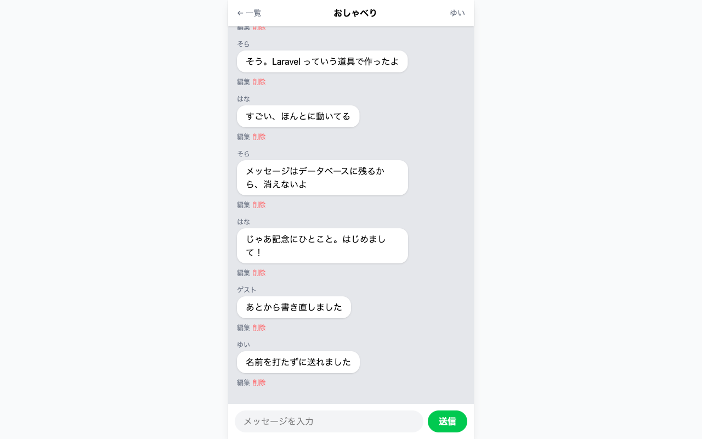
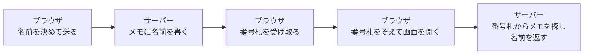

# セッションとは

毎回名前を打たなくて済むように、サーバーに名前をおぼえてもらうしくみを見ます。

この章は3つのセクションでできています。名前を決めて入る画面をつくり、送るときはその名前が自動で使われるところまで進みます。

| セクション | テーマ | 種類 |
|---|---|---|
| セッションとは | サーバーが名前をおぼえるしくみ | 読む |
| ニックネームの入室画面をつくる | 名前を決めて入る画面をつくる | 手を動かす |
| 送信から名前欄をなくす | 入室した名前で自動的に残るようにする | 手を動かす |

**この Chapter の進め方**: このセクションは読むだけです。残りの2つで、名前を決めて入る画面をつくってから、送信フォームの名前の欄を外します。どちらも画面の見た目が変わります。前の日より短く、打つコマンドも1つだけです。

## なぜセッションを使うのか

メッセージを送るとき、いまは名前の欄も毎回埋めています。名前はいつも同じですが、空のまま送れば赤い文字が出るので、1件送るごとに同じ文字を打ち直すことになります。打ち間違えれば、その1件だけ違う名前で残ります。

ふだん使われているチャットアプリでは、はじめに一度名前を決めれば、そのあとは名前を入れる欄がありません。決めた名前を、サーバーの側がおぼえているからです。同じことを、このチャットにも足します。

## セッションとは

**セッション** は、サーバーが、画面を開いた人ごとに1枚ずつ用意するメモです。名前を預けると、サーバーがそのメモに書き込みます。次に画面を開いたときは、サーバーがそのメモを見て名前を思い出します。

メモは、はじめて画面を開いた時点で Laravel が用意し、中身は会話と同じようにデータベースに残ります。入れておく表はプロジェクトをつくったときに用意ずみなので、この章では設計図を書きません。名前を預ける操作は、新しくつくるのではなく、すでにあるメモに1項目を書き込むことです。名前を決め直したときも、同じメモの中身が入れ替わります。

預けるのは名前だけで、パスワードで本人を確かめるしくみは扱わないため、この教材ではこの操作を **入室** と呼びます。

## セッションが使われている場面（買い物かご・申し込みフォーム）

通販サイトでは、ログインしないままでも商品をかごに入れられます。別のページを見てからかごを開いても、入れた商品は残っています。この「かごの中身」を持っているのがサーバー側のメモで、自分のブラウザからだけ見えます。

申し込みフォームで、入力・確認・完了と画面を進めるあいだ打った内容が引き継がれるのも、同じしくみです。画面が変わるたびにやりとりは一度切れますが、メモが残っているので内容は消えません。

このチャットで足す「決めた名前」も、かごの中身と同じ場所に置かれます。

!!! note "補足"

    セッションは、これまでも動いていました。フォームに入れた合言葉の1行を確かめるときも、空のまま送ったときに赤い文字を出すときも、このメモが使われています。自分でメモに書き込むのは、次のセクションからです。

## メモを見分けるための番号札

サーバーには画面を開いた人数ぶんのメモがあるので、どれが自分のものかを見分ける手立てが要ります。

レストランのたとえでは、ブラウザがお客さん、サーバーがお店でした。お店は、はじめて来たお客さんに番号札を渡します。お客さんが持ち歩くのは番号札だけで、注文の中身はお店の側のメモに書いてあります。次に来たときに番号札を出せば、お店は自分のメモを取り出せます。ブラウザとサーバーのあいだも同じ形です。

右の2つは、画面を開くたびに繰り返されます。名前が入っているのはサーバー側のメモで、番号札のほうには入っていません。だからルームを移っても、画面を開き直しても、名前はそのまま残ります。

番号札はブラウザごとに別なので、同じ画面を別の人が開いても、読まれるのはその人のメモです。名前が混ざりません。

## まとめ

- 送るたびに名前を打ち直しているのは、決めた名前をおぼえておく場所がないから
- セッションは、サーバーが画面を開いた人ごとに持っているメモで、買い物かごの中身と同じ場所。入室はそこに名前を1つ書き込むこと
- おぼえているのはサーバー側で、ブラウザが預かるのは、どのメモが自分のものかを示す番号札だけ
- 番号札はブラウザごとに別なので、サーバーは同じメモを別の人のものと混同しない

次のセクションでは、ニックネームを決めて入室する画面をつくります。決めた名前をセッションに預けて、ルーム一覧にもどってくるところまで進みます。
