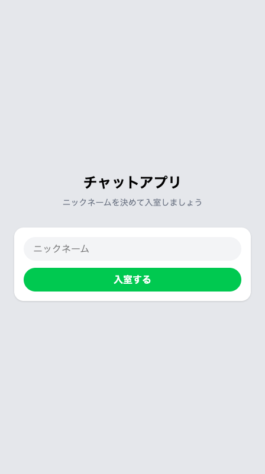
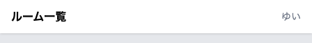

# ニックネームの入室画面をつくる

ニックネームを決めて入る画面をつくり、決めた名前をセッションに預けます。

## 入室の流れ

つくるのは、名前を1つ入れて「入室する」を押すだけの画面です。名前を決めるためだけに使うので、ルーム一覧やチャット画面とは別に、もう1枚用意します。

押したあとは3手です。打った名前がサーバーに届き、受け取る係がその名前をセッションに預け、ルーム一覧にもどります。もどる先が一覧なのは、入室した時点では開くルームが決まっていないからです。

フォームと受け取る側の形は、送信フォームをつくったときと同じです。新しいのは、名前をセッションに預ける1行だけです。

## 名前の預け方と取り出し方

預けるときは、名札と中身を組にして渡します。

```php
session(['nickname' => $validated['nickname']]);
```

左の `'nickname'` が名札で、`=>` の右が預ける中身です。ここには入力チェックを通った名前が入ります。

取り出すときは、名札だけを渡します。画面ファイルに `{{ session('nickname') }}` と書けば、預けた名前がその場所に出ます。まだ何も預けていないときは何も出ませんが、画面が止まることはありません。

## 実践: ニックネームを決めて入る

!!! success "確認"

    自分の GitHub のページから作業部屋を開いてください（「Code」→「Codespaces」）。今日は、ターミナルで `cd chat-app` を済ませ、`php artisan serve` が動いている状態から始めます。作業部屋を開き直した直後は、この2つを自分で打ってください。ブラウザは、右下に出る知らせの「ブラウザーで開く」から開きます。前のタブが残っていれば、そのタブを再読み込みしてもかまいません。`/rooms` を開くと3つのルームが並び、押すと会話が出ます。

打つコマンドは1つだけで、あとはファイルを書きます。

### Step 1: 入室画面が開く

`php artisan serve` を動かしているターミナルはふさがっているので、右上の `+` でもう1つ開き、そちらで `cd chat-app` を済ませてください。

受け取る係のファイルを、コマンドで出します。

```bash
php artisan make:controller EnterController
```

```text
   INFO  Controller [app/Http/Controllers/EnterController.php] created successfully.
```

`app` の中の `Http` の `Controllers` に `EnterController.php` が増えています。押して開くと中はほとんど空なので、ファイル全体を次の内容にまるごと置き換えてください。

```php title="app/Http/Controllers/EnterController.php"
<?php

namespace App\Http\Controllers;

class EnterController extends Controller
{
    public function show()
    {
        return view('enter');
    }
}
```

`show` は入室画面を出すだけの係で、`return view('enter');` が次につくる画面ファイルを呼び出します。

その画面ファイルをつくります。左のファイル一覧で `resources` の中の `views` を右クリックし、「新しいファイル...」を選んで `enter.blade.php` と打って Enter を押してください。空のファイルが開いたら、次の内容をまるごと入れます。

```blade title="resources/views/enter.blade.php"
<!DOCTYPE html>
<html lang="ja">
<head>
  <meta charset="UTF-8">
  <meta name="viewport" content="width=device-width, initial-scale=1.0">
  <title>チャットアプリ</title>
  <script src="https://cdn.jsdelivr.net/npm/@tailwindcss/browser@4"></script>
</head>
<body class="bg-gray-50">
  <div class="max-w-md mx-auto h-screen flex flex-col justify-center bg-gray-200 shadow-lg p-6">

    <h1 class="text-2xl font-bold text-center mb-2">チャットアプリ</h1>
    <p class="text-sm text-gray-500 text-center mb-8">ニックネームを決めて入室しましょう</p>

    <form action="/enter" method="POST" class="bg-white rounded-2xl p-4 shadow-sm">
      @csrf
      <input type="text" name="nickname" placeholder="ニックネーム" value="{{ session('nickname') }}"
        class="w-full bg-gray-100 rounded-full px-4 py-2 mb-3">
      @error('nickname')
        <p class="text-red-500 text-sm mb-3">{{ $message }}</p>
      @enderror
      <button type="submit" class="w-full bg-green-500 text-white font-bold rounded-full px-4 py-2">入室する</button>
    </form>

  </div>
</body>
</html>
```

入力欄の名札は `nickname` です。`value=` は、編集画面でいまの内容を先に入れておいたのと同じ形で、預けた名前がここに出ます。赤い文字を出す `@error` も先に置いてあります。

最後に住所の対応表です。`routes/web.php` を開き、`ChatController` と書かれた `use` の行のすぐ下に、次の1行を足してください。その下の行は、そのままずれます。

```php title="routes/web.php"
use App\Http\Controllers\EnterController;
```

続けて、ファイルのいちばん下に空行を1つ入れてから、次の1行を足します。

```php title="routes/web.php"
Route::get('/enter', [EnterController::class, 'show']);
```

ブラウザのアドレス欄で、住所の末尾を `/enter` に変えて開いてください。画面の真ん中に「チャットアプリ」の大きな文字と、「ニックネーム」の入力欄と、緑の「入室する」ボタンが出ます。



!!! warning "注意"

    この時点で「入室する」を押すと、画面いっぱいに英語のエラー画面が出ます。送信ボタンを先につくって押したときと同じで、受け取る行き方をまだ用意していないためです。

    ```text
    MethodNotAllowedHttpException
    The POST method is not supported for route enter. Supported methods: GET, HEAD.
    ```

    先に戻るボタンを押せば、入室画面にもどります。

### Step 2: 名前を送るとルーム一覧にもどる

送られてきた名前を預ける係を足します。同じ `EnterController.php` を開き、ファイル全体を次の内容にまるごと置き換えてください。

```php title="app/Http/Controllers/EnterController.php"
<?php

namespace App\Http\Controllers;

use Illuminate\Http\Request;

class EnterController extends Controller
{
    public function show()
    {
        return view('enter');
    }

    public function store(Request $request)
    {
        $validated = $request->validate([
            'nickname' => 'required',
        ], [
            'nickname.required' => 'ニックネームを入力してください',
        ]);

        session(['nickname' => $validated['nickname']]);

        return redirect('/rooms');
    }
}
```

増えたのは `store` のかたまりです。`validate()` の形は、名前とメッセージを必須にしたときと同じで、確かめるのは `nickname` の1つだけです。空のまま送られたときに出す文も、日本語でそえました。

その下の1行が、さきほど見た預ける形です。最後の `return redirect('/rooms');` で、ルーム一覧に送り返します。

対応表にも、届けるための行き方を1本足します。`routes/web.php` のいちばん下に、次の1行を足してください。

```php title="routes/web.php"
Route::post('/enter', [EnterController::class, 'store']);
```

ブラウザに切り替えて入室画面を開き直し、入力欄に `ゆい` と入れて「入室する」を押してください。ルーム一覧が出ます。見た目はまだ変わりませんが、名前はサーバー側のメモに入りました。

アドレス欄から `/enter` をもう一度開き、こんどは何も入れずに「入室する」を押してください。入室画面にもどり、入力欄と「入室する」のあいだに赤い文字が出ます。

```text
ニックネームを入力してください
```

入力欄には、預けてある `ゆい` が入ったままです。空のまま送っても、名前は預け替えられません。

### Step 3: 画面の右上に自分の名前が出る

預けた名前を、ルーム一覧とチャット画面のヘッダーに出します。どちらも1行増えます。

`resources/views/rooms.blade.php` を開き、`<header` で始まる行の先頭から `</header>` の行の末尾まで（3行）を選び、次の4行に貼り替えてください。

```blade title="resources/views/rooms.blade.php"
    <header class="bg-white px-4 py-3 flex items-center justify-between shadow-sm">
      <h1 class="font-bold">ルーム一覧</h1>
      <a href="/enter" class="text-sm text-gray-500">{{ session('nickname') }}</a>
    </header>
```

足したのは `<a href="/enter">` の行で、預けた名前をそのまま出します。1行目に入れた `justify-between` は、中身を左端と右端に振り分ける指示で、これで名前が右上に来ます。見出しからは中央ぞろえの指定が外れています。左端に寄せるためなので、消えていて合っています。

同じことをチャット画面にもします。`resources/views/chat.blade.php` を開き、ヘッダーの4行（`<header` の行から `</header>` の行まで）を選び、次の5行に貼り替えてください。

```blade title="resources/views/chat.blade.php"
    <header class="bg-white px-4 py-3 flex items-center justify-between shadow-sm">
      <a href="/rooms" class="text-sm text-gray-500">← 一覧</a>
      <h1 class="font-bold">{{ $room->name }}</h1>
      <a href="/enter" class="text-sm text-gray-500">{{ session('nickname') }}</a>
    </header>
```

ブラウザでルーム一覧を開き直してください。右上に `ゆい` と出ています。どれかのルームを押すと、そちらの右上にも同じ名前が出ています。



右上の名前を押すと、入室画面が開きます。入力欄にはいまの名前が入っているので、打ち替えて「入室する」を押せば、名前が入れ替わります。

**確認**: `/enter` で名前を入れて「入室する」を押すと、ルーム一覧にもどり、右上に自分の名前が出ています。ルームを開くと、そちらの右上にも同じ名前が出ています。

## まとめ

- 名前を預けるときは名札と中身を組にして渡し、取り出すときは名札だけを渡す
- 預けた名前は、画面ファイルに `session('nickname')` と書いた場所に出る
- 入室したあとはルーム一覧にもどり、右上の名前を押せば入り直して名前を変えられる

次のセクションでは、送信フォームから名前の欄をなくします。メッセージだけ打って送れば、入室したときのニックネームで記録されます。あわせて、名前を決めていない人がルーム一覧やチャット画面を開いたときに、まず入室画面へ案内するしくみも足します。
