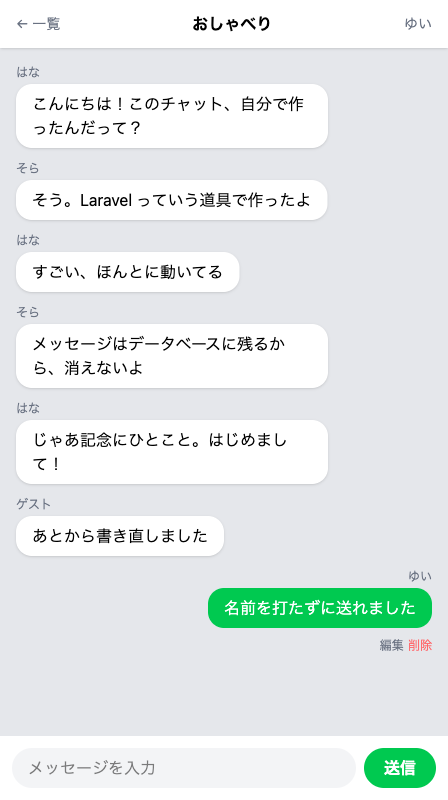
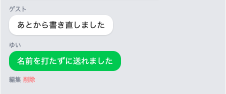

# 自分の吹き出しを右にする

自分の発言と相手の発言を、見た目で見分けられるようにします。



この章は3つのセクションでできています。自分の発言と相手の発言を見た目で分け、送った時刻を添えて、ふだん使うチャットの見た目に近づけます。

| セクション | テーマ | 種類 |
|---|---|---|
| 自分の吹き出しを右にする | 自分が送ったものだけ右に寄せる | 手を動かす |
| 送った時刻を添える | 吹き出しに送った時刻を出す | 手を動かす |
| ふたり分で試す | 入室し直して見え方が入れ替わるのを確かめる | 手を動かす |

**この Chapter の進め方**: はじめの2つでコードを書き替えます。最後のセクションではコードを書かず、別の名前で入室し直して、見え方が入れ替わるところを確かめます。この章で新しく覚えるコマンドはありません。

## 自分と相手を見分ける方法

いまのチャット画面では、自分が送ったメッセージも、ほかの人が送ったメッセージも同じ形で並んでいます。手がかりは、吹き出しの上に出ている小さな名前だけです。

その名前は、メッセージと一緒に保存してあるものです。くり返しの中では `$message->name` で取り出せます。いま画面を見ている人の名前のほうは、入室したときにセッションへ預けてあります。こちらは `session('nickname')` で取り出せます。ヘッダーの右上に自分の名前を出しているのと同じ書き方です。

この2つを比べて、同じなら自分の発言、違えば相手の発言です。入門編で、会話のリストをくり返しながら、名前が自分と同じ行にだけ印を付ける練習をしました。比べる印の `===` も、そのときと同じものです。

## 見た目を2通りに分ける書き方

入門編の `if` は、ターミナルで動かす PHP のファイルに書きました。画面のファイルでも同じことができます。Blade では `@` で始まる印を使い、波かっこの代わりに `@endif` で終わりを示します。

```blade
@if (条件)
  当てはまるときの中身
@else
  当てはまらないときの中身
@endif
```

これを `@foreach` の中に置くと、メッセージを1件並べるたびに、この分かれ道を通ります。ルームに入っているメッセージの数だけ、同じ判断がくり返されます。中身に書くのは、いまの吹き出しのかたまりを2つ並べて、片方だけ色を変えたものです。`@if` `@else` `@endif` の3つで1組になります。

## 実践: 自分の発言を右に寄せる

!!! success "確認"

    自分の GitHub のページから作業部屋を開いてください（「Code」→「Codespaces」）。今日は、ターミナルで `cd chat-app` を済ませ、`php artisan serve` が動いている状態から始めます。作業部屋を開き直した直後は、この2つを自分で打ってください。ブラウザは、右下に出る知らせの「ブラウザーで開く」から開きます。前のタブが残っていれば、そのタブを再読み込みしてもかまいません。名前を決めていないときは入室画面が出るので、前に入室したときと同じ名前（`ゆい`）を入れて入室してください。`/rooms` を開くと3つのルームが並ぶので、練習用の会話が入っている `おしゃべり` を開きます。ほかの2つには会話がほとんど入っていないので、この節では左右に分かれるところが見えません。

書き替えるのは `resources/views/chat.blade.php` の1つだけです。先に色を変えて、そのあと右に寄せます。

このファイルを開いてください。行をまとめて選ぶやり方は、`<style>` の中身をまるごと入れ替えたときと同じです。`@foreach ($messages as $message)` の行の先頭から `@endforeach` の行の末尾まで（16行）を選び、次の25行に貼り替えてください。

```blade title="resources/views/chat.blade.php"
      @foreach ($messages as $message)
        @if ($message->name === session('nickname'))
          <div class="mb-3">
            <p class="text-xs text-gray-500 mb-1">{{ $message->name }}</p>
            <div class="bg-green-500 text-white rounded-2xl px-4 py-2 inline-block max-w-[75%]">
              <p>{{ $message->body }}</p>
            </div>
            <div class="mt-1">
              <a href="/messages/{{ $message->id }}/edit" class="text-xs text-gray-500">編集</a>
              <form action="/messages/{{ $message->id }}" method="POST" class="inline">
                @csrf
                @method('DELETE')
                <button type="submit" class="text-xs text-red-400">削除</button>
              </form>
            </div>
          </div>
        @else
          <div class="mb-3">
            <p class="text-xs text-gray-500 mb-1">{{ $message->name }}</p>
            <div class="bg-white rounded-2xl px-4 py-2 inline-block max-w-[75%] shadow-sm">
              <p>{{ $message->body }}</p>
            </div>
          </div>
        @endif
      @endforeach
```

増えたのは9行です。`@if` `@else` `@endif` の3行と、`@else` の側に置いた白い吹き出しの6行です。`@if` の側では、色の指定が `bg-green-500 text-white` に変わっています。この名前を書くと、吹き出しが緑になって文字が白くなります。

チャット画面を開き直すと、自分が送った吹き出しだけが緑になります。位置はまだ左のままです。緑の吹き出しが1つも無いときは、入力欄に `自分の吹き出しです` と入れて「送信」を押してみてください。

「編集」と「削除」も、自分の吹き出しの下にだけ残ります。`@else` の側にそのかたまりを入れていないためで、人が送ったメッセージを直したり消したりできないのは、ふだん使うチャットと同じ形です。



!!! failure "よくあるエラー"

    貼り替えたあと、画面いっぱいに英語のエラー画面が出る。

    ```text
    Internal Server Error
    ParseError
    resources/views/chat.blade.php
    :42
    syntax error, unexpected token "endforeach"
    ```

    **原因**: `@if` か `@endif` が欠けています。

    **対処法**: 数字の `42` は `@endforeach` の行で、足りない行そのものではありません。入門編でエラーの行番号を読んだときと同じで、指された行の少し上を見ます。`@if` から `@endif` までがそろっているか確かめてください。

    欠けているのが `@else` だけのときは、エラーの言葉はどこにも出ません。気づくための手がかりは、自分の吹き出しが2つ並ぶことです。

つづけて、緑の吹き出しを右に寄せます。`@if` で始まる行の先頭から、3つ下の `<div class="bg-green-500` で始まる行の末尾まで（4行）を選び、次の4行に貼り替えてください。

```blade title="resources/views/chat.blade.php"
        @if ($message->name === session('nickname'))
          <div class="mb-3 text-right">
            <p class="text-xs text-gray-500 mb-1">{{ $message->name }}</p>
            <div class="bg-green-500 text-white rounded-2xl px-4 py-2 inline-block max-w-[75%] text-left">
```

変わったのは2行目と4行目の末尾だけで、1行目と3行目はそのままです。外側に付けた `text-right` が、中にある吹き出しを右端に寄せます。吹き出しのほうに付けた `text-left` は、そのままだと吹き出しの中の文章まで右にそろってしまうので、そこだけ左に戻すための指定です。

チャット画面を開き直すと、緑の吹き出しが右端に並びます。

**確認**: 自分が送った吹き出しは緑色で右に寄り、ほかの人の吹き出しは白いまま左に並んでいます。

## まとめ

- メッセージに残っている名前と、入室したときにセッションへ預けた名前を比べると、その1件が自分の発言かどうかが分かる
- くり返しの中に `@if` `@else` `@endif` を置くと、同じ一覧の中で見た目を2通りに分けられる
- 「編集」と「削除」は、自分が送った吹き出しの下にだけ残るようになった

次のセクションでは、吹き出しの名前の横に、送った時刻を添えます。サーバーの時計は世界の標準時で動いているので、設定を1行だけ変えて日本時間にそろえるところまで進みます。
