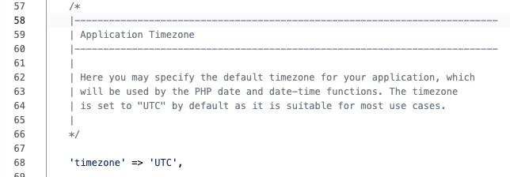
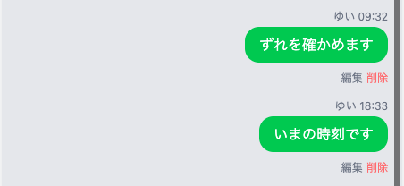

# 送った時刻を添える

吹き出しに、いつ送ったのかを添えます。

## なぜ時刻がずれるのか

メッセージの表をつくったとき、`id` と時刻の列は自分で書かなくても入りました。そのうち、入れた時刻の列に、1件ごとの送った時刻がいまも残っています。新しく用意するものはなく、取り出して並べるだけです。

ただし、その時刻を刻んでいるのはサーバーの時計です。サーバーの時計は世界の標準時（`UTC`）で動いていて、日本の時刻とは9時間ずれています。このまま出すと、さっき送ったばかりのメッセージにも、手元の時計とは違う時刻が付きます。

入門編で、時間によって挨拶が変わるプログラムをつくったとき、いちばん上に日本の時刻で考えてもらう1行を置きました。同じことを、今度はアプリ全体に対して指定します。

## 設定ファイルとは

Laravel には、アプリ全体の決めごとを書いておくファイルが集めてあります。置き場は `config` フォルダで、これまで一度も開いていない場所です。時刻の指定は、その中の `app.php` にあります。

画面のファイルを書き替えると、変わるのはその画面だけです。設定ファイルは、1行変えるとアプリのどこで時刻を扱っても、その指定に従います。

## 実践: 名前の横に時刻を出す

前のセクションから続けて進めます。ターミナルで `php artisan serve` が動いたまま、チャット画面を開いた状態から始めてください。作業部屋を開き直したときは、`cd chat-app` と `php artisan serve` をもう一度打ちます。

手を入れるのは全部で3か所です。はじめの2つは画面のファイルで、名前を出している行を書き替えます。3つめが設定のファイルです。先に時刻を出して、ずれているところを見てから直します。

1つめは、`resources/views/chat.blade.php` の自分の側です。このファイルを開いてください。書き替わるのは1行だけですが、同じ形の行がこのファイルに2つあるので、まわりの行もいっしょに選んで場所を確かめます。`@if ($message->name === session('nickname'))` の行の先頭から `<div class="bg-green-500` で始まる行の末尾まで（4行）を選び、次の4行に貼り替えてください。

```blade title="resources/views/chat.blade.php"
        @if ($message->name === session('nickname'))
          <div class="mb-3 text-right">
            <p class="text-xs text-gray-500 mb-1">{{ $message->name }} {{ $message->created_at->format('H:i') }}</p>
            <div class="bg-green-500 text-white rounded-2xl px-4 py-2 inline-block max-w-[75%] text-left">
```

変わったのは3行目だけです。`created_at` が、送った時刻を持っている列です。うしろに付けた `->format('H:i')` が、そこから「時:分」の形だけを取り出します。これが無いと、年月日から秒までが並んだ長い文字列が、名前のとなりにそのまま出ます。

2つめは、同じファイルの相手の側です。ここも、まわりの行をいっしょに選んで場所を確かめます。`@else` の行の先頭から `<div class="bg-white` で始まる行の末尾まで（4行）を選び、次の4行に貼り替えてください。

```blade title="resources/views/chat.blade.php"
        @else
          <div class="mb-3">
            <p class="text-xs text-gray-500 mb-1">{{ $message->name }} {{ $message->created_at->format('H:i') }}</p>
            <div class="bg-white rounded-2xl px-4 py-2 inline-block max-w-[75%] shadow-sm">
```

書き替わるのは名前の行だけで、入れる文字は1つめとまったく同じです。左右で違うことを書く必要はありません。

チャット画面を開き直すと、名前の右に時刻が並びます。

!!! failure "よくあるエラー"

    貼り替えたあと、画面いっぱいに英語のエラー画面が出る。

    ```text
    Internal Server Error
    Carbon\Exceptions\UnknownMethodException
    vendor/nesbot/carbon/src/Carbon/Traits/Date.php
    :3020
    Method fomat does not exist.
    ```

    **原因**: `format` のつづりが違っています。

    **対処法**: いちばん大きく出ている `vendor` で始まる場所は、Laravel が使っている道具の中身で、自分が書いたファイルではありません。その下に並ぶ行から `resources/views/chat.blade.php` を探すと、直す行が分かります。

並んだ時刻が合っているかを確かめます。前に送った吹き出しは、何時に送ったのかもう分かりません。いま1件送って見比べましょう。入力欄に `ずれを確かめます` と入れて「送信」を押してください。

増えた吹き出しの名前の右に出た時刻を、手元の時計と見比べてください。時のところが違っています。さきほどの9時間ぶんのずれが、そのまま出ています。

3つめは設定のファイルです。左のファイル一覧で `chat-app` の中の `config` フォルダを開き、`app.php` を押します。真ん中あたりに `Application Timezone` と書かれた英語の説明のかたまりがあり、そのすぐ下が時刻の行です。



`'timezone' => 'UTC',` の行を選び、次の1行に貼り替えてください。

```php title="config/app.php"
    'timezone' => 'Asia/Tokyo',
```

保存すれば、次に画面を開いたときから効きます。サーバーを止めて入れ直す必要はありません。

エラーの言葉はどこにも出ません。チャット画面を開き直しても、並んでいる時刻は1つも動かないので、効いたかどうかは新しく1件送って確かめます。

入力欄に `いまの時刻です` と入れて「送信」を押してください。増えた吹き出しの名前の右に、いまの時刻が出ます。

さきほど確かめに送った1件と、前に入れた練習用の会話の時刻は、設定を変える前に記録されたものなので、ずれたままです。いまから送るものは正しい時刻になります。



**確認**: 吹き出しの名前の右に時刻が並び、いま送ったばかりの1件には、いまの時刻が出ています。

## まとめ

- メッセージを送った時刻は表にもとから残っていて、`->format('H:i')` を付けると「時:分」の形で取り出せる
- `config` フォルダの設定ファイルは、1行変えるとアプリ全体に効く。これから記録される時刻が日本の時刻になった
- すでに記録されたぶんの時刻は、あとから設定を変えても書き替わらない

次のセクションでは、別のニックネームで入室し直して、ひとりで2人分を演じます。いま右に並んでいる自分の吹き出しが左に移り、相手だった吹き出しが右に来るところを確かめます。
