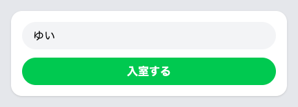
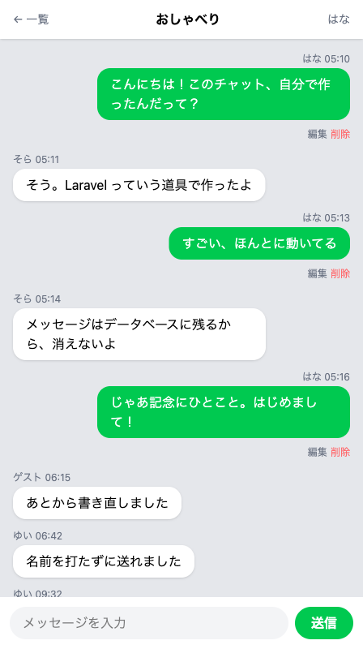

# ふたり分で試す

ひとりで2人分を演じて、見た目の出し分けを確かめます。

## ひとりで2人分を試す方法

前のセクションまでで、自分の発言は右、ほかの人の発言は左に並ぶ形ができました。ただし、いま左に並んでいるのは練習用に入れた会話で、右に並んでいるのは、いまの名前で送ったものです。別の人が使ったときにも同じように分かれるのかは、まだ確かめていません。

確かめるのに、もうひとり呼んでくる必要はありません。左右を決めているのは2つの名前です。メッセージに残っている名前と、いま入室している名前です。メッセージに残っているほうは保存済みなので動かせませんが、入室しているほうは、名前を決め直せばいつでも変えられます。

名前を決め直す入り口は、画面の右上にあります。名前をセッションに預けたとき、ヘッダーの自分の名前を押せば入室画面が開くことも確かめました。そこで別の名前を入れて入り直すと、アプリから自分として扱われる名前が入れ替わります。会話は1件も変わらないのに、右に来る吹き出しだけが変わります。

## 実践: 別のニックネームで入室し直す

この章の最後のセクションで、書き替えるファイルは1つもありません。前のセクションから続けて、`php artisan serve` が動いたまま進めます。作業部屋を開き直したときは、`cd chat-app` と `php artisan serve` をもう一度打ってください。

練習用の会話が並んでいる `おしゃべり` のルームを開きます。入力欄に `入り直す前に送りました` と入れて「送信」を押してください。いちばん下に、緑の吹き出しが右側に増えます。

つづけて、ヘッダーの右上に出ている自分の名前を押します。入室画面が開き、入力欄にはいまの名前が入っています。入室したときに預けた名前がそのまま出るので、入り直すときは書き替えるだけで済みます。



入力欄の中の名前をなぞって選び、`Backspace` キー（Mac では `delete` キー）で消してください。空になったら、左に並んでいる吹き出しの名前を1つ選んで打ちます。ここでは `はな` にします。打てたら「入室する」を押してください。ルーム一覧にもどるので、もう一度 `おしゃべり` を開きます。

ヘッダーの右上が `はな` に変わっています。そして、さっきまで右に並んでいた自分の吹き出しは、まとめて白くなって左に移っています。代わりに、`はな` の名前で送られていた吹き出しが、緑になって右に来ています。どれも練習用に入れた会話で、自分が送ったものではありません。「編集」と「削除」も、いっしょに緑の吹き出しの下へ移っています。



!!! warning "注意"

    入力欄の名前を消さずに打つと、`ゆいはな` のようにつながった名前で入室してしまいます。エラーの言葉はどこにも出ません。気づくための手がかりは、緑の吹き出しが右側に1つも来ないことです。ヘッダーの右上を見て、打ちたかった名前になっていなければ、もう一度押して入り直してください。

この状態で、入力欄に `入り直したあとに送りました` と入れて「送信」を押してみてください。新しい吹き出しも `はな` の名前で、右側に増えます。アプリから見れば、いまのあなたは `はな` です。

確かめ終わったら、いま送った1件を消しておきます。その吹き出しの下の「削除」を押してください。自分の名前にもどしたあとでは、この1件に「削除」が付かないので、消せなくなります。

消せたら、同じやり方で自分の名前にもどしておきましょう。もどすと、`はな` の吹き出しはまとめて左に移り、右に残るのは自分の名前で送ったものだけになります。

最後に、今日の分を記録して終わりましょう。左端のアイコンの列から「ソース管理」を押し、メッセージを打って「コミット」、続けて「変更の同期」を押します。手順の詳しい説明は、はじめて保存の儀式をしたページにあります。

```text
自分の吹き出しを右に寄せて時刻を添えた
```

## 完成チェックリスト

- 自分の発言は緑の吹き出しで右に、ほかの人の発言は白い吹き出しで左に並んでいる
- 吹き出しの上に名前が出て、その右に送った時刻が並んでいる
- ヘッダーの右上の名前を押すと入室画面が開き、いまの名前が入力欄に入っている
- 別のニックネームで入室し直すと、右にあった自分の吹き出しが左に移り、その名前で送られていた吹き出しが右に来る
- 今日の分が GitHub に上がっている

## まとめ

- 入室している名前を変えると、保存されているメッセージは1件も変わらないまま、左右の並びだけが入れ替わる
- 同じ名前で入室すると、その名前で送られた過去のメッセージまで自分のものとして扱われる。本物のログインとのちがいは、最後の日にふれる

この章では、自分の発言と相手の発言を見た目で分け、吹き出しに送った時刻を添えました。自分は右の緑、相手は左の白で並び、名前のとなりに時刻が付いたチャットになっています。

次の章では、相手のメッセージが自動で画面に出てくるようにします。はじめは1行だけの短いやり方で、決まった秒数ごとにページを読み直すようにして、入力途中の文字が消えてしまう欠点を自分の目で確かめます。そのあとは、自分のスマートフォンからもチャットを開けるところまで進みます。
