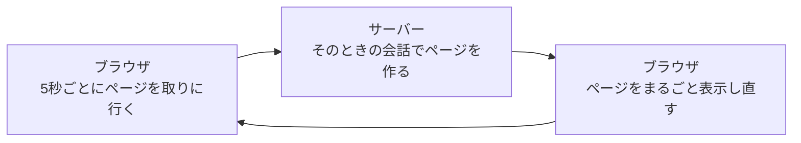

# 自動更新を1行で試す

相手の送ったメッセージが自動で画面に出てくるようにする、いちばん短い方法を試します。

この章は3つのセクションでできています。待っているだけで新しいメッセージが出てくるようにして、自分のスマートフォンからもチャットを開けるところまで進みます。

| セクション | テーマ | 種類 |
|---|---|---|
| 自動更新を1行で試す | 決まった秒数ごとにページを読み直す | 手を動かす |
| 入力が消えない自動更新にする | 会話の部分だけを入れ替える | 手を動かす |
| スマートフォンでひらく | 自分のスマートフォンから開いて送り合う | 手を動かす |

**この Chapter の進め方**: はじめの2つで自動更新のしくみをつくります。1行だけの短いやり方から始めて、その欠点が見えたところで、数行のやり方に差し替えます。最後のセクションでは、自分のスマートフォンからチャットを開きます。今日は、書き替える量が少なめです。

## 自動で新しくするしくみ

いまのチャット画面は、開いたときの会話をそのまま映しているだけです。ほかの人がメッセージを送っても、こちらの画面は変わりません。新しい会話を見るには、自分でページを開き直す必要があります。

会話が続いているあいだ、相手のメッセージを見るたびに開き直す手間が残ります。いちばん短い解決は、その開き直しをブラウザに任せてしまうことです。HTML には「何秒かたったら、このページを読み直してください」とブラウザに頼む書き方があります。

頼み先は `<meta>` です。`<head>` の中には `<meta charset="UTF-8">` と `<meta name="viewport" ...>` の2行がすでに入っています。前の1行は、日本語が正しく表示されるように文字の種類を伝えるものです。うしろの1行は、スマートフォンで見たときの表示を整えるものでした。どちらも画面に出る文字ではなく、ブラウザへの指示です。今回足すのも、その仲間です。



矢印はぐるりと回って、5秒ごとに同じことを繰り返します。

## 実践: 1行で自動更新にする

!!! success "確認"

    自分の GitHub のページから作業部屋を開いてください（「Code」→「Codespaces」）。今日は、ターミナルで `cd chat-app` を済ませ、`php artisan serve` が動いている状態から始めます。作業部屋を開き直した直後は、この2つを自分で打ってください。ブラウザは、右下に出る知らせの「ブラウザーで開く」から開きます。前のタブが残っていれば、そのタブを再読み込みしてもかまいません。名前を決めていないときは入室画面が出るので、前に入室したときと同じ名前（`ゆい`）を入れて入室してください。`/rooms` を開いてルームを1つ押すと、会話と、その下に入力欄が出ます。

書き替えるのは `resources/views/chat.blade.php` の1つだけで、足すのは1行です。

このファイルを開いてください。`<meta name="viewport" content="width=device-width, initial-scale=1.0">` の行のすぐ下に、次の1行を足してください。`<title>チャット</title>` の行は、下にずれます。ここは足すだけで、ファイル全体は貼り替えません。

```blade title="resources/views/chat.blade.php"
  <meta http-equiv="refresh" content="5">
```

`http-equiv="refresh"` が「読み直してください」という頼みで、`content="5"` がその間隔です。5 は秒数で、5秒たつごとに1回、ページが読み直されます。

保存したら、チャット画面を開き直してください。見た目は何も変わりません。読み直しは一瞬なので、画面をながめているだけでは起きているかどうか分かりにくいことがあります。はっきり確かめるには、入力欄を使います。

入力欄に `まだ送っていません` と打ち、「送信」は押さずにそのまま5秒ほど待ってみてください。打った文字が消えて、入力欄が空にもどります。これが、ブラウザがページを読み直した合図です。

読み直しているのはページ1枚まるごとで、会話の部分だけではありません。入力欄やヘッダーまでまとめて作り直されるので、打ちかけの文字は残らずに消えます。

そのかわり、読み直すたびにサーバーから会話を取り直しています。ほかの人が送ったメッセージは、次の読み直しで画面に並びます。自分でページを開き直す必要は、これでなくなりました。

!!! warning "注意"

    足した1行のつづりが違っていても、エラーの言葉はどこにも出ません。ブラウザは、読み取れない指示を黙って読み飛ばします。気づくための手がかりは、5秒待っても入力欄の文字が消えないことだけです。足した1行が `<meta http-equiv="refresh" content="5">` のとおりになっているか、記号の `-` や `"` まで見比べてください。

**確認**: 入力欄に文字を打って5秒待つと、その文字が消えて入力欄が空にもどります。

## まとめ

- `<head>` に1行足しておくと、決まった秒数ごとにブラウザがページを読み直す。自分でページを開き直す操作は、もう要らない
- 読み直すのはページ1枚まるごとなので、入力欄に打ちかけていた文字も一緒に消える。この消え方が、読み直しが起きている合図になる

次のセクションでは、いま足した1行を消して、数行のかたまりに差し替えます。ページをまるごと読み直すのをやめて、会話の部分だけを入れ替えるようにすると、入力途中の文字を保ったまま新着が届くようになります。新しいメッセージが増えるところも、ブラウザのタブを2つ並べて自分の目で確かめます。
