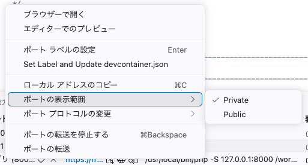
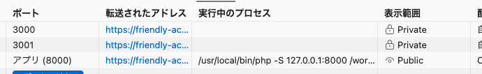
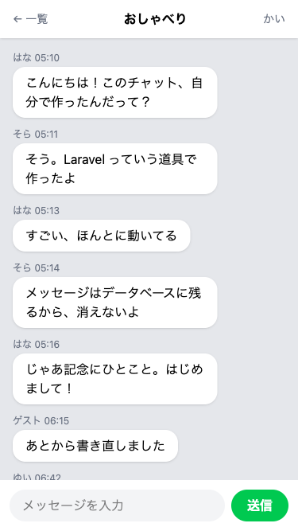

# スマートフォンでひらく

自分のスマートフォンからチャットをひらいて、パソコンと送り合います。

## 外から開けるようにするしくみ

チャットを開いているタブの住所は、`https://` から始まる長いものです。作業部屋の中で動いているサーバーへ、GitHub が用意した外からの入口です。ただしこの入口には鍵がかかっていて、通れるのは自分の GitHub のアカウントで入っている画面だけです。

この鍵は、自分で外せます。作業部屋ではじめてサーバーを動かしたとき、右下の知らせの枠に「公開用にする」というボタンがありました。あのとき押さなかったのは、まだ自分だけで使っていたからです。いまからは、その反対のことをします。

鍵を外すと、住所を知っている人なら誰でもチャットを開けるようになります。住所は作業部屋の名前が入った長いものなので、渡していない人がたまたま行き当たることは、まずありません。今日は自分のスマートフォンにだけ渡して試します。

## 実践: スマートフォンから自分のチャットを開く

このセクションでは、書き替えるファイルは1つもありません。前のセクションから続けて、`php artisan serve` が動いたまま、パソコンのブラウザでチャット画面を開いた状態から進めます。作業部屋を開き直したときは、`cd chat-app` から打ち直してください。手元にスマートフォンを用意しておきましょう。インターネットにつながっていれば、パソコンと同じ Wi-Fi でなくてもかまいません。

### Step 1: 外から開ける URL になる

ターミナルの上に並んだタブから「ポート」を押してください。サーバーの知らせが消えたときに開き直せる、と説明した一覧です。`3000`・`3001`・`8000` の3行が並びます。

このうち、`8000` と書かれた行を右クリックします。メニューが開くので、真ん中あたりの「ポートの表示範囲」にマウスを当ててください。右に小さなメニューがもう1つ開きます。中身は「Private」と「Public」の2つだけで、ここは日本語になっていません。いまは「Private」の左にチェックの印が付いています。下の「Public」を押してください。



押しても、確かめの窓や知らせは出ません。エラーの言葉はどこにも出ません。一覧の「表示範囲」の欄が、切り替わったかどうかの手がかりです。



**確認**: ポートの一覧の `8000` の行の「表示範囲」の欄が、鍵の絵と「Private」から目の絵と「Public」に変わっています。

!!! warning "注意"

    「Public」のあいだは、住所を知っている人なら誰でもチャットを開けて、メッセージを送れます。渡すのは自分のスマートフォンにだけにして、このセクションの最後で「Private」にもどします。

### Step 2: スマートフォンの画面にチャットが出る

住所は手で打つには長すぎるので、Chrome の QR コードを使ってスマートフォンに渡します。

パソコンでチャットを開いているタブに切り替え、吹き出しの外側の、何も出ていないところを右クリックしてください。開いたメニューの、区切り線ではさまれて1つだけ並んでいる「このページの QR コードを作成」を押すと、四角い模様の入った小さな窓が出ます。

スマートフォンでカメラのアプリを開き、その模様に向けてください。画面に住所が出てくるので、それを押します。

!!! tip "ヒント"

    メニューにその項目が見つからないときや、カメラで読み取れないときは、住所を自分宛のメールに貼って送る方法もあります。前のセクションでタブを増やしたときと同じで、アドレス欄を1回押して `Ctrl` キーと `C` キーでコピーできます。スマートフォンで届いたメールを開き、貼った住所を押してください。

その住所を押すと、まず全部が英語のページが出ます。チャットではありませんが、失敗でもありません。GitHub が出している確認のページで、「いま開こうとしているのは、誰かの作業部屋の中で動いているページです。信頼できる相手から受け取った住所のときだけ進んでください」と書かれています。クレジットカードの番号やパスワードを入れると、そのページをつくった人に見えるおそれがある、とも出ています。いま開くのは自分がつくったチャットで、住所を渡したのも自分です。そのまま進んでかまいません。

進むボタンは、右下にある緑色の「Continue」です。左に赤い字で「Report unsafe page」とありますが、こちらは通報のボタンなので押しません。スマートフォンでは、この文字も緑のボタンもとても小さく出ます。読みにくいときは、画面を2本の指で広げて拡大してから押してください。


「Continue」を押すと、同じ住所のままチャットが開きます。この確認のページが出るのはブラウザごとに1回だけで、2回目からは出ません。パソコンで開き直したときにも、一度だけ出ます。

出てくるのはチャット画面ではなく、入室画面です。名前を預けているのはパソコンのブラウザだけなので、スマートフォンからは、まだ誰なのか分かりません。パソコンで使っているのとは別の名前（ここでは `かい`）を入れて「入室する」を押し、ルーム一覧から `おしゃべり` を開いてください。

これまでの会話が、画面の幅いっぱいに並びます。パソコンでは中央に細く出ていた帯が、スマートフォンではちょうど全面になります。



!!! warning "注意"

    チャットが出ないときは、出ている画面で見分けられます。「Sign in to GitHub」と書かれたログイン画面になったときは、まだ「Public」に切り替わっていません。ポートの一覧にもどって「表示範囲」の欄を確かめてください。「このページが見つかりません」と出たときは、作業部屋が止まっています。パソコンで作業部屋を開き直し、`php artisan serve` を打ち直してください。

### Step 3: スマートフォンで送るとパソコンの画面に出る

パソコンの画面に切り替えて、スマートフォンと同じ `おしゃべり` のルームをいちど開き直してください。ここで英語の確認のページが出たら、さきほどと同じ、右下の緑の「Continue」を押します。会話が出たら、そのままにしておきます。

ここまで整えたら、あとはパソコンに触りません。

スマートフォンの入力欄に `スマートフォンから送りました` と打ち、「送信」を押します。そのままパソコンの画面を見て、5秒ほど待ちます。そのあとパソコンで会話を下までスクロールすると、いちばん下に、いま送ったメッセージが白い吹き出しで左側に増えています。新しいメッセージはいま見えているところより下に足されるので、届いてから下まで動かします。

増やしたのは、前のセクションで貼った数行です。5秒ごとに会話を取りに行っているので、送ったあとにパソコンで開き直す操作は1度もしていません。

!!! warning "注意"

    スマートフォンの画面には出ているのに、パソコンの画面が5秒たっても増えないことがあります。エラーの言葉はどこにも出ません。そのときは、パソコンの画面をいちど開き直してください。開き直した画面のいちばん下に、いま送ったメッセージが並んでいれば、送るところまではできています。開き直したところから、5秒ごとの取り直しがまた始まります。

反対も試せます。パソコンから1件送って5秒ほど待ち、スマートフォンの画面を下までスクロールすると、いちばん下に並んでいます。そちらでは別の名前で入室しているので、白い吹き出しで左に出ます。

前のセクションで2つのタブを並べたときは、どちらも同じブラウザで、同じ名前でした。いまは手元のスマートフォンから、別の名前で入った相手として並んでいます。

スマートフォンから送った1件は、スマートフォンの画面で消しておきましょう。いちばん下にある、自分がスマートフォンから送った吹き出しの下の「削除」を押します。パソコンからは別の名前に見えるので、そちらには「削除」が付きません。

### Step 4: 公開をやめる

確かめ終わったので、鍵をかけ直します。手順は公開したときと同じで、最後に押すものだけが違います。ポートの一覧にもどり、`8000` の行を右クリックして「ポートの表示範囲」を開き、今度は上の「Private」を押してください。

ここでも確かめの窓は出ません。「表示範囲」の欄が鍵の絵と「Private」にもどっていれば、公開はやめられています。

スマートフォンでいま開いている画面は、そのまま残ります。あとで開き直したときにチャットが出てこなくても、壊れたのではありません。鍵をかけ直したからです。

最後に、今日の分を記録して終わりましょう。左端のアイコンの列から「ソース管理」を押し、メッセージを打って「コミット」、続けて「変更の同期」を押します。手順の詳しい説明は、はじめて保存の儀式をしたページにあります。

```text
自動更新を入れてスマートフォンから開いた
```

## 完成チェックリスト

- スマートフォンのブラウザでチャットが開き、パソコンとは別のニックネームで入室できた
- どちらから送っても、そのあと開き直す操作をしないまま、5秒ほどでもう片方の画面のいちばん下に出てくる
- ポートの一覧の「表示範囲」の欄が、鍵の絵と「Private」にもどっている
- 今日の分が GitHub に上がっている

## まとめ

- ポートを「Public」にすると、住所を知っている人なら誰でもチャットを開けるようになる。試し終わったら「Private」にもどす
- スマートフォンのブラウザは未入室から始まる。別のニックネームで入室すれば相手として並び、送ったメッセージは自動更新でおたがいの画面に出てくる

この章では、相手のメッセージが自動で画面に出てくるようにして、自分のスマートフォンからもチャットを開きました。待っているだけで新しいメッセージが並び、スマートフォンとパソコンで送り合えるところまで来ています。

次の章では、チャットの見た目を自分の好みに変えます。色の名前の読み方をおぼえて、緑になっているところの色と、画面に出るアプリの名前を変えます。そのあとは吹き出しに名前の頭文字を入れた丸い印を足し、自分で機能を考えてつくる任意の課題も用意しています。
