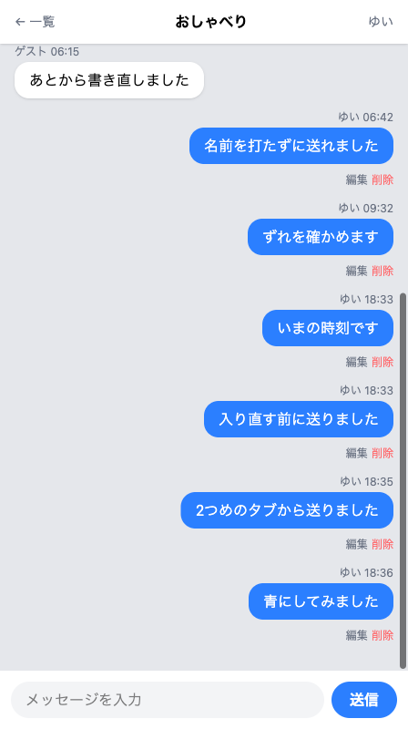
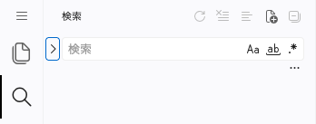
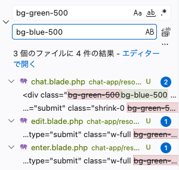

# 色とタイトルを変える

アプリの名前と色を、自分の好みに変えます。



この章は3つのセクションでできています。ここまでに作った画面の見た目を、自分の好みに近づけます。

| セクション | テーマ | 種類 |
|---|---|---|
| 色とタイトルを変える | アプリの名前と配色を自分の好みにする | 手を動かす |
| 頭文字アイコンをつける | 吹き出しの横に名前の頭文字を出す | 手を動かす |
| 遊び場: もっと自分らしく（任意） | 目標だけを見て自由につくる | 手を動かす |

**この Chapter の進め方**: はじめの2つで、名前と色と吹き出しの見た目を変えます。最後のセクションは自由課題なので、やらずに次へ進んでもかまいません。

## Tailwind のクラスの読みかた

チャット画面の器を作ったとき、`class` に並んでいる文字の読み方は、自分好みの色へ変えるときあらためて説明する、と書きました。ここがその場所です。

`class` の中には、空白で区切られた名前がいくつも並んでいます。1つの名前が1つの指示です。緑の吹き出しに付いている `bg-green-500` は、ハイフンで3つに分かれています。

| 部分 | 意味 |
|---|---|
| `bg` | 背景の色 |
| `green` | 色の名前 |
| `500` | 濃さ |

真ん中を別の名前にすると、背景の色が変わります。使えるのは `blue` `pink` `purple` `orange` `sky` `teal` などです。数字は濃さで、小さいほど淡く、大きいほど濃くなります。ここは `500` のままにしておきましょう。となりの `text-white` も同じ組み立てで、`text` が文字の色、`white` が白です。この2つで「緑の背景に白い文字」の1組になっています。同じ行にある `px-4` や `py-2` は余白の指示で、こちらは触りません。

白い文字との相性は色によって差があり、`blue` や `pink` や `purple` に変えると読みやすくなります。避けたいのは黄色に近い色（`yellow` `lime` `amber`）だけです。白い文字が背景に沈んで読みにくくなります。

## 緑が出ている4か所

いまの緑が出ているのは、次の4か所です。

- 入室画面の「入室する」ボタン
- チャット画面の「送信」ボタン
- チャット画面の、自分の吹き出し
- 編集画面の「更新する」ボタン

この4か所は、`enter.blade.php`・`chat.blade.php`（2か所）・`edit.blade.php` の3つのファイルに散らばっています。ファイルを1つずつ開いて直すと、どれかを忘れたときに、そこだけ緑のまま残ります。エディタには、作業部屋の中のすべてのファイルから同じ言葉をさがして、まとめて置き換える道具があります。

## 実践: 自分の色に変える

!!! success "確認"

    自分の GitHub のページから作業部屋を開いてください（「Code」→「Codespaces」）。今日は、ターミナルで `cd chat-app` を済ませ、`php artisan serve` が動いている状態から始めます。作業部屋を開き直した直後は、この2つを自分で打ってください。ブラウザは、右下に出る知らせの「ブラウザーで開く」から開きます。開いた先はまだ Laravel のようこそ画面なので、アドレス欄で住所の末尾を `/enter` に変えてください。前のタブが残っているときは、右上に出ている自分の名前を押しても入室画面に着きます。入室画面が出たら、前に入室したときと同じ名前（`ゆい`）を入れて入室してください。

先にアプリの名前を変えて、そのあと色を変えます。

アプリの名前が出ているのは、名前を入れて使いはじめる入室画面です。`resources/views/enter.blade.php` を開いてください。次の2つは、このファイルにすでにある行を見つけるための見本です。貼り付けずに読んでください。

上のほうの `<title>` で始まる行が、ブラウザのタブに出る文字です。

```blade title="resources/views/enter.blade.php"
  <title>チャットアプリ</title>
```

その少し下の `<h1` で始まる行が、画面のいちばん大きい文字です。

```blade title="resources/views/enter.blade.php"
    <h1 class="text-2xl font-bold text-center mb-2">チャットアプリ</h1>
```

どちらの行にも `チャットアプリ` と入っています。この文字のところだけを選んで、自分で決めた名前に打ち直してください。たとえば `ひだまり広場` のように、好きな言葉でかまいません。行のほかのところはそのままにします。

入室画面を開き直すと、どちらも新しい名前に変わります。ほかの3枚の画面のタブには「チャット」「ルーム一覧」「メッセージの編集」と出ていますが、こちらはアプリの名前ではなく、そのページの名前なので、そのままにしておきます。

つづけて、色を変えます。左端のアイコンの列で、マウスを乗せると「検索」と出るものを押してください。文字を入れる欄が出ます。



欄の左に小さな `>` の印があります。これを押すと、すぐ下にもう1つ欄が出ます。上がさがす言葉、下が置き換えたあとの言葉です。上の欄に、次の言葉を入れてください。

```text
bg-green-500
```

3つのファイルに4件見つかり、その行が欄の下に並びます。`green-500` だけで探すと、5件目に `welcome.blade.php` が出てきます。プロジェクトをつくった日に見た、ようこそ画面のファイルです。このファイルを書き替えても自分の4つの画面は変わりません。直す意味のないファイルを巻き込まないために、かならず `bg-` から入れてください。

次に、下の欄へ新しい色の名前を入れます。青にするなら、こう入れます。

```text
bg-blue-500
```

入れたとたん、置き換わったあとの形が下の一覧に出ます。押す前に、どこがどう変わるのかを目で確かめられます。



確かめたら、下の欄の右にあるボタンを押します。マウスを乗せると「すべて置換」と出ます。置き換えてよいかを確かめる窓が出ることもあります。下の一覧で中身を見たあとなので、置き換えを進めるほうのボタンを押してかまいません。取り消すほうを押しても何も変わらず、同じボタンから押し直せます。

ブラウザで入室画面を開き直すと、「入室する」のボタンが新しい色になっています。押すと、ルームの一覧に進みます（入力欄が空になっていたら、さきほどと同じ名前を入れてから押してください）。ルームの一覧の画面は色を使っていないので、ここは変わりません。ルームを1つ押すと、下の「送信」のボタンが新しい色になっています。

自分の吹き出しの色は、そのルームに自分の送ったメッセージが1件もないと確かめられません。入力欄に何か打って「送信」を押すと、新しい色の吹き出しが右に出ます。

!!! warning "注意"

    色の名前を打ち間違えると、「送信」のボタンが画面から消えたように見えます。エラーの言葉はどこにも出ません。白い帯の上に「送信」の白い文字だけが残ることが、気づくための手がかりです。自分の吹き出しも、同じように背景が消えます。

    **原因**: Tailwind は、知らない名前を黙って読み飛ばします。`bg-bule-500` のようにつづりを間違えると、背景の色だけが付きません。文字を白くする `text-white` のほうは生きているので、白い文字だけが残ります。

    **対処法**: 同じ検索と置換を、こんどは逆向きに実行します。上の欄に打ち間違えた名前、下の欄に正しい名前を入れて、もう一度すべて置き換えてください。4か所をまとめて変えているので、直すのも1回で済みます。

ここから先のセクションに出てくる画面とコードは、もとの緑のままです。色を変えたあとは見た目が違いますが、そのまま進めて問題ありません。

**確認**: 入室画面に自分で決めた名前が出て、「入室する」と「送信」のボタンと自分の吹き出しが、自分で選んだ色になっています。

## まとめ

- `bg-green-500` は「どこに」「何色を」「どのくらい濃く」の3つに分かれていて、真ん中を変えると色が変わる
- Tailwind が知らない名前を書いても止まらず、その指定だけが効かなくなる
- 同じ言葉が何か所にも散らばっているときは、作業部屋の中のすべてのファイルからさがして、まとめて置き換えられる

次のセクションでは、吹き出しの横に、名前の頭文字をとった丸いアイコンを出します。名前から1文字だけを取り出す書き方を使って、日本語の名前でも崩れないようにします。
