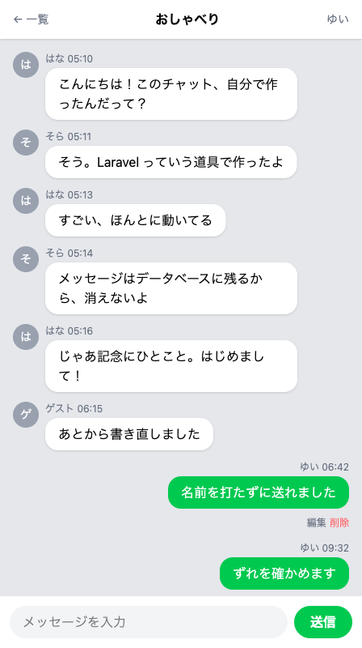
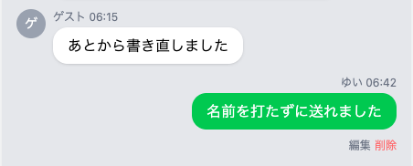

# 頭文字アイコンをつける

相手の吹き出しの左に、名前の頭文字を入れた丸いアイコンを並べます。



## 名前から1文字だけ取り出す

丸の中に入れるのは、その人の名前の1文字目です。`はな` なら `は`、`そら` なら `そ` になります。付けるのは相手の吹き出しだけにします。自分の発言はすでに右に寄っていて、ひと目で見分けが付くからです。

名前は1件ごとに違うので、あらかじめ書いておくことはできません。メッセージを1件並べるたびに、その名前から1文字目を取り出します。PHP には、文字列から必要なぶんだけ取り出す道具があります。

```php
mb_substr($message->name, 0, 1)
```

かっこの中に渡しているのは3つです。取り出すもとの文字列、何文字目から始めるか、何文字ぶん取るか。数え始めは 1 ではなく 0 なので、`0, 1` で「先頭から1文字」という指定になります。

頭に付いている `mb_` は、文字の単位で数える、という意味です。日本語の文字は、コンピュータの中では1文字あたり3つぶんの場所を使って記録されています。`mb_substr` はその3つをひとまとめにして1文字と数えますが、1つぶんずつ数える書き方だと、先頭の1つだけを取り出してしまい、文字として成立しません。

!!! warning "注意"

    1文字目は `$message->name[0]` と書いても取り出せます。ただしこの書き方は1つぶんずつ数えるので、日本語の名前だと、丸の中がひし形に「?」が入った記号になります。エラーの言葉はどこにも出ません。名前が違うのに丸の中に同じ記号ばかり並ぶことが、気づくための手がかりです。英字の名前は1文字目がそのまま出るので、`Yotaro` のような名前で試したときは崩れに気づけません。

## 実践: 頭文字アイコンを出す

前のセクションから続けて進めます。`php artisan serve` が動いたまま、チャット画面を開いた状態から始めてください。作業部屋を開き直したときは、`cd chat-app` と `php artisan serve` をもう一度打ちます。

書き替えるのは `resources/views/chat.blade.php` の1か所だけです。丸が出るのは相手の吹き出しの側なので、手を入れるのは `@else` から下で、自分の吹き出しの側は触りません。

このファイルを開いてください。`@else` の行の先頭から `@endif` の行の末尾まで（8行）を選び、次の11行に貼り替えてください。

```blade title="resources/views/chat.blade.php"
        @else
          <div class="mb-3 flex gap-2">
            <div class="w-8 h-8 shrink-0 rounded-full bg-gray-400 text-white text-sm flex items-center justify-center">{{ mb_substr($message->name, 0, 1) }}</div>
            <div class="max-w-[75%]">
              <p class="text-xs text-gray-500 mb-1">{{ $message->name }} {{ $message->created_at->format('H:i') }}</p>
              <div class="bg-white rounded-2xl px-4 py-2 shadow-sm">
                <p>{{ $message->body }}</p>
              </div>
            </div>
          </div>
        @endif
```

いちばん外側の箱に `flex gap-2` が増えています。`flex` は中身を横に並べる指示で、`gap-2` がそのあいだの隙間です。この箱の中で、頭文字のアイコンと吹き出しが左右に並びます。

新しく足したのは3行目です。`w-8 h-8` が縦と横の大きさをそろえ、`rounded-full` が角をすっかり丸めるので、灰色の円になります。中身の `{{ mb_substr($message->name, 0, 1) }}` が、その円に入る1文字です。

名前と吹き出しは `<div class="max-w-[75%]">` でひとまとめに包みました。これまで吹き出しそのものに付いていた幅の上限が、この包みに移っています。吹き出しの行から `inline-block max-w-[75%]` が消えているのは、そのためです。

チャット画面を開き直すと、相手の吹き出しの左に灰色の丸が並び、その中に名前の1文字目が入っています。自分が送った吹き出しには丸が付かず、これまでどおり右に寄ったままです。

丸が付くのは相手の吹き出しだけなので、自分の送ったものしか並んでいないルームを開いていると、1つも出ません。はなとそらのサンプルの会話が入っている「おしゃべり」を開くと確かめられます。



!!! warning "注意"

    貼り替えたあと、会話が縦に並ばず、右へ横一列に伸びてしまうことがあります。吹き出しが細長くなり、文章が1文字ずつ縦に折り返されます。

    **原因**: 終わりの `</div>` が1つ足りません。2件目から先のメッセージが1件目の箱の中に入ってしまい、その箱に付いた「中身を横に並べる」指示が、全部にかかります。

    **対処法**: `@endif` のすぐ上に `</div>` が3つ続いているかを見てください。吹き出しのぶん、名前と吹き出しを包むぶん、行全体の箱のぶんで、3つ要ります。

最後に、今日の分を記録して終わりましょう。左端のアイコンの列から「ソース管理」を押し、メッセージを打って「コミット」、続けて「変更の同期」を押します。手順の詳しい説明は、はじめて保存の儀式をしたページにあります。

```text
見た目を自分好みにととのえた
```

## 完成チェックリスト

- 相手のメッセージの左に灰色の丸が並んでいて、丸の中は名前の1文字目になっている（`はな` なら `は`）
- 会話は上から下へ縦に並んでいて、横一列にはなっていない
- 自分のメッセージには丸が付かず、これまでどおり右に寄っている
- 今日の分が GitHub に上がっている

## まとめ

- `mb_substr` は文字の単位で数えるので、日本語の名前でも1文字目だけをきれいに取り出せる
- 2つをまとめた外側の箱に `flex` を付けると、頭文字のアイコンと吹き出しが横に並ぶ。丸を付けたのは相手の吹き出しの側だけ

この章では、アプリの名前と色を自分の好みに変え、相手の吹き出しに頭文字のアイコンを足しました。見本のとおりに写してつくった画面が、自分で選んだ名前と色になっています。

次のセクションは自由課題です。メッセージの件数・背景・入室のあいさつ・絵文字のボタンといったアイデアから好きなものを選び、目標だけを頼りにつくります。できなかったときのために答え合わせのコードも用意してあるので、読むだけにしても、飛ばして先へ進んでもかまいません。
