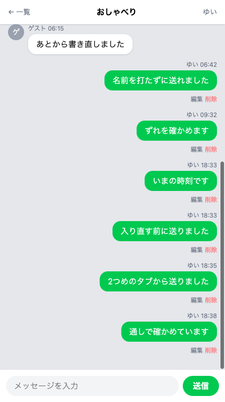

# 完成チェックと仕上げ

**このハンズオンで使う機能**: これまでにつくったすべての機能（メッセージの送信・書き直しと削除・ルーム・ニックネーム入室・左右の出し分け・自動更新）

足してきた機能を通しで動かして、自分のアプリとして仕上げます。



この章は3つのセクションでできています。つくったチャットを通しで確かめて仕上げ、そのあとでここまでを見わたします。

| セクション | テーマ | 種類 |
|---|---|---|
| 完成チェックと仕上げ | 通しで動かして、トップページを入口にする | 手を動かす |
| ここまでのふりかえり | つくったものと使った道具を見わたす | 読む |
| この先の学び | できるようになったことと、この先にあるもの | 読む |

**この Chapter の進め方**: 手を動かすのは、このセクションだけです。残る2つは読むだけなので、通しの確認を終えてから、ゆっくり読んでください。

## 仕上げ前の確認

前のセクションまでで、ここまでできています。

- ニックネームを入れて入室すると、ルームの一覧が出る
- ルームを押すと、そのルームの会話が並ぶ
- 自分のメッセージは右、ほかの人のメッセージは左に出て、名前のとなりに時刻が付いている
- ほかの人の吹き出しの左に、名前の1文字目が入った灰色の丸が並んでいる
- 画面を開きっぱなしにしていても、新しいメッセージが5秒ほどで出てくる

!!! success "確認"

    自分の GitHub のページから作業部屋を開いてください（「Code」→「Codespaces」）。今日は、ターミナルで `cd chat-app` を済ませ、`php artisan serve` が動いている状態から始めます。作業部屋を開き直した直後は、この2つを自分で打ってください。ブラウザは、右下に出る知らせの「ブラウザーで開く」から開きます。

何回にも分けて書き替えてきたチャット画面のファイルは、いまこの形になっています。通しで見るのはここが最初です。貼るためのものではないので、自分の画面と見比べたいときだけ開いてください。色を変えた人は、色の名前だけこの見本と違います。自由課題で書き替えたところも同じで、そのままで問題ありません。

??? note "いまの resources/views/chat.blade.php（72行）"

    ```blade title="resources/views/chat.blade.php"
    <!DOCTYPE html>
    <html lang="ja">
    <head>
      <meta charset="UTF-8">
      <meta name="viewport" content="width=device-width, initial-scale=1.0">
      <title>チャット</title>
      <script src="https://cdn.jsdelivr.net/npm/@tailwindcss/browser@4"></script>
    </head>
    <body class="bg-gray-50">
      <div class="max-w-md mx-auto h-screen flex flex-col bg-gray-200 shadow-lg">

        <header class="bg-white px-4 py-3 flex items-center justify-between shadow-sm">
          <a href="/rooms" class="text-sm text-gray-500">← 一覧</a>
          <h1 class="font-bold">{{ $room->name }}</h1>
          <a href="/enter" class="text-sm text-gray-500">{{ session('nickname') }}</a>
        </header>

        <main class="flex-1 overflow-y-auto p-4">
          <div id="messages">
          @foreach ($messages as $message)
            @if ($message->name === session('nickname'))
              <div class="mb-3 text-right">
                <p class="text-xs text-gray-500 mb-1">{{ $message->name }} {{ $message->created_at->format('H:i') }}</p>
                <div class="bg-green-500 text-white rounded-2xl px-4 py-2 inline-block max-w-[75%] text-left">
                  <p>{{ $message->body }}</p>
                </div>
                <div class="mt-1">
                  <a href="/messages/{{ $message->id }}/edit" class="text-xs text-gray-500">編集</a>
                  <form action="/messages/{{ $message->id }}" method="POST" class="inline">
                    @csrf
                    @method('DELETE')
                    <button type="submit" class="text-xs text-red-400">削除</button>
                  </form>
                </div>
              </div>
            @else
              <div class="mb-3 flex gap-2">
                <div class="w-8 h-8 shrink-0 rounded-full bg-gray-400 text-white text-sm flex items-center justify-center">{{ mb_substr($message->name, 0, 1) }}</div>
                <div class="max-w-[75%]">
                  <p class="text-xs text-gray-500 mb-1">{{ $message->name }} {{ $message->created_at->format('H:i') }}</p>
                  <div class="bg-white rounded-2xl px-4 py-2 shadow-sm">
                    <p>{{ $message->body }}</p>
                  </div>
                </div>
              </div>
            @endif
          @endforeach
          </div>
        </main>
        <footer class="bg-white p-3">
          <form action="/rooms/{{ $room->id }}" method="POST" class="flex gap-2">
            @csrf
            <input type="text" name="body" placeholder="メッセージを入力" value="{{ old('body') }}"
              class="flex-1 bg-gray-100 rounded-full px-4 py-2">
            <button type="submit" class="shrink-0 bg-green-500 text-white font-bold rounded-full px-5 py-2">送信</button>
          </form>
          @error('body')
            <p class="text-red-500 text-sm mt-2">{{ $message }}</p>
          @enderror
        </footer>

      </div>
      <script>
        setInterval(async () => {
          const res = await fetch(location.href);
          const html = await res.text();
          const doc = new DOMParser().parseFromString(html, 'text/html');
          document.querySelector('#messages').innerHTML = doc.querySelector('#messages').innerHTML;
        }, 5000);
      </script>
    </body>
    </html>
    ```

## 実践: 通しで動かして仕上げる

書き替えるのは1行だけです。先に、いまできていることを上から順に動かして、そのあと仕上げの1行を入れます。

### Step 1: 全部の機能が順に動く

ここで書き替えるものはありません。

入室から始めます。ブラウザのアドレス欄で、住所の末尾を `/enter` に変えて開き、前に入室したときと同じ名前（`ゆい`）を入れて「入室する」を押してください。ルームの一覧に3つのルームが並び、ヘッダーの右上にいま入れた名前が出ます。

`おしゃべり` を押します。上の帯にルームの名前が出て、これまでの会話が並びます。数が多いので、まず下までスクロールして、いちばん下の吹き出しが見えるようにしておきましょう。このあと確かめるものは、どれもいちばん下に出ます。そのつど下まで動かして見ます。ほかの人の吹き出しは左に寄り、その左に名前の1文字目が入った灰色の丸が付いています。自分が送ったものは右に寄って色が付き、どちらも名前のとなりに送った時刻が並んでいます。

入力欄に `通しで確かめています` と入れて「送信」を押してください。送ったあとは画面が上にもどるので、また下までスクロールします。いちばん下に、自分の吹き出しが1つ増えています。

その吹き出しの下の「編集」を押します。書き直しの画面に変わり、入力欄にいまの本文が入っています。`書き直しも動きました` に打ち直して「更新する」を押してください。ルームにもどるので、下までスクロールすると、その1件の本文が変わっています。

同じ吹き出しの下の「削除」を押します。ルームにもどるので、下までスクロールすると、その1件だけが消えて、ほかの吹き出しは並んだままです。

最後は自動更新です。打ちかけの文字が消えないようにしたときと同じ手順で、ブラウザのタブを2つ並べます。アドレス欄を1回押して `Ctrl` キーと `C` キーでコピーし（Mac では `command` キーと `C` キーです）、タブの並びのいちばん右の `+` で開いた新しいタブに貼り付けて、Enter キーを押します。あとから開いたタブで `もう1つのタブから送りました` と打って「送信」を押し、先に開いていたタブに切り替えて5秒ほど待ちます。そのあと下までスクロールすると、いちばん下に、いま送ったメッセージが増えています。新しいメッセージはいま見えているところより下に足されるので、届いてから下まで動かします。

ここまで詰まらずに進めたなら、足した機能は全部つながっています。思ったとおりに動かないところがあったときは、その機能の名前が付いた章にもどって、書き替えたコードと自分のファイルを見比べてください。

### Step 2: トップページが自分のアプリの入口になる

チャットを開くとき、住所の末尾には `/rooms` や `/enter` を付けています。末尾に何も付けない、いちばん短い住所がアプリの入口にあたる場所です。そこを開くと、いまも Laravel のようこそ画面が出ます。プロジェクトをつくった日に、動きはじめた合図として見た画面です。最後の仕上げに、ここを自分のチャットへつなぎます。

直すのは1行です。`routes/web.php` を開いてください。いちばん上のかたまりの中に、はじめてルートを書いたときにも見た `return view('welcome');` の行があります。この行を、先頭の空白ごと選び、次の1行に貼り替えてください。

```php title="routes/web.php"
    return redirect('/rooms');
```

`view(...)` は画面のファイルを組み立てて返す指示で、`redirect(...)` は別の住所へ行くようブラウザに伝える指示です。メッセージを送ったあとにチャット画面へもどしていたのと同じもので、こんどは対応表の中で使います。

保存したら、ブラウザのアドレス欄の住所から、うしろに付いている `/rooms` や `/rooms/1` の部分を、先頭の `/` ごと消してください。作業部屋のアドレスだけが残る形です。Enter キーを押すと、ようこそ画面ではなく自分のチャットが出ます。入室したままなら、ルームの一覧が出ます。

しばらく開かないでいると、ルームの一覧のかわりに入室画面が出ます。こちらも正しい動きです。ルームの一覧は入室していない人には見せない作りなので、入口を開いた人をアプリが入室画面へ送ります。

ようこそ画面がまだ出るときは、もう一度読み込んでみてください。なお、貼り替えた行の終わりの `;` を落とすと、入口だけでなくチャットの画面もまとめて開けなくなります。はじめてルートを書いたときに確かめたとおり、`routes/web.php` はどのページを開くときも先に読まれるからです。

### Step 3: 完成を記録する

最後に、完成したチャットを記録しましょう。左端のアイコンの列から「ソース管理」を押し、メッセージを打って「コミット」、続けて「変更の同期」を押します。手順の詳しい説明は、はじめて保存の儀式をしたページにあります。

```text
チャットが完成した
```

これで、書いたコードは GitHub に残ります。作業部屋がいつか消えても、この記録からもどせます。

画面のほうも残しておきましょう。動くチャットができた日に案内したのと同じやり方で、スクリーンショットに撮れます。Windows では `Windows` キーと `Shift` キーと `S` キー、Mac では `shift` キーと `command` キーと `4` キーを同時に押すと、範囲を選んで撮れます。もう1つのタブから送った1件を「削除」で消してから撮ると、会話だけが並んだ画面が残ります。自分の吹き出しが残るように、それより前のものは消さないでください。

## 完成チェックリスト

- いちばん短い住所を開くと、ようこそ画面ではなく自分のチャットが出る
- ニックネームを入れて入室すると3つのルームが並び、押すと画面のいちばん上にそのルームの名前が出る
- 自分のメッセージは右に寄って色が付き、ほかの人のメッセージは左に出て、灰色の丸に名前の1文字目が入っている。どちらも名前のとなりに送った時刻が出ている
- 自分のメッセージの下にだけ「編集」と「削除」があり、書き直しも、その1件だけを消すこともできる
- もう1つのタブから送ったメッセージが、開きっぱなしの画面にも5秒ほどで増える
- 完成したチャットが GitHub に上がっている

これで、あなたのチャットアプリは完成です。

## まとめ

- 入室からメッセージの送信・書き直し・削除・自動更新まで、足してきた機能が1つの流れとして通った
- 対応表の中で `view(...)` のかわりに `redirect(...)` を返すと、その住所を開いた人を別の住所へ送れる。いちばん短い住所が、自分のアプリの入口になった

次のセクションでは、つくったものと、使った道具をふりかえります。どの機能をどの順に足していったのかを一覧で見わたし、それぞれの道具をどの場面で使ったのかをたどります。
