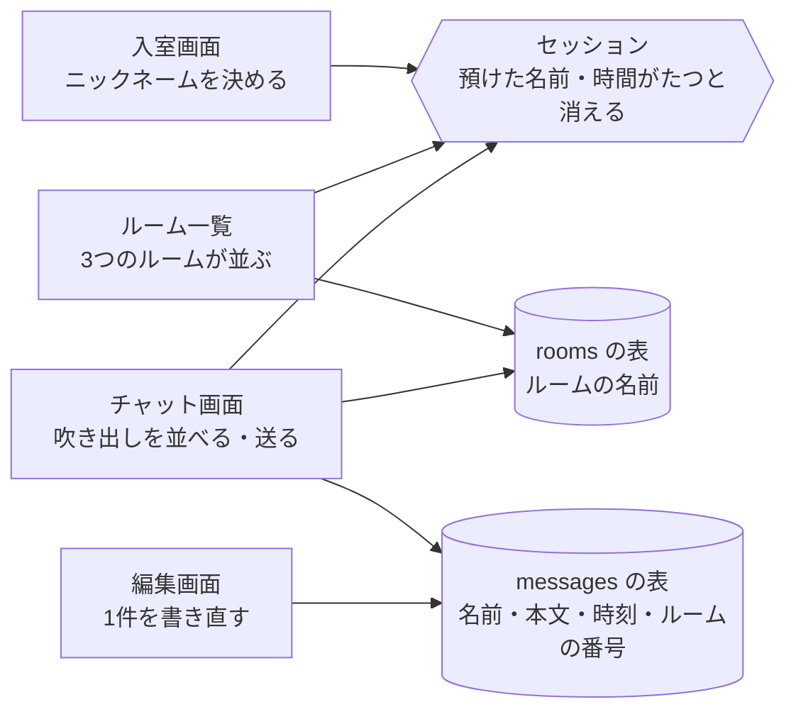

# ここまでのふりかえり

通しで動いたチャットを、こんどはつくった順に並べます。あわせて、どの場面でどの道具を使ったのかもたどります。

## つくったもの

はじめにできたのは、仮の会話が吹き出しで並ぶだけの画面でした。そこへ1つずつ足していって、いまの形になっています。足した順に並べると、こうなります。

| 足したもの | できるようになったこと |
|---|---|
| チャット画面の器 | 住所を開くと、吹き出しが縦に並んだチャットらしい画面が出る |
| メッセージの表と一覧 | データベースに入れた会話が、画面を開くたびに吹き出しで並ぶ |
| 送信 | 入力欄に打った言葉が保存され、一覧に増える |
| 書き直しと削除 | 送ったメッセージを書き直せる。要らないものは1件だけ消せる |
| ルーム | 話題ごとに3つのルームに分かれ、選んだルームの会話だけが並ぶ |
| ニックネーム入室 | 入室のときに決めた名前が残り、送るたびに打たなくてよい |
| 左右の出し分けと時刻 | 自分のメッセージは右、ほかの人のメッセージは左に出て、名前のとなりに時刻が付く |
| 自動更新 | 開いたままの画面に新しいメッセージが5秒ほどで増え、打ちかけの文字も消えない |
| スマートフォンから開く | ポートを公開すれば、手元のスマートフォンからも同じチャットを開ける |
| 配色・アプリの名前・頭文字のアイコン | 見た目が自分の好みになり、ほかの人の吹き出しの横に名前の1文字目が出る |
| いちばん短い住所 | うしろに何も付けない住所が、自分のチャットの入口になる |

自由課題で足したものは人によって違うので、ここには入れていません。

並べたものは、4つの画面と3つの置き場に収まっています。次の図は、どの画面がどの置き場を使っているかだけを表したもので、矢印は「この画面が使っているもの」です。

画面と置き場のあいだには、住所と動きを結びつけた対応表と、送られてきたものを受け取る係がはさまっています。Laravel の役割分担を見たときの、受付と調理場にあたる部分です。図には出てきませんが、機能を足すたびにいちばん多く書き替えてきたのは、自分の手で書いたこの2つです。

## 使った道具

画面をつくったのは **HTML** と **CSS** です。入門編で打った `<h1>` や `
`、それに `<form>` `<input>` `<button>` の3つの部品は、そのままチャットの画面ファイルに並んでいます。見た目の書き方だけは変わりました。あのときは `<style>` の中に「どこを」「どうする」の組で書き、チャットでは Tailwind CSS を使って `class` に短い名前を並べています。決めているものは、どちらも色と大きさと余白です。

動きをつくったのは **PHP** です。リストを `foreach` で並べた書き方は、吹き出しをくり返す `@foreach` になりました。`if` で表示を分けた書き方は、自分の吹き出しと相手の吹き出しを分ける `@if` になっています。係のファイルに書いた処理も、同じ PHP です。

それらをまとめて動かす土台が **Laravel** です。さきほどの対応表と係、画面をつくる Blade、表を扱う係が、それぞれ決まった場所にあります。自分で書いたのは、その中身です。表の設計図や係のファイルそのものは、`php artisan` から始まるコマンドで出してもらいました。

送ったメッセージが残る場所は **データベース** です。使ったのは SQLite で、ファイル1つで動くので、別のサーバーを立てずに済みました。自分でつくった表は `messages` と `rooms` の2つです。

自動更新のために貼った数行だけは **JavaScript** です。ブラウザの中で動くので、いったん出た画面の一部を、あとから書き替えられます。

これらを書いて動かしたのは、ブラウザの中の **作業部屋** です。パソコンには何も入れていません。ボタンのない用事を頼む先が **ターミナル** です。`php artisan serve` もここに打ちます。書いたものを残す先が **GitHub** です。章の終わりごとの保存の儀式で、作業部屋の外に上げてきました。

## まとめ

- 仮の会話が並ぶだけの画面に、送信から自動更新まで1つずつ足していった
- 画面は4つ、置き場は3つで、あいだを対応表と係がつないでいる
- 入門編で覚えた HTML・CSS・PHP を、チャットの中でもそのまま使っている

次のセクションでは、ここまでで何ができるようになったのかを言葉にしてから、この教材では扱わなかった世界と、その先に何があるのかを見わたします。
