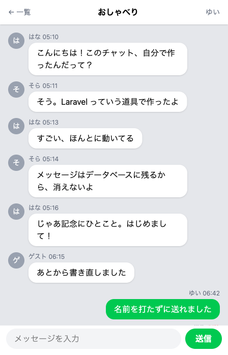

# チャットアプリを、一からつくる

プログラミングがはじめての方のための教材です。文法をひととおり覚えてから作りはじめるのではなく、
早い段階で動くものを手に入れて、そこに機能を足しながら HTML・CSS・PHP・Laravel をつかんでいきます。

最後まで進めると、この画面が自分の手元で動きます。

- メッセージを送ると保存され、あとから見返せます。書き直しと削除もできます
- 話題ごとにトークルームを分けて、ニックネームで入室します
- 自分と相手の発言が左右に分かれ、名前と送信時刻が添えられます
- 自分のスマートフォンのブラウザからも開けます

途中で手が止まらないように、押すボタンの位置と打ち込む文字はすべて画面つきで書いてあります。

期間の目安1日 60〜120 分 × 14日（全 4 部・61 セクション）

扱う技術HTML / CSS / PHP 8.4 / Laravel / SQLite / Tailwind CSS

開発環境GitHub Codespaces（ブラウザの中で動きます。パソコンへのインストールはありません）

前提知識不要。ブラウザで検索ができ、ファイルの保存ができれば始められます

用意するものパソコンとインターネットの環境、Google Chrome、GitHub アカウント（どちらも教材の中で用意します）

[はじめる](part-01/chapter-01/1-1-1.md){ .ct-start }

## カリキュラム

| | | |
|---|---|---|
| 第1部 | **準備編** — ブラウザ・アカウント・開発環境をそろえ、はじめての1行を画面に出します。エディタとターミナルの使い方、エラーとの向き合い方もここで身につけます。 | [開く](part-01/chapter-01/1-1-1.md) |
| 第2部 | **入門編** — HTML と CSS でページの見た目をつくり、PHP で変数・くり返し・条件分岐といったプログラムの骨組みを手を動かしてつかみます。 | [開く](part-02/chapter-01/2-1-1.md) |
| 第3部 | **実践編** — Laravel でプロジェクトをつくり、ルーティング・Blade・データベースでチャットの土台を組み上げます。メッセージが送れて残るところまで進みます。 | [開く](part-03/chapter-01/3-1-1.md) |
| 第4部 | **応用編** — 編集・削除、トークルーム、ニックネーム入室、送信時刻、自動更新、見た目の調整を足して仕上げます。 | [開く](part-04/chapter-01/4-1-1.md) |

## 身につくこと

**書かれたコードを読んで動かせる。** ファイルの一覧を見て、これは画面をつくるファイル、これは送られてきたものを受け取る係だと見当がつく状態になります。貼ったコードのどの行が何をしているかも、たいていは追えます。

**エラーが出ても手が止まらない。** ターミナルに返ってくる英語の1行は、左側の「どこで」と右側の「何が」の2か所だけ読めばよいと分かります。ブラウザの画面いっぱいに出る英語も、どのファイルのどこで止まったのかをたどれます。

**データを預けて取り出せる。** テーブルをつくり、そこへ入れ、必要なものだけを画面に並べる。チャットにかぎらず、データを扱うアプリはどれも同じことをしています。

一方で、何もない状態から自分で組み立てるところは、この教材では扱いません。どんなテーブルをつくり、どの住所を用意するかを決める作業は、こちらで引き受けています。順番の問題で、読んで動かす力を重ねたあとに身につく力です。

## 対象

プログラミングをこれから始める方に向けて書いています。前提にしているのは、ブラウザで検索ができ、メールの送受信とファイルの保存ができることだけです。タイピングはゆっくりでかまいません。

HTML を書いたことがなくても、ターミナル（黒い画面）を開いたことがなくても、最初のセクションから順に進められます。

## 進め方

コードはコピーして貼り付けても最後まで完成させられますが、短いものは手で打つことをおすすめします。記号の位置やつづりが手に残ります。

1つの章が、だいたい1日ぶんです。途中で間が空いても、開発環境はそのまま残っているので、次に開けば続きから始められます。急いでいるときに飛ばせるセクションは、本文の中で案内しています。

思ったとおりに動かないときの調べ方は、第1部の中にまとめたページがあります。詰まったらそこに戻ってきてください。
